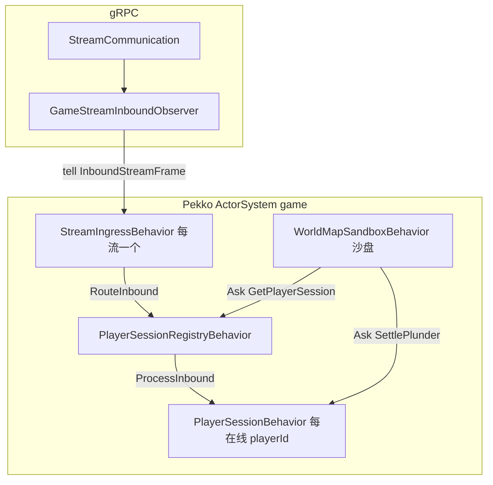

详细讲解下game中pekko部分的实现

下面按「运行时 → 桥接 → 会话 → 世界 → 与 Spring 的衔接」把 game-service 里 Pekko Typed 的实现讲清楚（基于当前代码）。

------

## 1. 总体思路

- 一个进程一个 `ActorSystem`，名 `game`，用户 Actor 树从这里 spawn。

- Typed API：消息用 密封接口 / record，不用 `Object` 乱投。

- 两条业务线

  ：

  1. Gate 上行流 → 流入口 Actor → 会话注册表 → 每玩家一个 `PlayerSessionBehavior` → `GameMessageDispatcher`。
  2. 世界侧（Region / City）→ 需要找玩家时用 `Ask` 问 `PlayerSessionRegistryBehavior`，再 `Ask` 玩家 做掠夺结算等。

------

## 2. ActorSystem 从哪里来、怎么关

PekkoActorSystemConfiguration.javaLines 35-41

​    @Bean

​    public ActorSystem<SpawnProtocol.Command> gameActorSystem() {

​        Config config = ConfigFactory.load();

​        ActorSystem<SpawnProtocol.Command> system =

​                ActorSystem.create(SpawnProtocol.create(), "game", config);

- `SpawnProtocol` 作为「根」能力：业务代码通过 `AskPattern.ask(actorSystem, replyTo -> new SpawnProtocol.Spawn<>(behavior, name, props, replyTo), ...)` 在系统里 动态创建 子 Actor（例如 `player-session-registry`、`world-registry`、每条 gRPC 流的 `stream-ingress-*`）。
- 配置：`ConfigFactory.load()` 会合并 `application.conf`（见下）与 Pekko 默认 `reference.conf`。
- 关闭：实现 `DisposableBean`，Spring 容器关闭时 `terminate()` 并等待最多 30 秒，避免 JVM 直接退出时 Actor 泄漏。

------

## 3. HOCON：`application.conf` 与背压

```java
application.confLines 4-18

pekko {

  actor {

​    default-dispatcher {

​      throughput = 5

​    }

​    ...

​    mailbox {

​      stream-ingress-bounded {

​        mailbox-type = "org.apache.pekko.dispatch.BoundedMailbox"

​        mailbox-capacity = 1000

​        mailbox-push-timeout-time = 0s

​      }

​    }

  }

}
```

- 流入口 Actor 使用 `pekko.actor.mailbox.stream-ingress-bounded`（在 `GameGrpcServer` 里 `Props.empty().withMailboxFromConfig(...)`），队列满时 push-timeout=0 会丢消息进 dead letters（与 HTTP/2 流控不同，这是应用层背压）。
- 默认 dispatcher 的 `throughput = 5` 控制每轮调度最多处理多少条消息再让出线程。

------

## 4. gRPC → Actor：桥接层

`StreamIngressBehavior`（每条 双向流 一个实例）：

- 收到 `InboundStreamFrame`（含 `playerId, messageId, seq, body`）→ `tell` 给 `PlayerSessionRegistryBehavior` 的 `RouteInbound(streamId, ...)`。
- 收到 `Shutdown` → `tell StreamClosed(streamId)`，然后 `Behaviors.stopped()`。

这样 Netty/gRPC 回调线程上不做业务，只做 `tell`。

`GameStreamInboundObserver` 在 `onNext` 里把 proto 转成 `InboundStreamFrame` 发给 `ingress`，完成「IO 线程 → Actor 邮箱」的切换。

------

## 5. 会话层：`PlayerSessionRegistryBehavior` + `PlayerSessionBehavior`

### 5.1 注册表职责

- `sessions`：`playerId → ActorRef<PlayerSessionBehavior.Command>`。
- `streamToPlayers`：某 `streamId` 上出现过的 `playerId` 集合（支持一条流上多个玩家，或同一玩家多条流）。
- `playerRefCount`：每个 `playerId` 被多少条不同的流引用（不是消息条数）。

`RouteInbound` 时：

1. 若该 `(streamId, playerId)` 首次出现，则 `playerRefCount++`；若从 0→1，则 `spawnSession(playerId)`。
2. `spawnAnonymous` 创建 `PlayerSessionBehavior`，`watchWith`，在子 Actor 停时收到 `PlayerSessionTerminated` 做清理。
3. 向对应 `PlayerSessionBehavior` 发 `ProcessInbound(messageId, seq, body)`。

`StreamClosed(streamId)`：对该流上所有 `playerId` 做 `releaseOneStream`；若 refcount 归零则 `stop` 该玩家会话。

`GetPlayerSession`：给跨 Actor 用（例如 City 要 `Ask` 玩家），返回 `Optional<ActorRef<...>>`。

### 5.2 玩家 Actor：`PlayerSessionBehavior`

- `ProcessInbound`：在 Actor 线程里调 `GameMessageDispatcher.dispatch(playerId, ...)`（与 Spring 的 `dispatcher` 同一条调用链，串行保证同一玩家单线程处理）。
- `SettlePlunder`：不直接碰 Mongo，委托 `PlayerPlunderLedger.trySettle`，再 `replyTo` 给 Ask 方。
- 监督：外层 `Behaviors.supervise(...).onFailure(SupervisorStrategy.stop())`，子行为失败则 停止 该会话（与「在线会话」语义一致）。

------

## 6. 世界层：`WorldMapSandboxBehavior`（单沙盘）

大地图侧 **仅** 一个 Typed Actor 邮箱（每 `game.id` × `gameplayId` 一实例）：`Map<cityId, CityMapCacheState>` 懒加载；可选 `CityWorldStatePersistence` 按 `(persistenceRegionId, cityId)` load/save。

掠夺结算路径（`SettlePlunderVictim`）：

1. `AskPattern` → `PlayerSessionRegistryBehavior.GetPlayerSession` → 得到受害者会话 `ActorRef`。
2. 再 `Ask` → `PlayerSessionBehavior.SettlePlunder`。
3. 用 `pipeToSelf` 把 `CompletionStage` 结果变成 `GotSession` / `GotPlunder` 再处理，避免在回调线程上阻塞。

这是典型的 Typed + 异步 Ask 写法。

------

## 7. 与 Spring 的衔接

- `ActorSystem`、`ActorRef<PlayerSessionRegistryBehavior.Command>`、`ActorRef<WorldMapSandboxBehavior.Command>`（`worldMapSandbox`）等由配置类里 `SpawnProtocol` 启动时 blocking join 得到引用。
- `GameMessageDispatcher`、`PlayerPlunderLedger`（Mongo 实现）、`CityWorldStatePersistence` 等 注入进 Behavior 的工厂方法（`create(dispatcher, ...)`），Actor 线程里会调用 Spring 单例——这是常见模式，但要注意 不要在 Actor 里做阻塞 IO；当前 `dispatch` / `ledger` 若访问 Mongo，应保证 短、非长时间阻塞（或后续换隔离 dispatcher）。

------

## 8. 一张结构图（便于对照）




## 9. 未走 Pekko 的路径（避免误解）

- `SendGameMessage`（Unary） 当前在 `GameGrpcServer` 里 直接 `dispatcher.dispatch`，不经过 `PlayerSessionBehavior` 邮箱；与流式路径不一致，代码里已有 TODO 注释。

------

## 10. 小结表

| 组件                                                        | 作用                                                         |
| :---------------------------------------------------------- | :----------------------------------------------------------- |
| `PekkoActorSystemConfiguration`                             | 创建/销毁 `ActorSystem`，加载 `application.conf`             |
| `StreamIngressBehavior`                                     | 每流一个，把帧转成 `RouteInbound`                            |
| `PlayerSessionRegistryBehavior`                             | 按 `playerId` 路由、spawn/stop 会话、响应 `GetPlayerSession` |
| `PlayerSessionBehavior`                                     | 在线玩家串行 `dispatch` + 掠夺 `SettlePlunder`               |
| `WorldMapSandboxBehavior`                                   | 大地图沙盘、城缓存、Ask 玩家结算                             |


## `stream-ingress-*` 是干什么的？

每条 Gate ↔ Game 的 `StreamCommunication` 双向 gRPC 流 在建立时，`GameGrpcServer` 会：

- 分配一个自增的 `streamId`；
- 用 `SpawnProtocol` 起一个 `StreamIngressBehavior`，Actor 名叫 `stream-ingress-{streamId}`（见 `GameGrpcServer.streamCommunication` 里 `name = "stream-ingress-" + streamId`）。

这个 Actor 的职责很单一：

- 收到 gRPC `onNext` 转来的 `InboundStreamFrame` → `tell` 给 `PlayerSessionRegistryBehavior` 的 `RouteInbound(streamId, playerId, ...)`；
- 流结束 → `StreamClosed(streamId)`，然后自己 `stopped()`。

也就是说：它是「这一条 gRPC 流」在 Pekko 侧的入口，把 IO 线程上的数据丢进 Actor 邮箱，避免在 Netty 回调里跑业务；同时用 `streamId` 区分「哪一条连接上的帧」。

## 为什么一个 `playerId` 可能对应多条 stream？

数据结构设计就是这样支持的，原因包括：

1. `RouteInbound` 里带了 `streamId` + `playerId`
   注册表用 `streamToPlayers`：`*每条流*` 上出现过哪些 `playerId`；用 `playerRefCount`：这个 `playerId` 当前被多少条不同的流引用（不是消息条数，是 流条数）。
2. 同一会话在多条流上出现是合理场景
   - 重连：新流已建立、旧流还没走完 `onCompleted`/关闭，短暂 两条流 都带同一 `playerId`。
   - 多端同号：两个客户端/两个 Gate 连接都用同一个 `playerId`，就会 两条流 同时引用同一玩家。
   - 一条流上多个 playerId：协议上一条流里 `GameMessage` 可以带不同 `playerId`（例如网关聚合），所以 `streamId → Set<playerId>`。
3. 生命周期
   只有 `playerRefCount` 从 1 减到 0 时才会 `stop` 对应的 `PlayerSessionBehavior`。
   所以：多条流同时引用同一玩家 → 只保留一个会话 Actor，但 refcount>1；要所有相关流都关闭 refcount 才归零。

------

一句话：`stream-ingress-*` = 每条独立 gRPC 流一个桥接 Actor；一个 player 可能在多条 stream 上，是因为连接模型允许 重连重叠、多端、或一流多 playerId，注册表用 `streamId` + 按玩家 refcount 管理会话创建与销毁。


## 首先gate上不允许一个玩家连接多个gate，会顶号，在新连接建立时旧连接需要断开，那是不是也就不会出现一个玩家多条stream？

可以这么理解，但要分清 「连哪个 Gate」 和 「Gate–Game 上有几条流」 两件事。

## Gate 顶号能推出什么？

若产品规则是：同一玩家同时只能有一个有效 Gate 会话，新连接会踢掉旧连接，那么：

- 不会出现：同一玩家 同时在多个 Gate 上 各有一条长连接（你关心的「多 Gate」被禁止）。
- 通常也不会长期存在：同一玩家 对应多条并行的 Gate→Game 业务流（稳态下理想情况就是 一个玩家 ↔ 一条 StreamCommunication）。

所以从 稳态架构 看，你的直觉对：多数时候一个玩家只会对应 Game 侧一条 `stream-ingress` 所服务的那条流。

## 那为什么 Game 里还按「多 stream / refcount」建模？

因为 顶号 解决的是 客户端–Gate 层的互斥；Game 收到的是 Gate 转发的 gRPC 流，仍可能出现 短时间两条流都带同一 `playerId`，例如：

1. 换流时间窗：新流已经建立并开始往 Game 发 `RouteInbound`，旧流在 Gate/网络上 尚未 走完关闭，`StreamClosed` 还没 到达 Game（或晚到几毫秒～几百毫秒）。
2. 关闭顺序：Gate 先建新流再断旧流、或 Game 先收到新流帧后收到旧流结束，都会出现 重叠期。
3. 实现细节：若某处 没有 严格「先关旧流、再开新流」的全局顺序，重叠更容易出现。

在这种窗口里，同一个 `playerId` 会出现在两个 `streamId` 上，若 Game 仍按「每个 stream 各占一次 refcount」处理，就不会误杀 还没结束的那条流 对应的会话。

## 结论

- 规则上（顶号、单 Gate 会话）：不会设计成「玩家故意长期占多条 Gate–Game 流」。
- 工程上（异步、网络、换流）：仍可能出现 极短 的 同一玩家多条 stream，所以用 `streamId` + refcount 比假设「永远只有一条流」更安全。
- 若你们能 严格保证 旧流在 Game 侧已 `StreamClosed` 之后才允许新流发第一帧，则 常态下 refcount 恒为 1；当前实现是 不依赖这条强假设 的防御性写法。

如果你愿意对照实现，可以看 `PlayerSessionRegistryBehavior` 里 `streamToPlayers` / `playerRefCount` 与 `RouteInbound`、`StreamClosed` 的配合逻辑。


1. `AskPattern.ask(actorSystem, replyTo -> new SpawnProtocol.Spawn<>(behavior, name, props, replyTo), ...)` 在系统里 动态创建 子 Actor的逻辑在哪里？
2. 外层 `Behaviors.supervise(...).onFailure(SupervisorStrategy.stop())`，子行为失败则 停止 该会话，会导致由于小问题触发的异常（不影响后续逻辑）进而导致玩家直接退出吗？
3. 当前实现是 **`WorldMapSandboxBehavior` 单邮箱** 承载大地图写入；跨 `cityId` / 行军的语义用 **消息内字段**（如 `targetCityId`）与 **沙盘内 per-city 状态** 表达，而不是再拆多级 Region/City Actor。若单邮箱吞吐不足，可再按战场/分线拆多个沙盘（仍少于「每格一 Actor」）。
4. pekko的actor间的异步是怎么实现的？给个例子