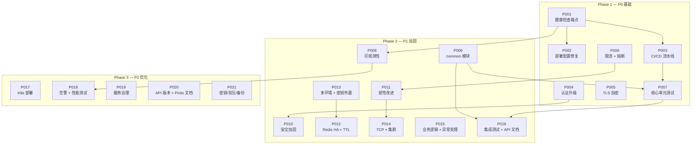

# 提案说明文档

> 基于 [开发计划清单](开发计划清单.md) 中 38 项生产级差距分析，拆分为 **21 个 openspec 变更提案**，分三个阶段执行。

---

## 提案总览

| 编号 | 提案名称 | 覆盖清单项 | 简要说明 | 优先级 | 依赖提案 |
|------|---------|-----------|---------|--------|---------|
| P001 | `add-actuator-health-checks` | 2.1 + 1.2 | 所有服务添加自定义健康检查端点；修复 game-service Docker 健康检查 | P0 | — |
| P002 | `fix-deployment-config` | 1.3 + 1.6 | docker-compose 环境变量对齐 gRPC 架构；补充容器；重写 README | P0 | P001 |
| P003 | `add-cicd-pipeline` | 1.1 + 5.4 | GitHub Actions CI/CD 流水线；JaCoCo 覆盖率报告 | P0 | P001 |
| P004 | `upgrade-authentication` | 3.2 + 3.3 | TokenService 升级为 JWT + Redis；WebSocket 入口集成 TokenValidator | P0 | — |
| P005 | `add-tls-encryption` | 3.1 | Netty WebSocket 升级 wss://；gRPC 启用 TLS；可配置开关 | P0 | — |
| P006 | `integrate-ratelimit-circuitbreaker` | 4.1 + 4.2 | RateLimiter 接入 WebSocket handler；CircuitBreaker 包裹 gRPC 调用 | P0 | — |
| P007 | `add-core-unit-tests` | 5.1 | 核心类单元测试覆盖（PlayerService、ConnectionManager、MessageDispatcher 等） | P0 | P003, P009 |
| P008 | `add-observability-stack` | 2.2 + 2.3 + 2.4 | Micrometer + Prometheus 指标；Micrometer Tracing + Zipkin 链路追踪；结构化 JSON 日志 | P1 | P001 |
| P009 | `extract-common-module` | 6.1 | 新建 common Maven 模块，统一 Proto 生成类、共享 DTO、工具类 | P1 | — |
| P010 | `harden-security` | 3.4 + 3.5 + 3.6 | MessageEncryptor 集成（AES-GCM）；REST API Key 鉴权；消息体输入校验 | P1 | P004 |
| P011 | `improve-resilience` | 4.3 + 4.4 + 4.5 | 优雅关闭 + connection draining；指数退避重连；连接数上限控制 | P1 | P006 |
| P012 | `add-redis-ha-and-ttl` | 4.6 + 9.2 | Redis Sentinel 配置支持；所有 Redis Key TTL 规划；maxmemory 策略 | P1 | P013 |
| P013 | `add-multi-env-and-secrets` | 1.4 + 7.3 | 多环境 Profile（dev/prod）配置；敏感信息 ${ENV_VAR} 外置 | P1 | — |
| P014 | `integrate-tcp-and-cluster` | 6.2 + 6.3 | NettyTcpServer Spring 组件化 + 开关控制；GateClusterManager 集群注册 | P1 | P011 |
| P015 | `add-game-logic-and-exceptions` | 6.4 + 6.5 | GameMessageHandler echo/broadcast 实现；Netty 统一 exceptionCaught；REST 全局异常处理 | P1 | — |
| P016 | `add-integration-tests-and-api-docs` | 5.2 + 8.1 + 9.1 | Testcontainers 集成测试；OpenAPI/Swagger API 文档；持久化存储方案规划 | P1 | P007, P009 |
| P017 | `add-k8s-deployment` | 1.5 | K8s Deployment/Service/ConfigMap/HPA 清单；可选 Helm Chart | P2 | — |
| P018 | `add-alerting-and-perf-tests` | 2.5 + 5.3 | Prometheus 告警规则 + Alertmanager；JMH 微基准测试 + Gatling 压测 | P2 | P008 |
| P019 | `add-service-governance` | 7.1 + 7.2 + 7.4 | Nacos 配置中心；配置热更新（Nacos SDK 监听）；统一服务注册发现 | P2 | — |
| P020 | `add-api-versioning-and-proto-docs` | 6.6 + 8.2 + 8.3 | API 版本管理策略；protoc-gen-doc Proto 文档；buf breaking change 检测 | P2 | — |
| P021 | `add-key-mgmt-backpressure-backup` | 3.7 + 4.7 + 9.3 | 密钥管理与版本轮换；gRPC/Redis Stream 背压；Redis RDB/AOF + DB 备份 | P2 | — |

---

## 执行阶段

### Phase 1 — P0 基础（7 个提案）

生产上线必须完成的基础能力，奠定健康检查、部署、安全认证、限流熔断、测试基石。

| 顺序 | 提案 | 说明 |
|------|------|------|
| 1 | P001 `add-actuator-health-checks` | 所有后续可观测性和部署配置的基础（自定义健康检查端点） |
| 2 | P002 `fix-deployment-config` | 依赖 P001 的健康检查端点 |
| 3 | P003 `add-cicd-pipeline` | 依赖 P001；CI 中跑测试和覆盖率 |
| 4 | P004 `upgrade-authentication` | 独立，可与 P002/P003 并行 |
| 5 | P005 `add-tls-encryption` | 独立，可与 P004 并行 |
| 6 | P006 `integrate-ratelimit-circuitbreaker` | 独立，可与 P004/P005 并行 |
| 7 | P007 `add-core-unit-tests` | 依赖 P003（CI 覆盖率门禁）和 P009（common 模块） |

### Phase 2 — P1 加固（9 个提案）

上线后短期内补齐的加固能力，涵盖可观测性、安全加固、韧性提升、环境配置、代码质量。

| 顺序 | 提案 | 说明 |
|------|------|------|
| 8 | P009 `extract-common-module` | 早期执行，后续提案受益于共享代码 |
| 9 | P008 `add-observability-stack` | 依赖 P001（健康检查端点） |
| 10 | P013 `add-multi-env-and-secrets` | 独立，环境配置基础 |
| 11 | P010 `harden-security` | 依赖 P004（认证升级） |
| 12 | P011 `improve-resilience` | 依赖 P006（限流熔断） |
| 13 | P012 `add-redis-ha-and-ttl` | 依赖 P013（环境配置） |
| 14 | P014 `integrate-tcp-and-cluster` | 依赖 P011（韧性改进） |
| 15 | P015 `add-game-logic-and-exceptions` | 独立，可与其他 Phase 2 提案并行 |
| 16 | P016 `add-integration-tests-and-api-docs` | 依赖 P007（单元测试）和 P009（common 模块） |

### Phase 3 — P2 优化（5 个提案）

长期优化项，提升运维能力、性能基线、服务治理和文档完整性。

| 顺序 | 提案 | 说明 |
|------|------|------|
| 17 | P017 `add-k8s-deployment` | 独立，K8s 部署清单 |
| 18 | P018 `add-alerting-and-perf-tests` | 依赖 P008（可观测性） |
| 19 | P019 `add-service-governance` | 独立，外部配置中心 + 服务发现 |
| 20 | P020 `add-api-versioning-and-proto-docs` | 独立，API 版本与文档 |
| 21 | P021 `add-key-mgmt-backpressure-backup` | 独立，密钥/背压/备份 |

---

## 依赖关系图

---

## 提案路径速查

| 编号 | openspec 路径 |
|------|--------------|
| P001 | `openspec/changes/add-actuator-health-checks/` |
| P002 | `openspec/changes/fix-deployment-config/` |
| P003 | `openspec/changes/add-cicd-pipeline/` |
| P004 | `openspec/changes/upgrade-authentication/` |
| P005 | `openspec/changes/add-tls-encryption/` |
| P006 | `openspec/changes/integrate-ratelimit-circuitbreaker/` |
| P007 | `openspec/changes/add-core-unit-tests/` |
| P008 | `openspec/changes/add-observability-stack/` |
| P009 | `openspec/changes/extract-common-module/` |
| P010 | `openspec/changes/harden-security/` |
| P011 | `openspec/changes/improve-resilience/` |
| P012 | `openspec/changes/add-redis-ha-and-ttl/` |
| P013 | `openspec/changes/add-multi-env-and-secrets/` |
| P014 | `openspec/changes/integrate-tcp-and-cluster/` |
| P015 | `openspec/changes/add-game-logic-and-exceptions/` |
| P016 | `openspec/changes/add-integration-tests-and-api-docs/` |
| P017 | `openspec/changes/add-k8s-deployment/` |
| P018 | `openspec/changes/add-alerting-and-perf-tests/` |
| P019 | `openspec/changes/add-service-governance/` |
| P020 | `openspec/changes/add-api-versioning-and-proto-docs/` |
| P021 | `openspec/changes/add-key-mgmt-backpressure-backup/` |

---

## 关键约束说明

1. **P001 必须最先执行** — P002（Docker）、P003（CI/CD）、P008（可观测性）均依赖健康检查端点
2. **P009（common 模块）应在 Phase 2 初期执行** — 后续提案（P007 单元测试、P016 集成测试）需要共享代码
3. **P004（认证升级）先于 P010（安全加固）** — 安全加固基于已升级的认证体系
4. **P003（CI/CD）先于 P007（测试）** — CI 中需要覆盖率门禁支持

---

*文档版本：1.0*
*生成日期：2026-03-16*
*基于：[开发计划清单](开发计划清单.md)*
