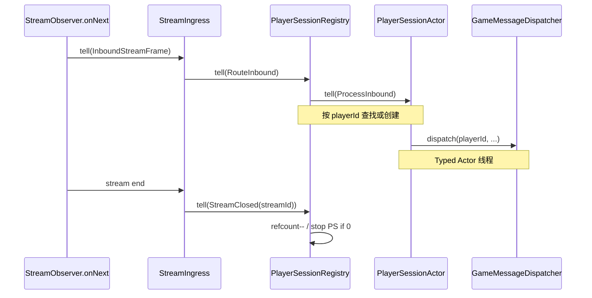

## Context

- **现状**：[`StreamIngressBehavior`](../../../game-service/src/main/java/com/clawai/gatedemo/game/pekko/bridge/StreamIngressBehavior.java) 在 Actor 线程上 **直接**调用 [`GameMessageDispatcher.dispatch`](../../../game-service/src/main/java/com/clawai/gatedemo/game/handler/GameMessageDispatcher.java)。桥接规格要求 **`dispatch` 不在 gRPC 回调线程** — 已满足，但 **按流** 串行，**未**按 **`playerId`** 形成长期会话聚合。
- **路线图**（[`pekko-game-actor-openspec-roadmap.md`](../../../docs/pekko-game-actor-openspec-roadmap.md)）：**PlayerSessionActor** 绑定在线会话，**不负责**地图权威；资源权威后续在 Player 内串行扩展。
- **约束**：[`GameMessage`](../../../proto/game_service.proto) 每条含 `player_id`；**无**独立 `session_id`。流级标识由本进程为每个 `streamCommunication` 分配 **`streamId`（long，单调递增即可）**。

## Goals / Non-Goals

**Goals:**

- **寻址**：进程内 **`playerId` → ActorRef<PlayerSession>**（Typed），供后续 World 命令、Ask 使用。
- **生命周期**：某流上 **首次**出现某 `playerId` 时 **创建或复用**会话 Actor，并 **将该流对该玩家的占用** 记入引用；流 **`onCompleted`/`onError` 结束路径** 释放占用，`playerId`  refcount 归零时 **停止** PlayerSessionActor。
- **业务路径**：PlayerSession 在 **自身 dispatcher** 上调用 **`dispatch`**，参数与阶段 2 一致。
- **可测性**：Registry / PlayerSession / 更新后的桥接路径具备 **单元测试**；保留「`onNext` 不调用 `dispatch`」类断言（`dispatch` 仅在 Typed Actor 线程发生）。

**Non-Goals:**

- 不修改 **handler** 注册表语义、不引入 **City/Region** 实现。
- 不解决 **跨进程** 玩家会话（阶段 8）。
- 不强制 **Unary** 走 PlayerSession（与 `GameGrpcServer` 中已有 TODO 一致）。

## Decisions

### D1: 顶层 Registry + 每玩家子 Actor

- **内容**：在 **同一 `ActorSystem`（SpawnProtocol guardian）** 下 **spawn** 单例 **`PlayerSessionRegistry`**；由其 **`context.spawnAnonymous`** 各 **`PlayerSessionActor`**（避免子 Actor **终止期间**固定名 `player-session-{id}` 复用触发 `InvalidActorNameException`）。
- **理由**：与阶段 2「从非 Actor 代码 Spawn 子 Actor」模式一致；**全局**按 `playerId` 映射，符合路线图「在线一人一 Actor」。
- **watch**：`watchWith` 携带 **`ActorRef`**，仅在 **仍为当前会话** 时清理映射，避免旧实例 **Terminated** 误删已替换的新 `PlayerSession`。
- **备选**：StreamIngress 下挂 `playerId` 子 Actor — 难以表达 **跨流** 复用与 refcount。

### D2: 流 ↔ 玩家 引用计数

- **内容**：
  - 每个 **StreamIngress** 实例持有 **`streamId`**（在 `GameGrpcServer` 分配）。
  - Registry 维护 `streamId → Set<playerId>`（该流上出现过的玩家）与 `playerId → refcount`（**多少条流** 当前占用该玩家会话）。
  - **首次**某 `(streamId, playerId)` 组合出现时：`refcount++`（若从 0→1 则 **spawn** PlayerSession）。
  - **`StreamClosed(streamId)`**：移除该流集合，对每个相关 `playerId` 执行 `refcount--`；若为 0 则 **`context.stop`** 对应 PlayerSession。
- **理由**：支持 **多流同玩家** 不提前停会话；流结束无泄漏。
- **备选**：每流单独 PlayerSession — 与路线图「一人一 Actor」冲突。

### D3: StreamIngress 仅路由

- **内容**：`InboundStreamFrame` → `registry.tell(RouteInbound(streamId, playerId, messageId, seq, body))`；**不再**注入 `GameMessageDispatcher` 到 StreamIngress。
- **理由**：单一职责；`dispatch` **唯一**从 PlayerSession 进入。

### D4: PlayerSession 持有 GameMessageDispatcher

- **内容**：与阶段 2 相同 **Spring 单例** `GameMessageDispatcher` 传入 PlayerSession **工厂**；会话内 **`dispatch(playerId, ...)`**。
- **理由**：最小改动业务层；`setSender` 仍在 **流建立** 时绑定 **当前流** 的 `GameMessageSender`（与现有多流 **volatile sender** 行为一致 — **已知限制**，非本变更解决）。

### D5: 监督策略

- **内容**：Registry 使用 **`SupervisorStrategy.stop()`**（或等价）处理子级 `PlayerSessionActor` 失败：**停止**失败子 Actor，**不**自动重启；Registry 同时从 **`playerId` 映射表** 中移除该条目并将 **refcount** 归零（与实现一致的具体清理步骤见代码注释）。
- **理由**：避免损坏状态无限重试；首版以 **可预测** 为主；后续可改为 `restartWithBackoff`（阶段 7）。

### D6: 面向 World 的命令类型表（占位）

| 命令名（占位） | 方向 | 说明 |
|----------------|------|------|
| `WorldCommandStub` | Session → World | 阶段 4 起替换为真实 Region/City 命令（行军、攻城等） |

本表满足 `game-player-session-actor` 规格「命令类型表可追溯」；实现 **无**需发送真实消息。

## Risks / Trade-offs

| 风险 | 缓解 |
|------|------|
| `volatile sender` 多流覆盖 | 与阶段 2 相同；文档标注；后续可改为按流/按玩家路由 **MessageSender** |
| Registry 单点邮箱压力 | 首版轻量（仅路由）；背压仍以 StreamIngress 有界邮箱为主 |
| 测试与生产线程语义 | 单测使用 **TestKit** + **间谍 dispatcher** |

## Migration Plan

- **部署**：纯进程内重构；无 DB/proto 迁移。
- **回滚**：恢复 StreamIngress 直接 `dispatch`（不推荐长期保留）。

## Open Questions

- **Unary** 是否与流统一经 PlayerSession：后续独立 change。
- **PlayerSession** 邮箱是否改为有界：阶段 7 与 observability 一并评估。

## 参考序图

