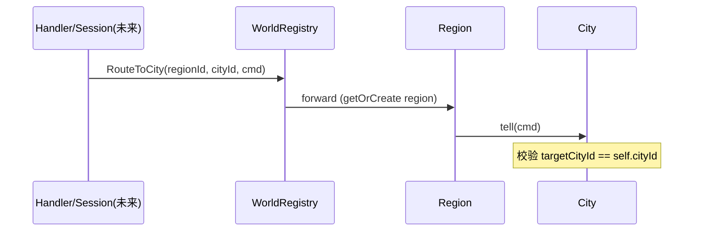

## Context

- **路线图**（[`pekko-game-actor-openspec-roadmap.md`](../../../docs/pekko-game-actor-openspec-roadmap.md)）：**城/地块/分区**为写入边界；**地图缓存 + DB** 须 **单写者**顺序更新。
- **现状**：[`PlayerSessionRegistryBehavior`](../../../game-service/src/main/java/com/clawai/gatedemo/game/pekko/session/PlayerSessionRegistryBehavior.java) 按 `playerId` 路由；**尚无**世界侧聚合。
- **持久化**：[`persistence-plan.md`](../../../docs/persistence-plan.md) 描述 DB 选型/表方向；本阶段 **不**绑定具体城表，只规定 **先内存后异步落库** 等 **原则**。

## Goals / Non-Goals

**Goals:**

- **Routing key**：**`regionId`（long）** + **`cityId`（long）** 唯一确定 **一个 City Actor**（同进程内）。
- **层级**：`WorldRegistry` → **`RegionBehavior(regionId)`** → **`CityBehavior(regionId, cityId)`**；便于阶段 8 将 **Region** 或 **City** 映射为 **Shard** `entityId`。
- **地图缓存**：**`CityMapCacheState`**（占位 POJO，如 `ConcurrentHashMap` 包在 **不可变快照**或 **单线程突变**二选一；本实现采用 **仅在 City Actor 内修改** 的 **可变 Map**，避免并发写）。
- **城命令校验**：凡携带 **`targetCityId`** 的入城消息，**MUST** 与 **本 Actor 的 `cityId`** 一致，否则 **拒绝处理**（日志 + 指标占位）。
- **验收单测**：同一 **`cityId`** 串行；**错误 `targetCityId`** 不进入 **正确城** 的业务计数。

**Non-Goals:**

- **无** DB 迁移、**无** gRPC 对外 API、**无** PlayerSession 与 City 的 **完整** 业务闭环（仅注册 Bean 供后续接线）。

## Decisions

### D1: World → Region → City 三级

- **理由**：与路线图「分区 → 城」一致；**Sharding 预备**：`entityId` 可取 `regionId` 或 `cityId` 字符串。
- **备选**：扁平 **仅 City** + `Map` 查找 — 丢失 **分区**边界，不利于大地图分服。

### D2: 子 Actor 命名

- **Region**：`context.spawn(regionBehavior, "region-" + regionId)`（懒创建一次；若将来重启需 **watch** 与 **spawnAnonymous** 策略，见 PlayerSession 阶段经验）。
- **City**：**`spawnAnonymous(CityBehavior)`**，避免终止期间 **固定名**冲突。

### D3: 地图缓存归属

- **`CityMapCacheState`** 作为 **`CityBehavior`** 私有字段；**任何** gRPC/Player 路径 **不得**直接持有 **可变** 引用外传；跨 Actor 须 **消息**（阶段 5 Ask）。

### D4: DB 写序（原则）

- **同一 `cityId`**：**City 邮箱**内更新内存 → **再** 触发异步/同步持久化（具体 **Outbox** 见阶段 6）；**禁止** Handler 线程直接写城表后 **再** 通知 City 改缓存（双写乱序）。

### D5: 监督

- **WorldRegistry** 对 **Region** 子级：**stop** 失败子 Actor（与 Player 阶段一致文档化）；**City** 由 **Region** 监督（默认）。

## Risks / Trade-offs

| 风险 | 缓解 |
|------|------|
| Region/City 进程内无限增长 | 文档化；后续 passivation / Sharding |
| 与 PlayerSession 重复发令 | 阶段 5 统一 Ask；本阶段仅 **桩** 路由 |

## Migration Plan

- 纯新增 Bean 与 Actor；**无**数据迁移。
- **回滚**：移除 Bean 与世界包；PlayerSession **不**依赖本包即可回滚。

## Open Questions

- **Unary** 业务消息 **何时** 从 `GameMessageDispatcher` 转发到 **WorldRegistry**：后续 handler 改造 change。

## 地图缓存占位（数据结构）

| 字段/容器 | 说明 |
|-----------|------|
| `tileKey → int` 或 `Map<String, Integer>` | 占位：地格/建筑等级等；**仅 City 内写** |

## 参考序图（路由）

