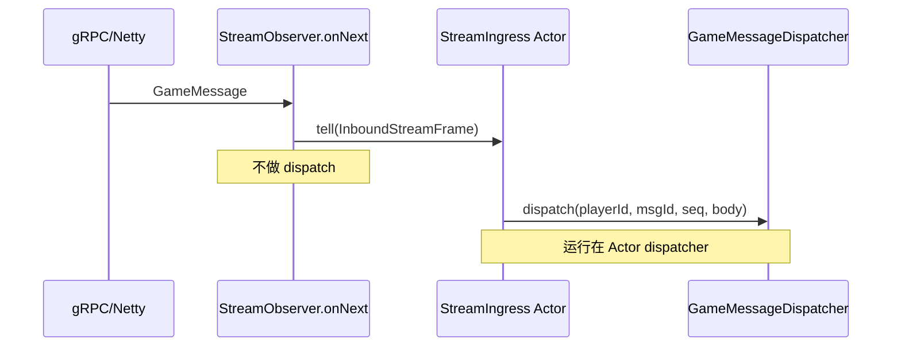

# Design: Bridge gRPC Stream to Game Actor Mailbox

## Context

- **现状**：[`GameGrpcServer.GameServiceImpl.streamCommunication`](../../../game-service/src/main/java/com/clawai/gatedemo/game/grpc/GameGrpcServer.java) 在 **`StreamObserver.onNext`** 内直接调用 [`GameMessageDispatcher.dispatch`](../../../game-service/src/main/java/com/clawai/gatedemo/game/handler/GameMessageDispatcher.java)（加载 `PlayerData`、解析 protobuf、执行 handler、可能同步存盘）。该回调运行在 **gRPC 传输线程**，违反路线图 **「Netty/gRPC 回调只做入队」** 原则。
- **已有能力**：[`game-pekko-actor-runtime`](../../../openspec/specs/game-pekko-actor-runtime/spec.md) 提供单例 `ActorSystem`；实现采用 **`SpawnProtocol`** 作为 guardian，以便从非 Actor 代码（如 gRPC 回调路径）经 **`AskPattern` + `SpawnProtocol.Spawn`** 创建子 Actor。
- **约束**：[`GameMessage`](../../../proto/game_service.proto) 无独立 `sessionId`；**每条消息**含 `gate_id`、`player_id`。Gate 与 Game 之间 **一条** `StreamCommunication` RPC 对应 **一个**长连接，[`GameMessageSender`](../../../game-service/src/main/java/com/clawai/gatedemo/game/handler/GameMessageSender) 绑定该流的 `responseObserver`。

## Goals / Non-Goals

**Goals:**

- **入站路径**：`onNext` 仅做 **轻量**工作（构造不可变入站命令 + `tell`），**禁止**在 gRPC 回调线程执行 `dispatch` 及下游业务。
- **串行语义**：**同一双向流**上的上行消息由 **单个桥接 Actor** 顺序处理，与当前「单线程依次 dispatch」在单连接上的顺序一致，便于与后续 **按 player 分片** 衔接。
- **生命周期**：流关闭时停止桥接 Actor，与 `dispatcher.setSender` / `GameMessageSender` 生命周期对齐（避免向已终止 Actor 投递）。
- **可测性**：提供 **自动化测试**（见 `tasks.md`）：至少 **单元级**「回调不调用 dispatch」+ **集成/模拟** 流上消息到达 Actor。

**Non-Goals:**

- **不实现**完整 PlayerSessionActor、City/Region、Cluster Sharding。
- **不改变** proto；不强制在本变更中重构 **Unary** `SendGameMessage`（可留 TODO）。
- **不替代** [`docs/backpressure-design.md`](../../../docs/backpressure-design.md) 中 Gate 侧 `onReady`；本设计只覆盖 **Game 应用侧**邮箱与丢弃策略。

## Decisions

### D1: 每流一个桥接 Actor（StreamIngress）

- **内容**：为每个活跃的 `streamCommunication` 会话 **spawn** 一个子 Actor（经 **`SpawnProtocol`** 创建，父为 user guardian），类型例如 `StreamIngress`。
- **理由**：实现简单；**单连接内**全序；与路线图「按 session 映射到 ActorRef」一致；后续可在该 Actor 下再按 `playerId` 派生子 Actor（阶段 3）。
- **备选**：单 Actor + 按 key 分邮箱（复杂）；**直接**用 `ForkJoinPool` 提交 `dispatch`（无统一背压与监督）。

### D2: 入站消息形态

- **内容**：内部消息类型（如 `InboundStreamFrame`）包含：`playerId`、`messageId`、`seq`、`body`（`byte[]` 或 `ByteString` 拷贝）、可选 `receivedAt`、**流标识**（用于日志与调试）。
- **理由**：与现有 `dispatch(long, int, int, byte[])` 对齐；在独立 change `define-game-actor-message-envelope` 落地前不强制 `correlationId`。

### D3: 与 `GameMessageDispatcher` 的集成

- **内容**：桥接 Actor **持有** `GameMessageDispatcher` 的引用（构造注入或 Spring 桥接到 Actor 工厂）。Actor 收到 `InboundStreamFrame` 后调用 **`dispatch(...)`**（同进程内方法调用，运行在 **Actor 默认 dispatcher**）。
- **理由**：最小改动业务 handler；`setSender` 仍在流建立时注入 **同一 dispatcher 实例**，下行 `GameMessageSender` 不变。
- **注意**：若未来 `dispatch` 内出现阻塞 IO，应迁移到 **阻塞 dispatcher** 或 `pipeToSelf`（阶段 7 清单），**不在本变更强制**。

### D4: 背压与有界邮箱

- **内容**：为桥接 Actor 配置 **有界邮箱**（或 Pekko 支持的 bounded queue 策略），**溢出策略**二选一并写清：**丢弃最旧**、**丢弃最新**或 **记录并丢弃 + 指标**（择一实现，默认 **可配置**）。
- **理由**：路线图要求避免无界堆积；与 HTTP/2 流控互补（对端仍可能被流控，但本进程内须防止 OOM）。
- **备选**：无界邮箱 + 仅依赖 gRPC 流控（**拒绝**：进程内仍可能堆积）。

### D5: 错误与流终止

- **内容**：`dispatch` 抛错时在 Actor 内记录日志（保持与当前 catch 行为一致或略增强）；**不**在 `onNext` 内吞掉导致 Actor 崩溃的 **致命**配置错误（按监督策略）。流 **`onCompleted`/`onError`** 时 **`context.stop(self)`** 或 `ActorSystem` 停止子 Actor，并清理 `dispatcher.setSender`（若需置空避免下行误用，见实现）。

## Risks / Trade-offs

| 风险 | 缓解 |
|------|------|
| 有界队列丢消息 | 文档化策略；日志/METRIC；与产品确认是否需背压到 Gate（后续） |
| `GameMessageDispatcher` 非线程安全单例 + 多流多 Actor 并发调用 | 每 Actor 串行调用 `dispatch`；若 `dispatcher` 有共享可变状态需审查（当前主要为 `volatile sender`，每流独立 sender 已存在） |
| 停机顺序：gRPC 先关导致投递失败 | 停止流时先停 Actor；Spring 销毁顺序与 `DisposableBean` 协调（与 `PekkoActorSystemConfiguration` 一致） |

## Migration Plan

- **部署**：单服务滚动发布；无 schema 迁移。
- **回滚**：恢复 `onNext` 直接 `dispatch`（不推荐长期保留）。

## Open Questions

- **Unary RPC** 是否与流统一走 Actor：建议 **后续 change** 处理，以免扩大本变更范围。
- **丢弃策略** 的生产默认值：首版可采用 **丢弃最新并打 WARN**，经压测再调。

## 参考序图（入站）

