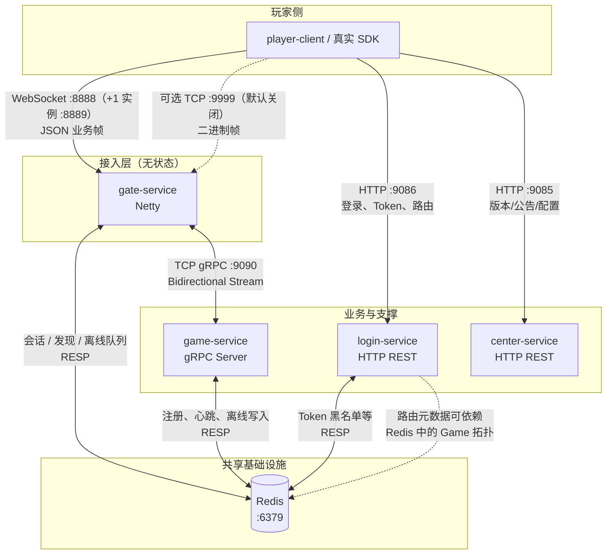
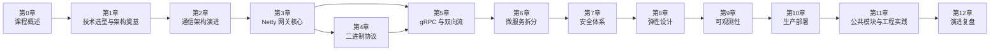

# 第 0 章：课程概述

本系列面向**游戏与网关领域从业者**（Level 4）：默认你已熟悉长连接网关、会话模型、服务发现与 gRPC/Netty 的基本语义。下文聚焦 **GateDemo 的拓扑、协议边界、版本化的技术选型**，以及后续章节的阅读路径。

---

## 1. 项目全景架构

GateDemo 将**玩家接入**与**有状态游戏逻辑**解耦：Gate 无状态水平扩展，Game 通过 Redis 注册/心跳暴露拓扑；Login 负责认证与路由推荐，Center 负责版本与配置类 HTTP 接口。玩家侧典型路径为：HTTP 拉配置/登录 → WebSocket（可选 TCP 二进制）长连 Gate → Gate 经 **gRPC 双向流** 与指定 Game 实例交换业务帧。

> **端口约定**（单机默认；Compose 中第二台 Gate 为 8889 / 8891）：Gate 的 Spring `server.port`（如 9083）主要用于 Actuator/Management，与 Netty 对外端口分离。

**数据路径摘要**

| 方向 | 路径 | 说明 |
|------|------|------|
| 上行 | Player → Gate → gRPC stream → Game | `game_msg` 等经 Gate 转 Protobuf 帧 |
| 下行 | Game → stream → Gate → Player | 推送、ACK、错误帧 |
| 离线 | Game → Redis 队列 → 玩家上线时由 Gate/Game 路径消费 | 与 README 中「离线消息」一致 |
| 控制面 | Game ↔ Redis | 服务实例注册与发现；Gate 订阅或轮询拓扑 |

---

## 2. 技术栈说明（含版本）

版本以仓库 **`pom.xml` / 模块 `pom.xml`** 为准；子模块未单独声明的组件继承 Spring Boot **3.2.0** BOM。

### 2.1 核心运行时

| 类别 | 选型 | 版本 / 说明 |
|------|------|-------------|
| 语言 | Java | **17**（`maven.compiler.source/target`） |
| 应用框架 | Spring Boot | **3.2.0**（父 POM） |
| 构建 | Maven | 父工程聚合 6 模块：`common`、`gate-service`、`game-service`、`player-client`、`center-service`、`login-service` |
| IDL / 序列化 | Protocol Buffers + gRPC Java | **protobuf-java 3.24.0**，**grpc-* 1.59.0**（`grpc-netty-shaded`、`grpc-protobuf`、`grpc-stub`；Game 额外 `grpc-services` 供 Health 等） |

### 2.2 Gate 接入与网络

| 类别 | 选型 | 版本 / 说明 |
|------|------|-------------|
| 字节级 I/O | Netty | **4.1.101.Final**（`gate-service` 显式声明 `netty-all`） |
| 应用层协议 | WebSocket（主）+ 可选 TCP | TCP 默认端口 **9999**、`enabled` 默认 **false**（见 `GateConfig.TcpConfig`） |
| JSON | Jackson | 随 Spring Boot 管理版本；含 `jackson-datatype-jsr310` |
| 校验 | Spring Validation | `spring-boot-starter-validation` |

### 2.3 状态与集成

| 类别 | 选型 | 说明 |
|------|------|------|
| Redis | `spring-boot-starter-data-redis` | 会话、发现、离线消息；Login 共用 |
| JWT | JJWT **0.12.5** | Gate 校验；Login 签发（父 POM `dependencyManagement`） |

### 2.4 可观测性与测试

| 类别 | 选型 | 版本 |
|------|------|------|
| 指标 | Micrometer Core + Prometheus registry | **1.12.2**（父属性） |
| 追踪桥接 | Micrometer Tracing → OpenTelemetry | **1.2.1** |
| 导出 | OpenTelemetry Zipkin exporter | **1.35.0** |
| 结构化日志 | Logstash Logback Encoder | **8.1** |
| Gate 集成测试 | Testcontainers | **1.19.3** |
| 覆盖率 | JaCoCo | **0.8.11** |

### 2.5 公共模块

**`common`**：承载 `proto` 编译产物与共享模型，避免各服务重复生成 gRPC/Protobuf 类；网关与 Game 均依赖该模块。

---

## 3. 教程路线图（第 0–12 章）

- **第 0 章**（本文）：全景、技术栈、学习路径与前置知识。  
- **第 1–12 章**：按项目**真实演进顺序**组织——从早期 Spring/Redis 尝试，到 Netty 网关、gRPC 流、微服务拆分，再到安全、弹性、可观测性与 K8s 部署。

**各章主题与关联**

| 章节 | 标题 | 关注点 |
|------|------|--------|
| 0 | 课程概述 | 拓扑、端口/协议、路线图、前置能力 |
| 1 | 技术选型与架构奠基 | Java 17 / Spring Boot 3.2、多模块边界、为何网关与游戏分离 |
| 2 | 通信架构演进 — 去 Redis 与 Gate 独立 | 从 Streams/HTTP 简化到 Gate 独立进程的设计动因 |
| 3 | Netty 网关核心 — WebSocket 与 TCP 双协议 | Pipeline、线程模型、与 Spring 生命周期协作 |
| 4 | 自定义二进制协议设计 | 帧格式、与 JSON 路径的并存策略 |
| 5 | gRPC 通信 — 从单次调用到双向流 | `ManagedChannel` 池、流控、与 Protobuf `bytes` 载荷 |
| 6 | 微服务拆分 — Center、Login 与服务发现 | HTTP 边界、Redis 拓扑、路由契约 |
| 7 | 安全体系 — 认证、加密与防护 | JWT、可选 AES、TLS 配置入口 |
| 8 | 弹性设计 — 限流、熔断与优雅关停 | 背压、断连、Drain 行为 |
| 9 | 可观测性 — 指标、日志与追踪 | Prometheus、结构化日志、OTel/Zipkin |
| 10 | 生产部署 — 多环境、Docker 与 Kubernetes | Compose、镜像、K8s 清单与配置分离 |
| 11 | 公共模块与工程实践 | `common`/Proto 单一事实源、CI、测试分层 |
| 12 | 演进复盘与未来规划 | OpenSpec/文档与代码的对应、已知局限与扩展方向 |

第 3 章与第 4 章均依赖第 2 章的「Gate 独立」结论；第 5 章在协议与网络上承接第 3–4 章并对接 Game；第 7–10 章假设你已理解第 5–6 章的请求路径与数据面。

---

## 4. 前置知识要求（Level 4）

以下能力**默认已具备**，教程中不会从零讲解语法或框架入门：

1. **长连接网关**：连接生命周期、心跳、踢线、广播与单播语义；理解无状态 Gate 为何依赖外部会话存储。  
2. **TCP / WebSocket**：帧边界、半包粘包、TLS 终止位置对接入的影响。  
3. **gRPC**：`.proto` 代码生成、一元与流式 RPC、`Status`/`Metadata`、Keep-alive 与 HTTP/2 下的连接复用。  
4. **Netty**：`ChannelPipeline`、`EventLoop`、内存与线程模型；能读懂 Handler 链上的编解码与业务分离。  
5. **Redis 实战**：String/Hash/List 等在本项目中的角色（会话、注册表、队列）；哨兵/集群在配置上的开关（见 `application.yml` 注释）。  
6. **Spring Boot 运维面**：Profile、`ConfigurationProperties`、Actuator 端点与容器内健康检查的配合。  
7. **Kubernetes / 可观测性**（第 9–10 章深度使用）：Deployment、ConfigMap、Service、Prometheus 拉取指标的基本概念。

若你主要做客户端或纯后端 API，建议先浏览 **第 1、3、5、6 章** 再按需深入安全与部署章节。

---

## 5. 与本仓库的对应关系

- **运行与端口**：以根目录 `README.md` 与 `docker-compose.yml` 为准。  
- **协议示例**：README「消息协议」一节给出 WebSocket JSON 样例；生产路径以代码与 `proto/` 为准。  
- **设计文档**：`docs/` 下持久化、Redis Key、背压等专题与第 8–11 章互补。

下一章：**第 1 章 — 技术选型与架构奠基**。
