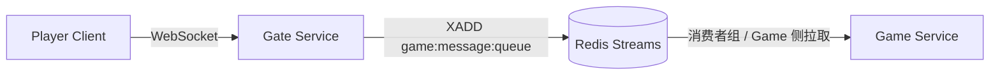

# 第 1 章：技术选型与架构奠基

> **读者预设**：熟悉游戏网关、长连接与微服务边界；本章不解释「什么是 WebSocket」，而说明**为何在 Demo 阶段锁定 Java 技术栈、如何用 Maven 切分模块，以及为何曾用 Redis Streams 承载 Gate→Game**。

---

## 1. 问题引入

要做的是一个**可演进的网关演示**：玩家经长连接接入，消息需送达游戏逻辑服，且后续要叠加认证、限流、多实例与可观测性。初期约束包括：

- **单一语言与生态**：团队维护成本、Spring 生态成熟度、与 Netty/gRPC 的衔接。
- **快速验证端到端路径**：先跑通「客户端 → 网关 → 游戏服」，再迭代协议与中间件。
- **解耦 Gate 与 Game 进程**：两者独立部署、可水平扩展，中间需要**缓冲、持久化或至少可回溯**的通道，避免「Game 短暂不可用即丢光上行消息」。

在这些前提下，项目从第一天就定位为 **Java 实现**（仓库首版即 `Spring Boot 3.2`），而非脚本语言原型再迁移——避免双栈并行与二次建模成本。

---

## 2. 设计决策

### 2.1 技术栈：Java 17 + Spring Boot 3.2 + Redis Streams

| 备选方向 | 优点 | 在本项目中的取舍 |
|----------|------|------------------|
| 更低层 C++/Rust 网关 | 极限性能、资源可控 | Demo 阶段开发/运维成本高，与业务服（JVM）割裂 |
| 仅 Servlet/Web 栈 | 上手快 | 长连接与高并发 I/O 非其强项 |
| **Java 17 + Spring Boot 3.2** | 统一生态、依赖治理、观测与配置成熟 | **选定**：父 POM 继承 `spring-boot-starter-parent:3.2.0`，`java.version=17` |
| Kafka / RabbitMQ | 吞吐与语义丰富 | 部署与运维重于 Demo 目标 |
| **Redis Streams** | 持久化、消费者组、与网关侧 Redis（会话/黑名单等）同栈 | **选定（初期 Gate→Game 通道）**：见 `docs/设计文档.md` 2.3 节与 `docs/开发方案.md` 队列方案对比 |

**Redis Streams 的定位**（设计文档中的论证）：相对 Pub/Sub，Stream 提供持久化与消费者组，适合「多 Gate 实例 + 下游 Game 消费」的草图；相对 Kafka，组件少、与已有 Redis 复用。**代价**是：把**实时交互链路**绑在另一套存储语义上，带来延迟、故障面与运维复杂度——这正是第 2 章要拆掉的原因（此处只记录**当时的合理起点**）。

### 2.2 Maven 多模块划分

原则：**按可部署单元与复用边界切分**，而不是按「层」机械分包。

- **`common`**：Proto 编译产物、跨服务 DTO，避免 gate/game/login 重复生成 gRPC 类。
- **`gate-service` / `game-service`**：核心演示路径，依赖最重（Netty、gRPC、Redis 等）。
- **`player-client`**：联调与压测客户端，独立生命周期。
- **`center-service` / `login-service`**：演进后期拆出的配置与登录路由；父 POM 预留 `dependencyManagement` 统一版本。

### 2.3 初始通信拓扑：WebSocket + Redis Streams



Gate 负责会话与鉴权前置；**下行到 Game** 通过 Stream 解耦进程与时间差。离线消息可复用 Stream 按玩家分 key 的设计（`docs/设计文档.md` 3.5、`docs/开发方案.md` 离线策略）。

---

## 3. 核心实现

### 3.1 父 POM：版本与模块锚点

```14:42:/Users/lizhiwei/Work/Lzw/GateDemo/pom.xml
    <parent>
        <groupId>org.springframework.boot</groupId>
        <artifactId>spring-boot-starter-parent</artifactId>
        <version>3.2.0</version>
        <relativePath/>
    </parent>

    <modules>
        <module>common</module>
        <module>gate-service</module>
        <module>game-service</module>
        <module>player-client</module>
        <module>center-service</module>
        <module>login-service</module>
    </modules>

    <properties>
        <java.version>17</java.version>
        <maven.compiler.source>17</maven.compiler.source>
        <maven.compiler.target>17</maven.compiler.target>
        <project.build.sourceEncoding>UTF-8</project.build.sourceEncoding>
        <grpc.version>1.59.0</grpc.version>
        <protobuf.version>3.24.0</protobuf.version>
        ...
    </properties>
```

`dependencyManagement` 中集中声明 `grpc-*`、`protobuf-java`、`jjwt-*`、Micrometer 等，子模块不写版本号即可对齐——这是多模块 Java 服务长期可维护的关键。

### 3.2 `gate-service` 依赖画像（接入 + Redis + 后续 Netty/gRPC）

```17:83:/Users/lizhiwei/Work/Lzw/GateDemo/gate-service/pom.xml
    <dependencies>
        <!-- Common module (Proto classes, shared DTOs) -->
        <dependency>
            <groupId>com.clawai.gatedemo</groupId>
            <artifactId>common</artifactId>
        </dependency>

        <!-- Spring Boot Starters -->
        <dependency>
            <groupId>org.springframework.boot</groupId>
            <artifactId>spring-boot-starter-web</artifactId>
        </dependency>
        <dependency>
            <groupId>org.springframework.boot</groupId>
            <artifactId>spring-boot-starter-websocket</artifactId>
        </dependency>
        ...
        <!-- Netty -->
        <dependency>
            <groupId>io.netty</groupId>
            <artifactId>netty-all</artifactId>
            <version>4.1.101.Final</version>
        </dependency>
        ...
        <!-- Redis -->
        <dependency>
            <groupId>org.springframework.boot</groupId>
            <artifactId>spring-boot-starter-data-redis</artifactId>
        </dependency>
```

说明：当前主干在**玩家面**已以 Netty 自建 WebSocket 为主（见第 2 章），但 POM 仍保留 `starter-websocket` 等历史与辅助能力；**Redis** 则继续承担集群状态、离线消息、限流等横切能力，与「是否用 Stream 做 Gate→Game」是正交决策。

### 3.3 Gate→Game：Redis Stream 生产者（`MessageQueueProducer`）

下列代码体现**初期「先入队、后消费」**的落地方式：`game:message:queue` 作为统一 Stream，字段扁平化为 Redis hash；离线消息按玩家拆 key（`game:offline:messages:{playerId}`）。

```78:101:/Users/lizhiwei/Work/Lzw/GateDemo/gate-service/src/main/java/com/clawai/gatedemo/gate/queue/MessageQueueProducer.java
    public String sendToGame(Long playerId, short messageId, Map<String, Object> messageData) {
        try {
            Map<String, Object> message = new HashMap<>();
            message.put("player_id", playerId);
            message.put("message_id", messageId);
            message.put("timestamp", System.currentTimeMillis());
            message.put("data", messageData);

            RecordId recordId = redisTemplate.opsForStream().add(StreamRecords.newRecord()
                    .in(STREAM_KEY)
                    .ofMap(message));

            logger.debug("Message sent to game queue: playerId={}, msgId={}, recordId={}",
                    playerId, messageId, recordId);

            return recordId != null ? recordId.getValue() : null;
        } catch (Exception e) {
            logger.error("Failed to send message to game queue: {}", e.getMessage());
            return null;
        }
    }
```

消费者侧（`MessageQueueConsumer`）创建消费者组、`XREADGROUP` 阻塞拉取、`XACK` 提交——典型 **at-least-once** 管线；与实时对战低延迟目标之间存在张力，第 2 章会展开。

### 3.4 消息与协议基调（设计文档层）

`docs/设计文档.md` 将客户端报文定为 **14 字节头 + body**（flags / sequence / messageId / bodyLength / requestId），并采用 **FNV 派生 16 位消息 ID**——这是「在 JSON 与 Protobuf 之外的第三条路」：**带宽可控 + 手工演进**。该决策与本章栈选型一致：都在 JVM 上完成编解码与热路径优化，为后续二进制协议与 gRPC 铺路。

---

## 4. 演进复盘

| 维度 | 当时收益 | 遗留或代价 |
|------|----------|------------|
| Java 17 / Boot 3.2 | 依赖治理、虚拟线程友好、Jakarta 命名空间统一 | Gate 进程同时扛 Netty I/O 与 Spring 生命周期，需警惕**线程模型混用**（业务线程池 vs EventLoop） |
| 多模块 | `common` 收敛 Proto，避免重复编译与版本漂移 | 模块增多后 CI 需分层构建（可只测变更模块） |
| Redis Streams 作 Gate→Game | 解耦、持久化、多消费者组扩展叙事清晰 | **额外一跳延迟**、Redis 故障即通道故障、消费滞后时**交互体验难预测**；与「同步型」游戏操作语义不匹配时需另找背压策略 |

`MessageQueueConsumer` 中若 Stream 不可用则直接降级日志并 return，说明 Stream 路径在工程上被当作**可选增强**而非强依赖核心链路——为后续去掉 Stream、改直连埋下伏笔。

---

## 5. 扩展思考

1. **若坚持 Stream 作入站缓冲**：如何定义 **PENDING** 积压告警、**死信**与重试策略？Game 消费失败时是否允许 `XCLAIM` 转移？
2. **与 Kafka 对比**：何种 QPS / 留存时长 / 多租户隔离会迫使从 Redis Stream 迁出？迁移时如何保持 gateId、playerId、msgType 等字段不变？
3. **练习**：阅读 `docs/开发方案.md` 阶段三中「消息队列缓冲」小节，画出 **Gate 实例数变化时** 消费者组分区与 Redis 内存增长的估算公式。
4. **行业对照**：商业手游网关常见「接入层无状态 + 逻辑服有状态」；Stream 更适合 **异步任务、邮件、公会通知** 等可延迟管道，而非主战斗指令——思考你们项目中哪些消息类型应**永不**进 Stream。

---

**下一章预告**：第 2 章讨论为何拆除 Gate↔Game 的 Redis 中介、如何用 HTTP（`RestClient`）过渡，以及 Gate **接入层 Netty 化**以换取流水线可控性与性能空间。
