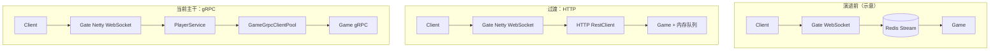

# 第 2 章：通信架构演进 — 去 Redis 与 Gate 独立

> **读者预设**：理解 Redis Streams 语义与 HTTP/gRPC 延迟量级差异；本章聚焦**为何拆掉 Gate→Game 的 Stream 中介**、**HTTP 直连的过渡形态**，以及 **Gate 在 I/O 路径上 Netty 化**的动机与代码落点。

---

## 1. 问题引入

第 1 章中，Gate→Game 经 **Redis Streams**（如 `game:message:queue`）解耦，带来持久化与消费者组叙事，但在**实时游戏网关**场景下暴露三类问题：

1. **延迟与尾延迟**：每条上行消息至少经历「序列化 → 网络 → Redis → 再被 Game 拉取」；阻塞读、网络抖动与 Redis 单点会放大 P99。
2. **语义错配**：许多操作期望**近似同步**的背压（Game 忙则 Gate 立刻感知），而 Stream 默认是**日志型、消费者拉取**，需额外设计超时、重试与幂等，复杂度回到应用层。
3. **运维与故障域**：Redis 既做会话/黑名单又做**主业务管道**时，一次内存上限或慢查询可能同时击穿上行与辅助能力。

因此演进目标变为：**缩短 Gate→Game 路径**，先去掉 Stream；同时在 **玩家接入侧**摆脱 Spring WebSocket 的「黑盒」，把 **TCP/WebSocket 流水线、空闲检测、TLS** 收到可控的 Netty `ChannelPipeline` 中。

---

## 2. 设计决策

### 2.1 去掉 Redis Streams（针对 Gate→Game）

| 方案 | 优点 | 缺点 |
|------|------|------|
| 保留 Stream | 削峰、持久化、多实例消费 | 延迟高、语义重、Redis 压力大 |
| **HTTP 同步/异步 POST** | 实现快、与 Spring 3.2 `RestClient` 一致、易抓包调试 | 无内置持久化；Game 需自管内存队列与丢弃策略 |
| gRPC 长连接（后续） | 低延迟、流控、二进制契约 | 需 Proto、连接池与双向流生命周期管理 |

**决策**：先用 **HTTP 直连** 验证「无 Redis 管道」的可行性（见仓库内 `NOREDIS_MIGRATION_REPORT.md`）；稳定后再切换到 **gRPC**（当前 `PlayerService` + `GameGrpcClientPool`）。

### 2.2 HTTP 过渡：`RestClient` + Game 侧 `/api/game/receive`

过渡期的契约是 **JSON 负载**，由 Gate 组装 `gateId/playerId/gameId/msgType/seq/timestamp/body`，Game 用内存结构（如 `ConcurrentHashMap` + `LinkedBlockingQueue`）缓冲。**代价**明确写在迁移报告中：Game **有状态**、重启丢缓存、水平扩展需分片或粘性路由——这些是**有意换取**路径简化。

### 2.3 Gate「独立」为 Netty：指 **接入层**，而非去掉 Spring Boot

当前仓库中，进程入口仍是 `@SpringBootApplication`（`GateServiceApplication`），**Spring 负责配置、Bean 生命周期、gRPC 客户端、调度与 Actuator**；**玩家连接**则由 **`NettyWebSocketServer` 自建 `ServerBootstrap`**，在 `ChannelPipeline` 上挂载 HTTP 编解码、聚合、`WebSocketServerProtocolHandler`、`IdleStateHandler` 与业务 `GateNettyWebSocketHandler`。

这种拆法的**决策动机**是：

- **性能**：减少抽象层、精确控制 `SO_KEEPALIVE`、`TCP_NODELAY`、线程组大小与 SSL 插入点。
- **行为一致性**：WebSocket 与后续 **TCP 二进制端口**（`NettyTcpServer`）可共享同一套帧编解码与业务 handler 思路。
- **背压可见性**：可在 EventLoop 与业务线程池之间显式划分，避免阻塞 IO 线程（例如 `forwardToGame` 异步化）。

若未来要做到「进程级无 Spring」，属于下一阶段（需自管配置源、指标、优雅退出），与本 Demo 当前边界不同。

---

## 3. 核心实现

### 3.1 架构对比（演进心智图）



### 3.2 历史片段：HTTP 直连（`feature/noRedis` / 提交 `41de887`）

下列代码**不在当前主干**，但真实存在于项目 Git 历史中；`NOREDIS_MIGRATION_REPORT.md` 亦描述了相同契约。引用它是为了说明**过渡实现**如何刻意保持 Gate 侧模型不变（`PlayerMessage`、playerId、gameId），仅替换传输层。

```java
// 历史：gate-service ... PlayerService（commit 41de887 附近）
public void forwardToGame(Long playerId, Integer gameId, PlayerMessage message) {
    String gameUrl = httpClientConfig.getGameBaseUrl() + "/api/game/receive";

    Map<String, Object> payload = Map.of(
        "gateId", gateConfig.getId(),
        "playerId", playerId,
        "gameId", gameId,
        "msgType", message.getMsgType() != null ? message.getMsgType() : "unknown",
        "seq", message.getSeq() != null ? message.getSeq() : 0,
        "timestamp", System.currentTimeMillis(),
        "body", message.getBody()
    );

    restClient.post()
        .uri(gameUrl)
        .contentType(MediaType.APPLICATION_JSON)
        .body(payload)
        .retrieve()
        .toBodilessEntity();
}
```

**品读点**：`toBodilessEntity()` 表示 Gate 只关心「是否投递成功」，不等待业务结果——适合 fire-and-forget 的初版，但**请求-响应型**玩法需再引入 correlation id 或改 gRPC。

### 3.3 当前：Netty WebSocket 服务器嵌入 Spring 生命周期

```72:106:/Users/lizhiwei/Work/Lzw/GateDemo/gate-service/src/main/java/com/clawai/gatedemo/gate/ws/NettyWebSocketServer.java
    @PostConstruct
    public void start() {
        logger.info("Starting Netty WebSocket server on port {}", gateConfig.getPort());
        ...
        bossGroup = new NioEventLoopGroup(1);
        workerGroup = new NioEventLoopGroup();

        try {
            ServerBootstrap bootstrap = new ServerBootstrap();
            bootstrap
                .group(bossGroup, workerGroup)
                .channel(NioServerSocketChannel.class)
                .childHandler(new ChannelInitializer<SocketChannel>() {
                    @Override
                    protected void initChannel(SocketChannel ch) {
                        ChannelPipeline pipeline = ch.pipeline();
                        if (sslContext != null) {
                            pipeline.addLast("ssl", sslContext.newHandler(ch.alloc()));
                        }
                        pipeline.addLast("httpCodec", new HttpServerCodec());
                        pipeline.addLast("chunkedWriter", new ChunkedWriteHandler());
                        pipeline.addLast("httpAggregator", new HttpObjectAggregator(8192));
                        pipeline.addLast("wsProtocol", new WebSocketServerProtocolHandler("/ws"));
                        pipeline.addLast("idleState", new IdleStateHandler(300, 0, 0, TimeUnit.SECONDS));
                        pipeline.addLast("businessHandler", gateWebSocketHandler);
                    }
                })
```

`@PostConstruct` / `@PreDestroy` 把 Netty 与 Spring 容器**同生命周期**绑定；`stopAccepting()` 又支持优雅关停的第一阶段（先关 server channel）。这是「Spring 为壳、Netty 为刃」的典型整合方式。

### 3.4 当前：连接表与下游调用（gRPC）

同一演进轴上，**会话表**从 `WebSocketSession` 迁为 **`Channel` + `AttributeKey`**，便于与 TCP 二进制链路统一；下游由 HTTP 换为 **gRPC 连接池**（并 `runAsync` 避免阻塞 EventLoop）：

```267:289:/Users/lizhiwei/Work/Lzw/GateDemo/gate-service/src/main/java/com/clawai/gatedemo/gate/service/PlayerService.java
    public void forwardToGame(Long playerId, Integer gameId, PlayerMessage message) {
        if (gameId == null) {
            logger.warn("⚠️ 消息缺少 gameId，无法转发");
            return;
        }

        CompletableFuture.runAsync(() -> {
            boolean success = gameGrpcClientPool.sendGameMessage(
                gameId,
                playerId,
                message.getMsgType() != null ? message.getMsgType() : "unknown",
                message.getSeq() != null ? message.getSeq().intValue() : 0,
                message.getBody() != null ? message.getBody() : Map.of()
            );
            ...
        });
    }
```

类文件头注释直接对比了 **HTTP 短连接** 与 **gRPC 长连接** 的取舍，可视为对第 2 章 HTTP 阶段的「官方复盘」。

### 3.5 Stream 组件在今天的位置

`MessageQueueProducer` / `MessageQueueConsumer` 仍保留在仓库中，用于**离线消息、队列叙事或兼容路径**；主业务转发已走 gRPC。阅读时需区分：**Redis Stream 作为通用设施未消失，但作为 Gate→Game 主链路的中介已被取代**。

---

## 4. 演进复盘

| 阶段 | 得到什么 | 付出什么 |
|------|----------|----------|
| Stream 作主通道 | 解耦、持久化故事简单 | 延迟、语义、Redis 耦合 |
| HTTP 直连 | 路径最短、调试成本低 | Game 内存队列有状态、扩展难 |
| Netty 接入 + gRPC 下游 | I/O 可控、长连接与双向流、二进制友好 | 连接池、TLS、流式背压与熔断需完整运维故事 |

**未消债务**：`PlayerService` 中 `ConcurrentHashMap<Long, Channel>` 在**多 Gate 实例**下仍不共享——需配合 `login-service` 路由、Redis 会话或粘性负载；这是架构演进在**第 6 章（微服务拆分）**继续展开的主题，而非本章能一次解决。

---

## 5. 扩展思考

1. **若保留 HTTP 而不上 gRPC**：HTTP/2 多路复用 + `RestClient` 连接池能否满足你们的 QPS？瓶颈会在 JSON 序列化还是内核 `connect()`？
2. **背压**：从 Stream 迁到同步 HTTP 再迁到 gRPC Stream，**背压信号**分别从何处来（Redis 队列长度？HTTP 429？gRPC flow-control）？
3. **练习**：对照 `NOREDIS_MIGRATION_REPORT.md` 中的 JSON 契约，写出一个 **Protobuf `GameMessage`** 字段映射表（当前仓库已实现，可自行核对 `proto/game_service.proto`）。
4. **行业实践**：大型项目常把 **「可丢、可延迟」** 与 **「不可丢、低延迟」** 消息分层；请列举你们业务中各属哪一类，并判断是否应经过 Redis/Kafka。

---

**下一章预告**：第 3 章将深入 **Netty 网关双协议（WebSocket + TCP）**、粘包拆包与心跳在流水线中的位置。
