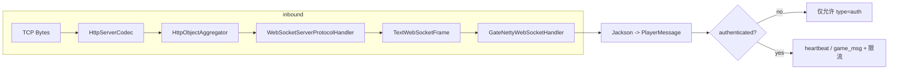
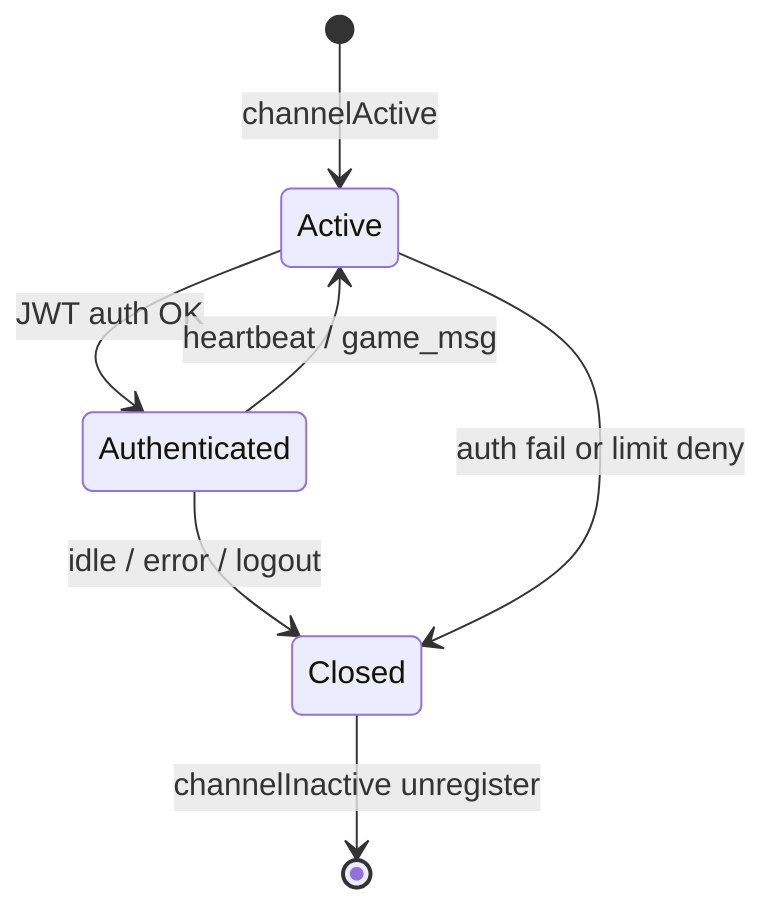

# 第 3 章：Netty 网关核心 — WebSocket 与 TCP 双协议

**读者定位**：已熟悉游戏网关与长连接场景的工程师。本章聚焦为何在 Spring Boot 内嵌 Netty、Pipeline 如何分层、TCP/WS 两条链路的差异与统一方式，以及连接与心跳策略的取舍。

---

## 1. 问题引入

网关需要同时满足：**浏览器/小游戏** 侧易接入（WebSocket + JSON）、**原生客户端** 侧追求带宽与解析成本（二进制帧）。若完全依赖 Spring WebSocket 或 Servlet 栈，往往在 **背压、线程模型、TLS 与 Handler 顺序** 上受框架约束；若纯自建 Netty，又需与 Spring 的 Bean 生命周期、配置中心、限流熔断等治理能力对齐。

本仓库的演进阶段呈现为：**WebSocket 路径** 已作为生产形态跑在 Netty 上（`NettyWebSocketServer` + `GateNettyWebSocketHandler`），并与 `PlayerService`、gRPC 下游深度集成；**TCP 二进制路径** 具备完整的编解码与心跳骨架（`GameMessageDecoder`/`Encoder`、`TcpChannelInitializer`、`TcpHeartbeatHandler`），但启动装配与业务分发仍与 WS 路径 **未完全收敛** —— 这在第 4 章协议层会更明显。

---

## 2. 设计决策

| 选项 | 优点 | 代价 |
|------|------|------|
| 仅用 Spring WebSocket | 与 MVC/Security 集成顺滑 | Reactor/Servlet 抽象下细粒度 Pipeline 控制弱；高定制心跳与限流需绕路 |
| 独立 Netty 进程 | 边界清晰 | 运维与配置分裂；与 Spring 生态二次集成成本高 |
| **Spring 管理 Bean + Netty `ServerBootstrap`（当前 WS）** | 统一配置与依赖注入；`@PostConstruct`/`@PreDestroy` 对齐生命周期；可 Sharable Handler 复用 | 需注意 **不要在 IO 线程做阻塞**；EventLoop 与业务线程边界要自行守护 |
| TCP 与 WS **协议不同、模型可统一** | WS 用 `PlayerMessage` JSON；TCP 用 `WrappedMessage` + `MessageHeader` | 需约定「同一业务语义」在两边的映射，或后续抽象统一入口 |

**心跳**：WebSocket 侧采用 **`IdleStateHandler` 读空闲 300s** + 业务层 `heartbeat` 消息续期（与空闲阈值解耦）；TCP 侧示例为 **60s 读空闲** 直接断链（`TcpHeartbeatHandler` 继承 `IdleStateHandler` 并覆写 `channelIdle`）。

**连接上限**：WS 在 `channelActive` 经 `ConnectionLimiter` 准入，断开时在 `channelInactive` 释放配额，避免文件句柄与内存被拖垮。

---

## 3. 核心实现

### 3.1 为什么从 Spring WebSocket 迁移到 Netty

**动机归纳**：在网关场景需要 **显式 Pipeline**（HTTP 升级、WS 协议、TLS、空闲检测、业务 Handler）以及 **可预测的线程语义**；Netty 把「协议栈」与「业务处理」拆成可组合 Handler，便于按连接做限流、鉴权与观测。

WebSocket 入口由 Spring 组件托管，启动时绑定端口并装配 Pipeline（含可选 TLS）：

```72:106:gate-service/src/main/java/com/clawai/gatedemo/gate/ws/NettyWebSocketServer.java
    @PostConstruct
    public void start() {
        logger.info("Starting Netty WebSocket server on port {}", gateConfig.getPort());

        if (gateConfig.getTls().isEnabled()) {
            try {
                sslContext = TlsSslContextFactory.buildServerContext(gateConfig.getTls());
                logger.info("TLS enabled for WebSocket (wss://)");
            } catch (Exception e) {
                throw new RuntimeException("Failed to initialize TLS for WebSocket", e);
            }
        }

        bossGroup = new NioEventLoopGroup(1);
        workerGroup = new NioEventLoopGroup();

        try {
            ServerBootstrap bootstrap = new ServerBootstrap();
            bootstrap
                .group(bossGroup, workerGroup)
                .channel(NioServerSocketChannel.class)
                .childHandler(new ChannelInitializer<SocketChannel>() {
                    @Override
                    protected void initChannel(SocketChannel ch) {
                        ChannelPipeline pipeline = ch.pipeline();
                        if (sslContext != null) {
                            pipeline.addLast("ssl", sslContext.newHandler(ch.alloc()));
                        }
                        pipeline.addLast("httpCodec", new HttpServerCodec());
                        pipeline.addLast("chunkedWriter", new ChunkedWriteHandler());
                        pipeline.addLast("httpAggregator", new HttpObjectAggregator(8192));
                        pipeline.addLast("wsProtocol", new WebSocketServerProtocolHandler("/ws"));
                        pipeline.addLast("idleState", new IdleStateHandler(300, 0, 0, TimeUnit.SECONDS));
                        pipeline.addLast("businessHandler", gateWebSocketHandler);
                    }
                })
```

**要点**：TLS → HTTP 编解码 → 聚合 → `WebSocketServerProtocolHandler` → 空闲检测 → **单例可共享** 的业务 Handler（`@ChannelHandler.Sharable`），避免每连接 new 一套有状态的 Spring Bean。

---

### 3.2 Netty Pipeline 与 Handler 设计

WebSocket 业务侧使用 `SimpleChannelInboundHandler<TextWebSocketFrame>`，把 **帧边界** 交给 Netty，把 **JSON 语义** 交给 Jackson + `PlayerMessage`：

```112:161:gate-service/src/main/java/com/clawai/gatedemo/gate/handler/GateNettyWebSocketHandler.java
    @Override
    protected void channelRead0(ChannelHandlerContext ctx, TextWebSocketFrame frame) throws Exception {
        String text = frame.text();
        logger.debug("收到消息：{}", text);

        PlayerMessage message = objectMapper.readValue(text, PlayerMessage.class);
        String validationError = messageValidator.validate(message);
        if (validationError != null) {
            sendError(ctx, "INVALID_MESSAGE", validationError);
            return;
        }

        String type = message.getType();

        // Global rate limit check
        if (!globalRateLimiter.tryAcquire("global")) {
            sendError(ctx, "RATE_LIMITED", "Server rate limit exceeded");
            return;
        }

        Boolean authenticated = ctx.channel().attr(AUTHENTICATED).get();

        if (!Boolean.TRUE.equals(authenticated)) {
            if ("auth".equals(type)) {
                handleAuth(ctx, message);
            } else {
                logger.warn("未认证连接发送非认证消息，关闭连接：{}", ctx.channel().remoteAddress());
                ctx.close();
            }
            return;
        }

        // Per-player rate limit (heartbeat exempt)
        if (!"heartbeat".equals(type)) {
            Long rateLimitPlayerId = ctx.channel().attr(PlayerService.PLAYER_ID_KEY).get();
            String key = rateLimitPlayerId != null ? String.valueOf(rateLimitPlayerId) : ctx.channel().id().asShortText();
            if (!perPlayerRateLimiter.tryAcquire(key)) {
                sendError(ctx, "RATE_LIMITED", "Too many requests");
                return;
            }
        }

        if ("heartbeat".equals(type)) {
            handleHeartbeat(ctx, message);
        } else if ("game_msg".equals(type)) {
            handleGameMessage(ctx, message);
        } else {
            logger.warn("未知消息类型：{} from {}", type, ctx.channel().remoteAddress());
        }
    }
```

**Pipeline 数据流（WebSocket 文本路径）**：



**设计取舍**：鉴权前仅允许 `auth`，避免半开连接刷业务接口；`heartbeat` 豁免 per-player 限流，防止心跳与业务抢令牌；全局限流保护进程级资源。

---

### 3.3 TCP 服务器实现与双协议统一

TCP 侧在 `NettyTcpServer` 中直接挂上 **二进制编解码** 与 `TcpMessageHandler`：

```30:44:gate-service/src/main/java/com/clawai/gatedemo/gate/tcp/NettyTcpServer.java
        ServerBootstrap bootstrap = new ServerBootstrap();
        bootstrap.group(bossGroup, workerGroup)
                .channel(NioServerSocketChannel.class)
                .option(ChannelOption.SO_BACKLOG, 128)
                .childOption(ChannelOption.SO_KEEPALIVE, true)
                .childOption(ChannelOption.TCP_NODELAY, true)
                .childHandler(new ChannelInitializer<SocketChannel>() {
                    @Override
                    protected void initChannel(SocketChannel ch) throws Exception {
                        ChannelPipeline pipeline = ch.pipeline();
                        pipeline.addLast(new GameMessageDecoder());
                        pipeline.addLast(new GameMessageEncoder());
                        pipeline.addLast(new TcpMessageHandler(null));
                    }
                });
```

`TcpMessageHandler` 在解码得到 `WrappedMessage` 后交给 `MessageDispatcher`：

```28:40:gate-service/src/main/java/com/clawai/gatedemo/gate/tcp/TcpMessageHandler.java
    @Override
    protected void channelRead0(ChannelHandlerContext ctx, WrappedMessage message) throws Exception {
        if (message == null || message.getHeader() == null) {
            return;
        }

        MessageHeader header = message.getHeader();
        short messageId = header.getMessageId();

        logger.debug("TCP received: msgId={}, seq={}", messageId, header.getSequence());

        dispatcher.dispatch(ctx, message);
    }
```

**双协议「统一」的现状语义**：  
- **统一在网关进程内共存**：WS 走 JSON 文本帧 + `PlayerService.forwardToGame`；TCP 走 `WrappedMessage` + `MessageDispatcher`。  
- **尚未统一在单一抽象**：例如 TCP 路径未复用 WS 的 JWT 黑名单、连接数限制、gRPC 熔断等横切逻辑（可演进方向见第 5 节）。

另：`TcpChannelInitializer` 定义了 **Idle + TcpHeartbeatHandler + 编解码** 的顺序，与 `NettyTcpServer` 当前内联 Pipeline **不一致**，且其中连续两个 `IdleStateHandler` 语义重叠，属于后续整合时应理顺的技术点：

```19:26:gate-service/src/main/java/com/clawai/gatedemo/gate/tcp/codec/TcpChannelInitializer.java
    @Override
    protected void initChannel(SocketChannel ch) throws Exception {
        ch.pipeline()
                .addLast(new IdleStateHandler(60, 0, 0, TimeUnit.SECONDS))
                .addLast(new TcpHeartbeatHandler(60))
                .addLast(decoder)
                .addLast(encoder);
    }
```

---

### 3.4 连接生命周期管理与心跳

**连接准入与踢线**：`channelActive` 获取 `ConnectionLimiter`；认证成功时若同 `playerId` 已在线则关闭旧 Channel，保证 **单点登录** 语义。

**WebSocket 读空闲**：300s 无读事件则 `ctx.close()`，与客户端周期性发送 `heartbeat` 解耦——客户端可远小于 300s 发心跳，服务端 `handleHeartbeat` 仅 `renewHeartbeat` 打日志（当前未写入 `PlayerConnection` 的 `lastHeartbeatTime`，`PlayerConnection` 模型在仓库中可作为后续增强挂载点）。

```255:265:gate-service/src/main/java/com/clawai/gatedemo/gate/handler/GateNettyWebSocketHandler.java
    @Override
    public void userEventTriggered(ChannelHandlerContext ctx, Object evt) throws Exception {
        if (evt instanceof IdleStateEvent) {
            IdleStateEvent event = (IdleStateEvent) evt;
            
            // 判断是哪种空闲事件
            if (event.state() == IdleState.READER_IDLE) {
                // 读空闲：超过 300 秒没有收到玩家消息
                logger.warn("⏰ 玩家心跳超时，关闭连接：{}", ctx.channel().remoteAddress());
                ctx.close();
            }
        } else {
            super.userEventTriggered(ctx, evt);
        }
    }
```

**TCP 心跳超时**：`TcpHeartbeatHandler` 继承 `IdleStateHandler`，在读空闲时关闭连接；静态块从 `MessageIdRegistry` 解析 `heartbeat` 的 messageId（与第 4 章协议 ID 对齐）：

```17:32:gate-service/src/main/java/com/clawai/gatedemo/gate/tcp/heartbeat/TcpHeartbeatHandler.java
    static {
        HEARTBEAT_MSG_ID = MessageIdRegistry.getIdByName("heartbeat");
    }

    public TcpHeartbeatHandler(int readerIdleTimeSeconds) {
        super(readerIdleTimeSeconds, 0, 0, TimeUnit.SECONDS);
    }

    @Override
    protected void channelIdle(ChannelHandlerContext ctx, IdleStateEvent evt) throws Exception {
        if (evt.state() == IdleState.READER_IDLE) {
            logger.warn("TCP heartbeat timeout, closing connection: {}", ctx.channel().remoteAddress());
            ctx.close();
        }
    }
```

**下行推送**：`PlayerService.sendToPlayer` 假定 Channel 上写的是 **`TextWebSocketFrame`** —— 再次印证当前「玩家会话」主路径是 WebSocket；TCP 会话若要与 Game 下行统一，需要单独的编码写出路径。

```220:228:gate-service/src/main/java/com/clawai/gatedemo/gate/service/PlayerService.java
        try {
            // 3. 将对象转换为 JSON 字符串
            String json = objectMapper.writeValueAsString(message);
            
            // 4. 封装为 WebSocket 文本帧
            TextWebSocketFrame frame = new TextWebSocketFrame(json);
            
            // 5. 发送消息
            // writeAndFlush 会异步发送，返回 ChannelFuture
            ChannelFuture future = channel.writeAndFlush(frame);
```

**连接生命周期总览**：



---

## 4. 演进复盘

**已改善**：Netty 托管 WebSocket，Pipeline 顺序清晰；业务 Handler 可注入限流、熔断、校验、JWT；优雅关闭阶段 `stopAccepting` 可与上层关停配合（见 `NettyWebSocketServer.stopAccepting`）。

**仍存技术债**：  
1. `NettyTcpServer` 与 `TcpChannelInitializer` **双轨**，且 `TcpMessageHandler(null)` 使 **分发器为空**，TCP 链路与生产 WS 路径不对等。  
2. `TcpHeartbeatHandler` 与前置 `IdleStateHandler` **重复计时**风险（若以 Initializer 为准装配）。  
3. `PlayerService` / `PlayerConnection`：**内存表 + Channel** 已满足演示；`renewHeartbeat` 未驱动状态机或 Redis 会话，跨实例网关需另设计。  
4. **双协议业务语义**未收敛到同一套「会话 + 路由」抽象，维护成本随消息类型增加而上升。

---

## 5. 扩展思考

1. **统一会话层**：抽象 `PlayerSession`（协议无关），内部持有 `Encoder` 适配器（WS JSON / TCP `WrappedMessage`），`forwardToGame` 只依赖 session id 与 payload。  
2. **IO 与业务隔离**：`forwardToGame` 已 `CompletableFuture.runAsync` 避免阻塞 EventLoop；TCP `MessageDispatcher` 提供 `dispatchAsync` 可按负载切换。  
3. **心跳策略**：对齐 **空闲时间** 与 **应用层 ping 间隔**（建议：ping 间隔 < 1/3 空闲阈值）；TCP 是否下发 `heartbeat_ack` 需与客户端约定与 `MessageIdRegistry` 一致。  
4. **练习**：将 `TcpChannelInitializer` 接到唯一启动入口，补全 `TcpMessageHandler` 的 Spring 注入，并把 WS 侧的 `ConnectionLimiter`、JWT 校验迁到 TCP 首包或 TLS 双向认证后的首帧。

---

*本章代码引用路径以仓库 `gate-service` 为准，行号随版本可能漂移。*
