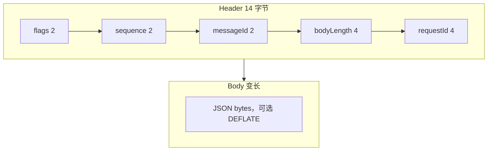
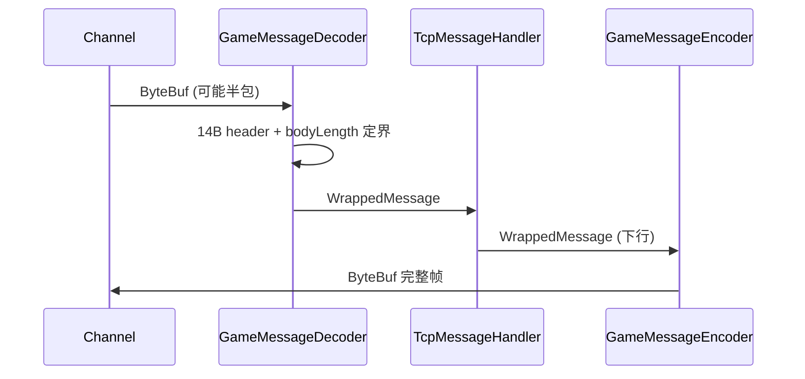

# 第 4 章：自定义二进制协议设计

**读者定位**：熟悉帧协议、粘包半包与消息路由的网关/客户端工程师。本章说明 GateDemo 如何在 **固定头 + 可变体** 上平衡解析效率与业务灵活性，如何用 **FNV-1a + 手工注册表** 管理消息 ID，以及在无独立「协议版本字段」前提下可做的兼容策略。

---

## 1. 问题引入

纯 JSON over WebSocket 易于调试，但原生客户端往往需要：**定长头快速路由**、**序列号 / requestId 关联异步应答**、**可选压缩** 以降低带宽。自定义二进制协议的核心矛盾是：**头部越固定，扩展越难；体越自由，类型安全越差**。本仓库选择 **14 字节头 + JSON 体（`JsonMessageBody`）** 作为折中——头负责网关级元数据，体保持策划友好的结构化载荷（后续可替换为 Protobuf 而不改帧边界）。

---

## 2. 设计决策

| 维度 | 选择 | 理由 |
|------|------|------|
| 帧结构 | 头定长 + `bodyLength` 定界 | `ByteToMessageDecoder` 标准半包处理；避免分隔符扫描 |
| 体格式 | JSON 字节 | 与现有 Jackson/Spring 生态一致；调试成本低 |
| 压缩 | DEFLATE，阈值 64 字节 | 小包头压缩不划算；Encoder 会回退「压缩后更大则不发压缩」 |
| 安全 | `flags` 预留 `FLAG_ENCRYPTED` | 位图扩展加密/压缩/模式；具体加解密可在 Handler 层配合 `MessageEncryptor` |
| 消息类型 ID | `short`（16 bit） | 2 字节 on-wire；65536 种类型对单游戏足够 |
| ID 分配 | **注册表优先，未注册则 FNV-1a 低 16 位** | 稳定、可文档化；避免纯哈希碰撞导致线上歧义 |

---

## 3. 核心实现

### 4.1 协议结构设计（Header + Body）

`MessageHeader` 将 **压缩、加密、请求/响应/推送模式** 编码进 `flags`，并固定 **sequence、messageId、bodyLength、requestId**：

```32:68:gate-service/src/main/java/com/clawai/gatedemo/gate/protocol/model/MessageHeader.java
public class MessageHeader {

    /**
     * 标志位字段
     * bit 15: 压缩标志 (0x8000 = 1000 0000 0000 0000)
     * bit 14: 加密标志 (0x4000 = 0100 0000 0000 0000)
     * bit 7-8: 消息模式 (0x00C0 = 0000 0000 1100 0000)
     */
    private short flags;

    /**
     * 消息序列号
     * 用于消息排序、重复检测、追踪请求-响应对应关系
     * 范围: 0-65535，循环使用
     */
    private short sequence;

    /**
     * 消息ID
     * 标识消息类型，使用FNV哈希算法从消息名称生成
     * 例如: "auth.login" -> 0x1001, "heartbeat" -> 0x2001
     */
    private short messageId;

    /**
     * 消息体长度
     * 单位：字节
     * 用于边界检测和内存分配
     */
    private int bodyLength;

    /**
     * 请求ID
     * 客户端生成，服务器响应时携带相同的requestId
     * 用于关联请求和响应，支持异步消息处理
     */
    private int requestId;
```

`WrappedMessage` 组合头与体（默认体实现为 `JsonMessageBody`）：

```38:72:gate-service/src/main/java/com/clawai/gatedemo/gate/protocol/model/WrappedMessage.java
public class WrappedMessage {

    /**
     * 消息头
     * 包含元数据：标志位、序列号、消息ID、长度、请求ID
     * 固定14字节
     */
    private MessageHeader header;

    /**
     * 消息体
     * 包含实际业务数据
     * 可变长度，使用JSON序列化
     */
    private MessageBody body;
    // ...
    public WrappedMessage(MessageHeader header, MessageBody body) {
        this.header = header;
        this.body = body;
    }
```

**帧布局（与编解码一致）**：



---

### 4.2 编解码器实现（GameMessageEncoder / Decoder）

**编码器**在写出前可能压缩，并 **同步更新** `bodyLength` 与压缩标志位，保证 on-wire 长度与头一致：

```64:112:gate-service/src/main/java/com/clawai/gatedemo/gate/protocol/codec/GameMessageEncoder.java
    @Override
    protected void encode(ChannelHandlerContext ctx, WrappedMessage msg, ByteBuf out) throws Exception {
        // 参数校验：消息或消息头为空则跳过
        if (msg == null || msg.getHeader() == null) {
            return;
        }

        // 步骤1: 提取消息头和消息体
        MessageHeader header = msg.getHeader();
        // 将消息体序列化为字节数组
        byte[] bodyBytes = msg.getBody() != null ? msg.getBody().toBytes() : new byte[0];

        // 步骤2: 判断是否需要压缩
        // 压缩条件：消息头标记为压缩 且 消息体大于阈值
        boolean needCompress = header.isCompressed() && bodyBytes.length > COMPRESS_THRESHOLD;
        byte[] finalBodyBytes = bodyBytes;

        // 步骤3: 执行压缩（如果需要）
        if (needCompress) {
            finalBodyBytes = compress(bodyBytes);
            // 如果压缩失败或压缩后更大，则不压缩
            if (finalBodyBytes == null || finalBodyBytes.length >= bodyBytes.length) {
                finalBodyBytes = bodyBytes;
                needCompress = false;
            }
        }

        // 步骤4: 更新消息头中的压缩标志和长度
        // 注意：必须在写入前更新，因为bodyLength需要反映实际传输的长度
        header.setBodyLength(finalBodyBytes.length);
        header.setCompressed(needCompress);

        // 步骤5: 写入消息头（固定14字节）
        // 写入顺序必须与解码器一致
        out.writeShort(header.getFlags());      // 2字节：标志位
        out.writeShort(header.getSequence());   // 2字节：序列号
        out.writeShort(header.getMessageId());  // 2字节：消息ID
        out.writeInt(header.getBodyLength());   // 4字节：消息体长度
        out.writeInt(header.getRequestId());    // 4字节：请求ID

        // 步骤6: 写入消息体
        if (finalBodyBytes.length > 0) {
            out.writeBytes(finalBodyBytes);
        }
```

**解码器**处理半包、校验 `bodyLength` 上限（10MB），按需 INFLATE，再 `JsonMessageBody.fromBytes`：

```76:149:gate-service/src/main/java/com/clawai/gatedemo/gate/protocol/codec/GameMessageDecoder.java
    @Override
    protected void decode(ChannelHandlerContext ctx, ByteBuf in, List<Object> out) throws Exception {
        // 步骤1: 检查是否读到完整的消息头
        // 消息头固定14字节，不够14字节说明数据不完整（半包）
        if (in.readableBytes() < HEADER_SIZE) {
            return;  // 数据不完整，等待下次数据到达
        }

        // 步骤2: 标记当前位置，以便后续可能的回退
        // 如果后续发现数据仍不完整，可以resetReaderIndex回退
        in.markReaderIndex();

        // 步骤3: 读取消息头（14字节）
        // 读取顺序必须与Encoder写入顺序完全一致
        short flags = in.readShort();      // 2字节：标志位
        short sequence = in.readShort();   // 2字节：序列号
        short messageId = in.readShort();  // 2字节：消息ID
        int bodyLength = in.readInt();     // 4字节：消息体长度
        int requestId = in.readInt();      // 4字节：请求ID

        // 步骤4: 验证消息体长度（安全检查）
        // 负数或超过最大值，可能是恶意攻击
        if (bodyLength < 0 || bodyLength > MAX_BODY_LENGTH) {
            logger.error("Invalid body length: {}, closing connection", bodyLength);
            ctx.close();  // 关闭连接
            return;
        }

        // 步骤5: 检查是否读到完整的消息体
        // 不够则回退readerIndex，等待下次数据到达
        if (in.readableBytes() < bodyLength) {
            in.resetReaderIndex();  // 回退到标记位置
            return;  // 数据不完整，等待下次数据到达
        }
        // ... 组装 WrappedMessage 并 out.add(message)
```

客户端 `player-client` 维护 **对称实现**（`ClientMessageEncoder` / `ClientMessageDecoder`），逻辑与网关侧一致，保证 **双端字节序与阈值对齐**：

```17:48:player-client/src/main/java/com/clawai/gatedemo/client/protocol/codec/ClientMessageEncoder.java
    @Override
    protected void encode(ChannelHandlerContext ctx, WrappedMessage msg, ByteBuf out) throws Exception {
        if (msg == null || msg.getHeader() == null) {
            return;
        }

        MessageHeader header = msg.getHeader();
        byte[] bodyBytes = msg.getBody() != null ? msg.getBody().toBytes() : new byte[0];

        boolean needCompress = header.isCompressed() && bodyBytes.length > 64;
        byte[] finalBodyBytes = bodyBytes;

        if (needCompress) {
            finalBodyBytes = compress(bodyBytes);
            if (finalBodyBytes == null || finalBodyBytes.length >= bodyBytes.length) {
                finalBodyBytes = bodyBytes;
                needCompress = false;
            }
        }

        header.setBodyLength(finalBodyBytes.length);
        header.setCompressed(needCompress);

        out.writeShort(header.getFlags());
        out.writeShort(header.getSequence());
        out.writeShort(header.getMessageId());
        out.writeInt(header.getBodyLength());
        out.writeInt(header.getRequestId());

        if (finalBodyBytes.length > 0) {
            out.writeBytes(finalBodyBytes);
        }
```

**编解码数据流**：



---

### 4.3 消息 ID 生成方案（FNV-1a + 手工注册表）

`MessageIdGenerator` 使用 **FNV-1a 64 位迭代，取低 16 位** 得到 `short` ID（注意与 `docs/消息ID生成方案.md` 示例中 `getBytes(UTF_8)` 不同，本实现按 **Unicode char** 迭代，**同名字符串与按字节哈希结果可能不一致**，双端必须以同一实现为准）：

```63:79:gate-service/src/main/java/com/clawai/gatedemo/gate/protocol/MessageIdGenerator.java
    public static short generateId(String messageName) {
        // 参数校验
        if (messageName == null || messageName.isEmpty()) {
            return 0;
        }

        // FNV-1a哈希算法
        long hash = FNV_64_INITIAL;
        for (int i = 0; i < messageName.length(); i++) {
            // XOR字符值
            hash ^= messageName.charAt(i);
            // 乘以质数
            hash *= FNV_64_PRIME;
        }

        // 取低16位，转换为short
        return (short) (hash & MASK_16BIT);
    }
```

`MessageIdRegistry` **静态注册**关键消息，避免哈希碰撞与文档漂移；`getIdByName` **先表后哈希**：

```60:108:gate-service/src/main/java/com/clawai/gatedemo/gate/protocol/MessageIdRegistry.java
    static {
        // 认证模块
        register("auth.login", (short) 0x1001);    // 登录
        register("auth.logout", (short) 0x1002);   // 登出
        register("auth.relogin", (short) 0x1003);  // 顶号（离线消息过多时）

        // 心跳模块
        register("heartbeat", (short) 0x2001);        // 心跳
        register("heartbeat_ack", (short) 0x2002);    // 心跳响应

        // 战斗模块
        register("battle.move", (short) 0x3001);      // 移动
        register("battle.attack", (short) 0x3002);    // 攻击

        // 聊天模块
        register("chat.send", (short) 0x4001);        // 发送聊天
        register("chat.receive", (short) 0x4002);    // 接收聊天
    }
    // ...
    public static short getIdByName(String name) {
        Short id = NAME_TO_ID.get(name);
        // 如果已注册则返回注册ID，否则自动生成
        return id != null ? id : MessageIdGenerator.generateId(name);
    }
```

客户端注册表 **与网关相同常量**，保证 on-wire ID 一致：

```11:20:player-client/src/main/java/com/clawai/gatedemo/client/protocol/MessageIdRegistry.java
    static {
        register("auth.login", (short) 0x1001);
        register("auth.logout", (short) 0x1002);
        register("auth.relogin", (short) 0x1003);
        register("heartbeat", (short) 0x2001);
        register("heartbeat_ack", (short) 0x2002);
        register("battle.move", (short) 0x3001);
        register("battle.attack", (short) 0x3002);
        register("chat.send", (short) 0x4001);
        register("chat.receive", (short) 0x4002);
    }
```

`MessageDispatcher` 目前 **硬编码**注册 `0x1001` / `0x2001` 处理器，与上表一致；新增业务消息时应 **避免仅改 Registry 不改 Dispatcher** 的遗漏：

```31:34:gate-service/src/main/java/com/clawai/gatedemo/gate/router/MessageDispatcher.java
    private void registerDefaultHandlers() {
        register((short) 0x1001, new AuthHandler());
        register((short) 0x2001, new HeartbeatHandler());
    }
```

---

### 4.4 协议版本兼容策略

当前帧 **未单独携带 protocol version 字段**；兼容可落在以下层次组合（与现有 `flags` 设计相容）：

1. **消息 ID 段预留**：`MessageIdRegistry` 注释中按模块划分区间（如 0x1000 认证、0x2000 心跳），**新能力用新 ID**，旧客户端不认识的 ID 由网关返回可观测错误 or 静默丢弃（需产品策略）。  
2. **flags 未用位**：高 16 bit 中除压缩/加密/模式外仍有 **保留位**，可约定 `PROTO_V2` 语义（需双端同步）。  
3. **体内部版本**：在 `JsonMessageBody` 内约定 `"schemaVersion": 1` 字段，网关只做透传，由业务服务解释；适合 **快速迭代**、不必改头布局。  
4. **并行监听**：不同端口或不同路径承载 v1/v2（运维成本更高，但最不易互相污染）。

**加密标志**：`MessageHeader` 已定义 `FLAG_ENCRYPTED`，编解码器当前分支以压缩为主；若启用加密，应保证 **先解压再解密或先解密再解压** 的顺序在文档中写死，并在 Encoder 最后一道变换前设置正确标志。

---

## 4. 演进复盘

**收益**：固定 14 字节头使网关层 O(1) 解析元数据；`bodyLength` 上限防御 DoS；DEFLATE 可选节省带宽；双端 Encoder/Decoder 对称降低联调成本。

**债务**：  
1. **文档与实现**：`docs/消息ID生成方案.md` 使用 UTF-8 字节做 FNV，与代码 `charAt` 不一致，新人若只读文档会算出 **错误 ID**。  
2. **ID 与路由**：Registry、Dispatcher、文档三处需 **生成或检查工具** 对齐（文档中提到的 `message-id-gen` 尚未在仓库中强制执行）。  
3. **体为 JSON**：载荷大时 CPU 与 GC 压力高于 Protobuf；`JsonMessageBody` 异常时返回空字节/静默失败，生产环境应配合日志与指标。  
4. **无显式协议版本**：长期演进依赖纪律（ID 段 + 体 schema）；否则易出现「半兼容」客户端。

---

## 5. 扩展思考

1. **生成期校验**：构建时扫描 `MessageIdRegistry` 与 `MessageDispatcher` 注册集合是否一致；CI 中运行 `MessageIdGenerator.main` 输出对照表。  
2. **碰撞检测**：对未注册名批量跑哈希，检测 16 位冲突；冲突则强制注册表覆盖。  
3. **Protobuf 体**：保留 14 字节头，`MessageBody` 第二实现 `ProtobufMessageBody`，`flags` 增加 content-type 位或约定 messageId 段区分 JSON/Proto。  
4. **练习**：在 `flags` 中高 4 位定义 `wireVersion`，Decoder 在版本不匹配时发 **可解析的错误帧**（新 messageId）并断连；写出升级双写的迁移步骤。

---

*本章引用 `gate-service` 与 `player-client` 源码；`docs/消息ID生成方案.md` 为设计备忘，与实现冲突时以代码为准。*
