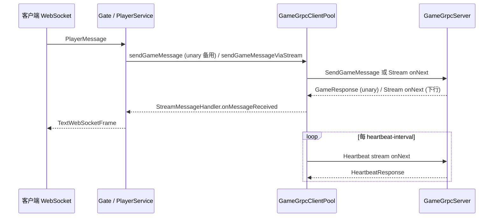
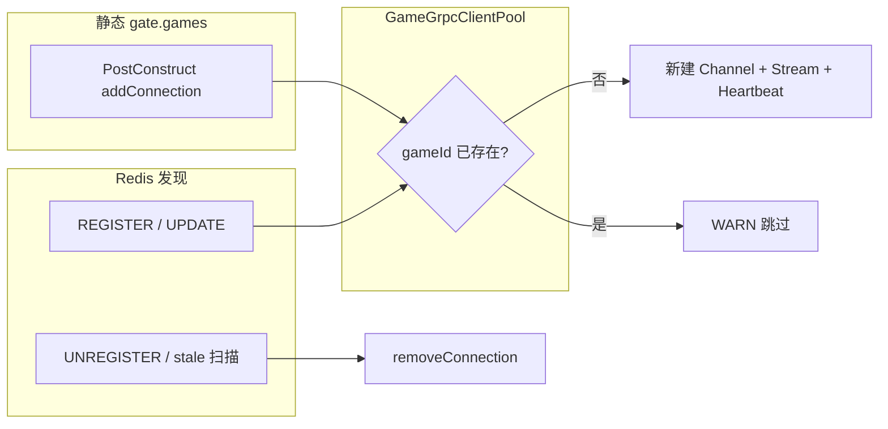

# 第 5 章：gRPC 通信 — 从单次调用到双向流

**读者层级**：熟悉网关与游戏服拆分、已理解 TCP/WebSocket 链路的架构读者。本章聚焦 Gate↔Game 的传输选型、契约演进、连接池与流式语义。

---

## 1. 问题引入

早期用 HTTP 把玩家消息「拍」到 Game，在玩家密度与消息频率上来后会遇到几类硬问题：

- **连接与握手成本**：短连接或高频建连把 CPU 和 ephemeral port 吃满；TLS 握手更放大开销。
- **语义不匹配**：游戏下行往往是**持续推送**，HTTP 请求-响应模型需要轮询或 SSE/Webhook 补丁。
- **序列化开销**：JSON 体积大、解析慢，不适合作为 GW↔GS 的高频路径（即使外层仍是业务 JSON，也应在边界明确何时二进制化）。
- **可观测与存活**：中间链路 idle 被 NAT/LB 掐断时，需要**应用层心跳**或长期占用的流，而不是「随缘 TCP keepalive」。

本项目的演进路径是：**保留 `SendGameMessage`  unary 作为可靠备用路径**，同时引入 **`StreamCommunication` 双向流** + **`Heartbeat` 双向流**，并在 Gate 侧用 **`GameGrpcClientPool`** 按 `gameId` 维护长连接。

---

## 2. 设计决策

| 选项 | 优点 | 代价 / 风险 |
|------|------|-------------|
| 继续 HTTP/JSON | 调试简单、生态成熟 | 握手多、包体大、推送别扭 |
| gRPC unary only | 实现简单、兼容性好 | 仍缺「服务端主动下行」的天然载体 |
| gRPC 双向流 + unary 回退 | 长连接、可推送、可心跳；unary 在 stream 未就绪时兜底 | 状态机复杂：重连、半开连接、与发现冲突 |
| 专用消息队列 / Kafka | 削峰、持久化 | 时延与运维成本；本 demo 阶段过重 |

**取舍结论**：

1. **HTTP/2 + Protobuf** 作为默认 RPC 载体， unary 用于「必须等 ACK」的路径；双向流承载高频与下行。
2. **业务 body 在 proto 层用 `bytes`**，避免把 Protobuf 绑死在某一版 JSON 字符串上；当前实现仍把 JSON UTF-8 塞进 `bytes`，属于渐进迁移中的折中。
3. **连接池按 `gameId` 分片**，与「一逻辑区服一 Game 进程」模型对齐；扩缩容交给 Redis 发现 + 池的 `add/remove`。
4. **心跳单独 RPC（`Heartbeat` stream）** 与 **HTTP/2 keepAlive（`ManagedChannelBuilder`）** 分层：`keepAlive*` 保 transport，`Heartbeat` 保应用层语义与日志可观测性。

---

## 3. 核心实现

### 5.1 gRPC 替代 HTTP 的性能收益

项目文档 [`GRPC_README.md`](../GRPC_README.md) 用表格概括了差异：长连接复用、Protobuf、HTTP/2 多路复用、双向流心跳等。实现上，Gate 侧 `PlayerService` 在转发玩家消息时走 gRPC（异步线程避免阻塞 Netty IO 线程）：

```267:289:gate-service/src/main/java/com/clawai/gatedemo/gate/service/PlayerService.java
    public void forwardToGame(Long playerId, Integer gameId, PlayerMessage message) {
        if (gameId == null) {
            logger.warn("⚠️ 消息缺少 gameId，无法转发");
            return;
        }
        
        // 异步转发，不阻塞 Netty IO 线程
        CompletableFuture.runAsync(() -> {
            // 根据 gameId 使用连接池发送消息
            boolean success = gameGrpcClientPool.sendGameMessage(
                gameId,
                playerId,
                message.getMsgType() != null ? message.getMsgType() : "unknown",
                message.getSeq() != null ? message.getSeq().intValue() : 0,
                message.getBody() != null ? message.getBody() : Map.of()
            );
            
            if (success) {
                logger.debug("📤 gRPC 消息已转发到 Game: gameId={}, playerId={}", gameId, playerId);
            } else {
                logger.error("❌ gRPC 消息转发失败：gameId={}, playerId={}", gameId, playerId);
            }
        });
    }
```

**要点**：IO 线程只做入站解析，出站 RPC 扔到 `CompletableFuture` 线程池；否则 gRPC 阻塞 stub 会把 Netty 事件循环饿死。

---

### 5.2 Proto 定义与 body 从 string 到 bytes 的演进

`GameMessage.body` 使用 `bytes`，语义是「不透明负载」，未来可直接承载 Protobuf 子消息或压缩数据，而不必改字段号：

```9:48:proto/game_service.proto
message GameMessage {
    string gate_id = 1;           // 网关 ID
    int64 player_id = 2;          // 玩家 ID
    int32 game_id = 3;            // 游戏 ID
    string msg_type = 4;          // 消息类型（如：battle.move, chat.send）
    int32 seq = 5;                // 消息序列号
    int64 timestamp = 6;          // 消息时间戳
    bytes body = 7;                 // 消息体（二进制Protobuf数据）
}
// ...
service GameService {
    rpc SendGameMessage (GameMessage) returns (GameResponse);
    rpc StreamCommunication (stream GameMessage) returns (stream GameMessage);
    rpc Heartbeat (stream HeartbeatRequest) returns (stream HeartbeatResponse);
}
```

Game 侧处理仍**把 `bytes` 当 UTF-8 JSON** 解析——这是典型的「契约先升级、业务后跟进」：

```41:65:game-service/src/main/java/com/clawai/gatedemo/game/service/GameMessageHandler.java
    public void handleGameMessage(Long playerId, Integer gameId, String msgType, int seq, com.google.protobuf.ByteString bodyBytes) {
        try {
            // 将二进制消息体转换为字符串再解析为Map
            String bodyStr = bodyBytes.toStringUtf8();
            Map<String, Object> body = objectMapper.readValue(bodyStr, Map.class);
            
            logger.info("🎮 收到游戏消息：playerId={}, gameId={}, msgType={}, seq={}", 
                playerId, gameId, msgType, seq);
            
            // 根据消息类型处理
            switch (msgType) {
                case "battle.move":
                    handleBattleMove(playerId, gameId, body);
                    break;
                case "chat.message":
                    handleChatMessage(playerId, gameId, body);
                    break;
                default:
                    logger.debug("⚠️ 未知消息类型：{}", msgType);
            }
        } catch (Exception e) {
            logger.error("❌ 处理游戏消息失败：{}", e.getMessage());
            throw new RuntimeException("处理游戏消息失败", e);
        }
    }
```

HTTP 兼容入口把 `String` 显式转成 `ByteString`，保证 unary 与旧调用链共用一个处理核心：

```74:78:game-service/src/main/java/com/clawai/gatedemo/game/service/GameMessageHandler.java
    public void handleMessage(Long playerId, String msgType, String bodyStr) {
        // 将字符串转换为ByteString
        com.google.protobuf.ByteString bodyBytes = com.google.protobuf.ByteString.copyFromUtf8(bodyStr);
        handleGameMessage(playerId, 0, msgType, 0, bodyBytes);
    }
```

---

### 5.3 gRPC 连接池设计（`GameGrpcClientPool`）

池内每个 `gameId` 对应一条 `ManagedChannel`、blocking/async stub，以及**两个流**：游戏双向流与心跳流。

**Channel 构建**（keepAlive、TLS/明文）与**建连后立即起流**：

```169:211:gate-service/src/main/java/com/clawai/gatedemo/gate/grpc/GameGrpcClientPool.java
    public void addConnection(int gameId, String host, int port) {
        if (connectionPool.containsKey(gameId)) {
            logger.warn("⚠️ Game {} 已存在连接，跳过", gameId);
            return;
        }
        
        logger.info("🔗 创建 Game {} 连接：{}:{}", gameId, host, port);
        
        GateConfig.GrpcPoolConfig poolConfig = gateConfig.getGrpcPool();
        ManagedChannelBuilder<?> builder = ManagedChannelBuilder
            .forAddress(host, port)
            .keepAliveTime(poolConfig.getKeepAliveTime(), TimeUnit.SECONDS)
            .keepAliveTimeout(poolConfig.getKeepAliveTimeout(), TimeUnit.SECONDS)
            .keepAliveWithoutCalls(poolConfig.isKeepAliveWithoutCalls());

        if (gateConfig.getTls().isEnabled()) {
            builder.useTransportSecurity();
            logger.info("gRPC TLS enabled for game {}", gameId);
        } else {
            builder.usePlaintext();
        }

        ManagedChannel channel = builder.build();
        // ...
        GrpcConnection conn = new GrpcConnection(gameId, host, port, channel, backoff);
        connectionPool.put(gameId, conn);
        
        // 启动Stream连接
        startStreamCommunication(conn);
        
        // 启动心跳
        startHeartbeat(conn);
        
        logger.info("✅ Game {} 连接已建立", gameId);
    }
```

**Stream 断线重连**使用每连接独立的 `ExponentialBackoff`，并由调度器异步 `startStreamCommunication`，避免阻塞：

```298:312:gate-service/src/main/java/com/clawai/gatedemo/gate/grpc/GameGrpcClientPool.java
    private void scheduleReconnect(GrpcConnection conn) {
        ScheduledExecutorService scheduler = reconnectScheduler;
        if (scheduler == null || scheduler.isShutdown()) {
            logger.warn("重连调度器已关闭，跳过 Game {} 重连", conn.gameId);
            return;
        }

        long delayMs = conn.backoff.getAndAdvance();
        scheduler.schedule(() -> {
            if (!connectionPool.containsKey(conn.gameId)) {
                return;
            }
            logger.info("🔄 尝试重连 Game {}（delay={}ms）", conn.gameId, delayMs);
            startStreamCommunication(conn);
        }, delayMs, TimeUnit.MILLISECONDS);
    }
```

配置项集中在 `GateConfig.GrpcPoolConfig`（`keepAliveTime`、`reconnectDelay`、`heartbeatInterval` 等），与 [`GRPC_POOL_README.md`](../GRPC_POOL_README.md) 描述一致。工作区中 `GrpcStreamConfig.java` 目前为空文件，实际生效的是 **`@ConfigurationProperties(prefix="gate")` 绑定**，而非独立的 `@Configuration` Bean。

---

### 5.4 双向流实现与心跳保活

**Gate 客户端**：`streamCommunication` 上挂 `StreamObserver`，在 `onNext` 里回调 `StreamMessageHandler`（供上层把 Game 下行写回 WebSocket）；`onError` 触发重连。

**Game 服务端**：`GameGrpcServer` 内部类实现 `streamCommunication`，在收到每条 `GameMessage` 时构造 `OutgoingMessageSink` 闭包，把业务回包再编码为 `GameMessage` 推回 Gate：

```198:234:game-service/src/main/java/com/clawai/gatedemo/game/grpc/GameGrpcServer.java
        @Override
        public StreamObserver<GameMessage> streamCommunication(StreamObserver<GameMessage> responseObserver) {
            logger.info("📡 Game Stream双向流通信已建立");

            return new StreamObserver<GameMessage>() {
                @Override
                public void onNext(GameMessage request) {
                    logger.debug("📥 收到Stream消息：gateId={}, playerId={}, msgType={}",
                        request.getGateId(), request.getPlayerId(), request.getMsgType());

                    try {
                        OutgoingMessageSink sink = (playerId, gameId, msgType, seq, body) -> {
                            try {
                                com.google.protobuf.ByteString bodyBytes = com.google.protobuf.ByteString
                                    .copyFromUtf8(objectMapper.writeValueAsString(body));
                                GameMessage out = GameMessage.newBuilder()
                                    .setGateId(request.getGateId())
                                    .setPlayerId(playerId)
                                    .setGameId(gameId)
                                    .setMsgType(msgType)
                                    .setSeq(seq)
                                    .setTimestamp(System.currentTimeMillis())
                                    .setBody(bodyBytes)
                                    .build();
                                responseObserver.onNext(out);
                            } catch (Exception ex) {
                                logger.error("❌ 发送流出消息失败：{}", ex.getMessage());
                            }
                        };
                        gameMessageHandler.handleGameMessage(
                            request.getPlayerId(),
                            request.getGameId(),
                            request.getMsgType(),
                            request.getSeq(),
                            request.getBody(),
                            sink
                        );
```

> **仓库现状说明**：当前工作区里的 `GameMessageHandler` 仅有 `ByteString` 版本、`OutgoingMessageSink.java` 为空，与上述 `handleGameMessage(..., sink)` 调用尚未对齐；集成前需补全函数式接口与重载，否则无法通过编译。教程保留该片段用于说明**设计意图：Stream 上业务处理要能反向 `onNext`**。

**应用层心跳**：`GrpcHeartbeatManager` 定时遍历池中 `gameId`，调用 `sendHeartbeat`；`Heartbeat` RPC 为独立双向流，与 `StreamCommunication` 解耦，避免把心跳与业务帧混在同一 observer 上。

```27:42:gate-service/src/main/java/com/clawai/gatedemo/gate/grpc/GrpcHeartbeatManager.java
    @Scheduled(fixedDelayString = "${gate.grpc-pool.heartbeat-interval:30000}")
    public void sendHeartbeats() {
        Set<Integer> gameIds = clientPool.getGameIds();
        if (gameIds.isEmpty()) {
            return;
        }

        logger.debug("💓 发送gRPC心跳到所有Game服务，连接数：{}", gameIds.size());
        
        for (int gameId : gameIds) {
            try {
                clientPool.sendHeartbeat(gameId);
            } catch (Exception e) {
                logger.warn("⚠️ 发送心跳到Game {} 失败：{}", gameId, e.getMessage());
            }
        }
    }
```

**调用路径总览（Mermaid）**：



---

### 5.5 连接池 vs 服务发现的冲突处理

[`GRPC_POOL_README.md`](../GRPC_POOL_README.md) 写明：**同一 `gameId` 在静态 `gate.games` 与 Redis 发现同时出现时，以先到先得为准**——`addConnection` 若已存在则 `WARN` 并跳过，**不覆盖**。

实现与文档一致：

```169:173:gate-service/src/main/java/com/clawai/gatedemo/gate/grpc/GameGrpcClientPool.java
    public void addConnection(int gameId, String host, int port) {
        if (connectionPool.containsKey(gameId)) {
            logger.warn("⚠️ Game {} 已存在连接，跳过", gameId);
            return;
        }
```

`GameDiscoveryService` 在 `REGISTER` / `UPDATE` 时调用 `connectToGame` → `addConnection`；`UNREGISTER`、过期扫描调用 `removeConnection`：

```188:198:gate-service/src/main/java/com/clawai/gatedemo/gate/service/GameDiscoveryService.java
    private void connectToGame(GameInstance instance) {
        if (instance == null || !instance.isAvailable()) {
            return;
        }

        gameGrpcClientPool.addConnection(instance.getId(), instance.getHost(), instance.getPort());
    }

    private void disconnectFromGame(int gameId) {
        gameGrpcClientPool.removeConnection(gameId);
    }
```

**运维含义**：若临时用静态表指向旧 IP，发现模块稍后推送新实例，**池不会自动纠偏**——必须删掉静态项或先 `removeConnection` 再让发现注册。这是为避免并发下「后写覆盖先写」导致连接抖动，但代价是**配置错误时要人工介入**。



---

## 4. 演进复盘

**已改进**

- Gate↔Game 从「无状态 HTTP」升级为 **长连接 + 多 RPC 形态**（unary / bidi stream / 心跳）。
- `bytes` 字段为后续 **真正的 Protobuf 业务包** 留出扩展点。
- 连接池统一 **TLS、keepAlive、指数退避重连**，并把心跳从业务流剥离。

**仍存在的债务 / 缺口**

1. **`PlayerService` 默认走 `sendGameMessage`（阻塞 unary）**，未使用 `sendGameMessageViaStream`；双向流的吞吐优势在转发路径上尚未闭环。
2. **`StreamMessageHandler` 的注册**在业务代码中未检索到 `setStreamMessageHandler` 调用（仅测试出现），Game→Gate→WebSocket 下行需补全装配。
3. **`GameGrpcServer` 与 `GameMessageHandler` / `OutgoingMessageSink` 源码不一致**（工作区空文件与缺重载），属于合并冲突或未完成提交，应优先修复以保证可构建。
4. **`GrpcStreamConfig.java` 空文件**：易造成读者误以为存在独立配置类，实际以 `GateConfig` 为准。

---

## 5. 扩展思考

1. **行业实践**：Envoy/ xDS 做 gRPC 客户端负载均衡与健康检查；Kubernetes Headless Service + gRPC resolver；与本 demo 的「`gameId`→单 channel」模型对比，讨论**单 sharding key 多副本**时如何改池结构。
2. **替代方案**：QUIC-based RPC、rsocket、或 SMUX 多路复用隧道——在移动弱网下的重连与 0-RTT 取舍。
3. **练习**
   - 将 `forwardToGame` 改为优先 `sendGameMessageViaStream`，unary 仅在 `!streamConnected` 时使用（池内已有分支示例）。
   - 实现 `StreamMessageHandler`，把 `GameMessage` 映射为 `PlayerService.sendToPlayer`。
   - 定义 `oneof` 业务负载的 proto，逐步淘汰 JSON UTF-8 包在 `bytes` 里的临时方案。

---

*本章代码路径以仓库 `GateDemo` 为准；若与你的本地分支不一致，请先对齐 `GameGrpcServer` 与 `GameMessageHandler`。*
