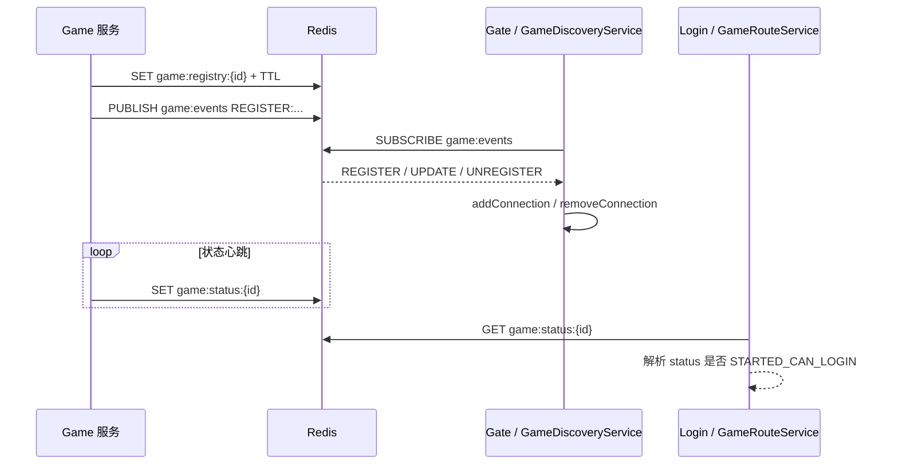
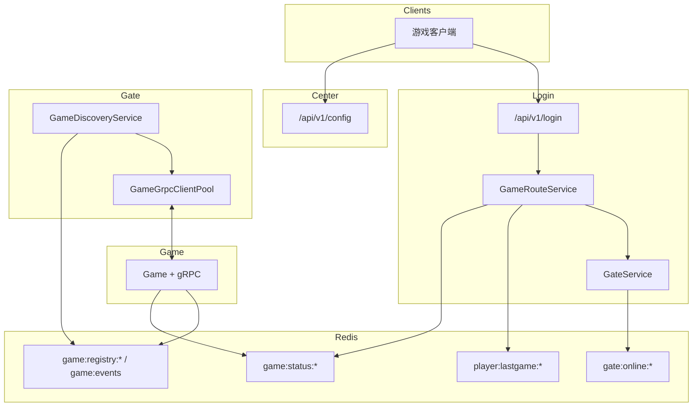

# 第 6 章：微服务拆分 — Center、Login 与服务发现

**读者层级**：已理解 Gate/Game 纵向链路，本章看**横向拆服务**后的配置下发、登录路由、Redis 协调与 Gate 对 Game 的动态挂载。

---

## 1. 问题引入

单体里「登录 + 配置 + 网关 + 游戏」揉在一起时，发布边界模糊、密钥扩散、扩容粒度粗。拆开后要解决：

- **客户端先拿谁**：版本、CDN/SDK、Login 地址等需要**独立刷新**，不应写死在包体。
- **谁签发 Token、谁验签**：登录与长连接网关分离时，JWT 密钥与黑名单策略要契约化。
- **玩家落到哪个 Game、哪个 Gate**：依赖**在线状态**与**最后一次登录区服**，且要容忍区服维护/切服。
- **Game 进程上下线**：Gate 不能仅靠静态 YAML，需要**注册 + 过期 + 事件**，否则扩缩容要改配置重启。

---

## 2. 设计决策

| 能力 | 归属服务 | 主要手段 |
|------|----------|----------|
| 全局/客户端配置 | **Center** | `ConfigurationProperties` + REST 聚合 DTO |
| 登录、JWT、选 Gate/Game | **Login** | Redis：`game:status:*`、`player:lastgame:*`、`gate:online:*` |
| Game 生命周期状态 | **Game** | `GameStatusService` 写 Redis；`GameRegistryService` 注册实例 |
| Gate 感知 Game 列表 | **Gate** | `GameDiscoveryService` 订阅 `game:events` + 周期防失活 |

**取舍**：

- 使用 **Redis 字符串 + Pub/Sub** 而非 etcd/Consul：与现有栈一致、demo 成本低；代价是**非强一致服务发现**，依赖 TTL 与轮询修补。
- **Login 与 Gate 心跳**：`LoginController` 暴露 `/gate/heartbeat`，`GateService` 内存维护 Gate 列表并写 Redis TTL；多 Login 实例时内存图不共享——生产应改为**只信 Redis**或引入协调组件（文中「扩展思考」展开）。
- **`GateClusterManager`**（内存集群表）与 **Game 发现** 解耦：前者偏向「多 Gate 自发现/剔除」演示，**不**承担 Game 注册；勿混淆。

---

## 3. 核心实现

### 6.1 CenterService — 配置中心的设计

Center 将 `center.*` 绑定到 `CenterConfig`，通过单一 REST 出口聚合为 `ConfigResponse`，客户端一次拉取版本、SDK、Login、公告等。

```12:52:center-service/src/main/java/com/clawai/gatedemo/center/config/CenterConfig.java
@ConfigurationProperties(prefix = "center")
public class CenterConfig {

    private ServerConfig server = new ServerConfig();
    private VersionConfig version = new VersionConfig();
    private SdkConfig sdk = new SdkConfig();
    private LoginConfig login = new LoginConfig();
    private List<AnnouncementConfig> announcements = new ArrayList<>();
    // ...
    @Data
    public static class VersionConfig {
        private String version = "1.0.0";
        private String minVersion = "1.0.0";
        private boolean forceUpdate = false;
        private String updateUrl = "https://example.com/update";
    }
    // ...
}
```

```24:31:center-service/src/main/java/com/clawai/gatedemo/center/controller/ConfigController.java
    @GetMapping("/config")
    public ApiResponse<ConfigResponse> getConfig() {
        logger.info("收到配置请求");
        
        ConfigResponse response = ConfigResponse.fromConfig(centerConfig);
        
        return ApiResponse.success(response);
    }
```

`ConfigResponse.fromConfig` 把嵌套配置「拍平」成客户端友好结构（公告当前取列表首条，适合简单运营配置）：

```15:44:center-service/src/main/java/com/clawai/gatedemo/center/model/ConfigResponse.java
    public static ConfigResponse fromConfig(CenterConfig config) {
        ConfigResponse response = new ConfigResponse();
        
        VersionInfo versionInfo = new VersionInfo();
        versionInfo.setVersion(config.getVersion().getVersion());
        versionInfo.setMinVersion(config.getVersion().getMinVersion());
        versionInfo.setForceUpdate(config.getVersion().isForceUpdate());
        versionInfo.setUpdateUrl(config.getVersion().getUpdateUrl());
        response.setVersion(versionInfo);
        // ... sdk, login, announcement ...
        return response;
    }
```

**设计要点**：Center **无状态**、可水平扩展；敏感信息不应进 `ConfigResponse`（当前为演示 host/port）。

---

### 6.2 LoginService — 认证与路由分离

**JWT 签发**在 Login，`gate-service` 侧用同一 secret 验签（文档注释已说明边界）：

```17:40:login-service/src/main/java/com/clawai/gatedemo/login/service/JwtTokenService.java
@Service
public class JwtTokenService {

    private final SecretKey secretKey;
    private final long expireSeconds;

    public JwtTokenService(
            @Value("${login.jwt.secret:DefaultGateDemoSecretKeyForHMACSHA256Auth!}") String secret,
            @Value("${login.jwt.expire-seconds:7200}") long expireSeconds) {
        this.secretKey = Keys.hmacShaKeyFor(secret.getBytes(StandardCharsets.UTF_8));
        this.expireSeconds = expireSeconds;
    }

    public String generateToken(Long playerId) {
        Date now = new Date();
        Date expiry = new Date(now.getTime() + expireSeconds * 1000);

        return Jwts.builder()
                .id(UUID.randomUUID().toString())
                .subject(String.valueOf(playerId))
                .issuedAt(now)
                .expiration(expiry)
                .signWith(secretKey)
                .compact();
    }
```

**登录主流程**：`GameRouteService.route` 选 Gate（最少在线）+ 选 Game（优先上次登录区服，其次推荐服），最后签发 token：

```118:178:login-service/src/main/java/com/clawai/gatedemo/login/service/GameRouteService.java
    public RouteResult route(Long playerId) {
        RouteResult result = new RouteResult();
        
        GateService.GateInstance gate = gateService.getAvailableGate();
        if (gate == null) {
            logger.warn("No available gate found");
            result.setCode(1);
            result.setMessage("暂时没有可用的网关服务器");
            return result;
        }
        
        result.setGateId(gate.getGateId());
        result.setGateHost(gate.getHost());
        result.setGatePort(gate.getPort());
        
        Integer lastGameId = getLastLoginGame(playerId);
        
        if (lastGameId != null) {
            GameStatus lastGameStatus = getGameStatus(lastGameId);
            
            if (lastGameStatus == GameStatus.STARTED_CAN_LOGIN) {
                savePlayerLoginRecord(playerId, lastGameId);
                result.setGameId(lastGameId);
                result.setCode(0);
                result.setMessage("success");
                // ...
                return result;
            } else {
                Integer recommendGameId = getRecommendedGame();
                // ... 推荐服可登录则 redirect ...
            }
        }
        // ... 无上次记录则走推荐服 ...
        result.setCode(1);
        result.setMessage("暂时没有可用的游戏服务器，请稍后重试");
        return result;
    }
```

**面向工具的 API 防护**：工作区中 `ApiKeyFilter.java` 可能被清空；以下片段来自仓库 **git 版本**，展示「可选 X-API-Key、健康检查放行」的典型写法：

```java
// login-service/.../ApiKeyFilter.java（与 git HEAD 一致；若本地为空请恢复）
@Override
protected void doFilterInternal(@NonNull HttpServletRequest request,
                                @NonNull HttpServletResponse response,
                                @NonNull FilterChain filterChain) throws ServletException, IOException {
    if (configuredApiKey == null || configuredApiKey.isEmpty()) {
        filterChain.doFilter(request, response);
        return;
    }
    String path = request.getRequestURI();
    if (isHealthEndpoint(path)) {
        filterChain.doFilter(request, response);
        return;
    }
    String apiKey = request.getHeader(HEADER_X_API_KEY);
    if (apiKey == null || !configuredApiKey.equals(apiKey)) {
        response.setStatus(HttpServletResponse.SC_UNAUTHORIZED);
        // ...
        return;
    }
    filterChain.doFilter(request, response);
}
```

推荐服列表来自 `LoginConfig.recommendGames`（`@ConfigurationProperties(prefix="login")`），与业务运营配置解耦。

---

### 6.3 Game 状态管理与 Redis 注册

**状态枚举**（与 Login 侧解析的整数约定一致）：

```1:31:game-service/src/main/java/com/clawai/gatedemo/game/service/GameStatus.java
public enum GameStatus {
    NOT_STARTED(0, "服务未启动"),
    STARTED_NOT_LOGIN(1, "已启动但不可登录"),
    STARTED_CAN_LOGIN(2, "可以登录");
    // ...
}
```

**周期同步** `game:status:{gameId}`：`status:onlineCount:timestamp` 格式，供 Login 读首段判断可否登录：

```76:88:game-service/src/main/java/com/clawai/gatedemo/game/service/GameStatusService.java
    @Scheduled(fixedRateString = "${game.status.heartbeat-interval:30000}")
    public void syncStatusToRedis() {
        if (!initialized) {
            return;
        }
        try {
            String key = GAME_STATUS_KEY + parseGameId(gameConfig.getId());
            String value = String.format("%d:%d:%d",
                currentStatus.getValue(),
                onlinePlayerCount,
                System.currentTimeMillis());

            redisTemplate.opsForValue().set(key, value, KEY_EXPIRE_SECONDS, TimeUnit.SECONDS);
```

**实例注册** `game:registry:{gameId}`：值为 `host:port:status:timestamp`，带 TTL，并 `PUBLISH game:events`：

```47:70:game-service/src/main/java/com/clawai/gatedemo/game/service/GameRegistryService.java
    public void register() {
        if (!initialized || !gameConfig.getRegistry().isEnabled()) {
            return;
        }
        try {
            int gameId = parseGameId(gameConfig.getId());
            int status = gameStatusService.getStatus().getValue();
            long timestamp = System.currentTimeMillis();

            String value = String.format("%s:%d:%d:%d",
                gameConfig.getHost(),
                gameConfig.getPort(),
                status,
                timestamp);

            redisTemplate.opsForValue().set(
                REGISTRY_KEY_PREFIX + gameId,
                value,
                gameConfig.getRegistry().getTtlSeconds(),
                TimeUnit.SECONDS
            );

            redisTemplate.convertAndSend(EVENT_CHANNEL,
                String.format("REGISTER:%d:%s", gameId, value));
```

状态变更时额外发 `UPDATE` 事件，便于 Gate **不依赖轮询**即可调整连接：

```103:111:game-service/src/main/java/com/clawai/gatedemo/game/service/GameRegistryService.java
    public void publishStatusUpdate(int oldStatus, int newStatus) {
        if (!initialized || !gameConfig.getRegistry().isEnabled()) {
            return;
        }
        try {
            int gameId = parseGameId(gameConfig.getId());
            redisTemplate.convertAndSend(EVENT_CHANNEL,
                String.format("UPDATE:%d:%d", gameId, newStatus));
```

`GameConfig` 中 `registry.ttlSeconds` 与 `heartbeat-interval` 共同决定**存活窗口**：心跳停则 key 过期，Gate 侧 stale 扫描兜底。

---

### 6.4 服务发现机制（Redis Pub/Sub + TTL）

Gate 侧 `GameDiscoveryService`：

- 启动时 `KEYS game:registry:*` 全量加载（**注意**：生产大集群应换 `SCAN` 或专用索引）。
- 订阅 `game:events`，解析 `REGISTER` / `UNREGISTER` / `UPDATE`。
- `UPDATE` 中 `status==2` 且池中无连接则 `addConnection`；非 2 则 `disconnectFromGame`。
- `checkStaleGames` 每 10s：key 缺失或时间戳超出 `staleThreshold` 视为下线。

```123:137:gate-service/src/main/java/com/clawai/gatedemo/gate/service/GameDiscoveryService.java
                case "UPDATE":
                    if (parts.length >= 3) {
                        int status = Integer.parseInt(parts[2]);
                        GameInstance existing = gameMap.get(gameId);
                        if (existing != null) {
                            existing.setStatus(status);
                            if (status == 2 && !gameGrpcClientPool.hasConnection(gameId)) {
                                connectToGame(existing);
                            } else if (status != 2) {
                                disconnectFromGame(gameId);
                            }
                            logger.info("Game status updated: gameId={}, status={}", gameId, status);
                        }
                    }
                    break;
```

```144:177:gate-service/src/main/java/com/clawai/gatedemo/gate/service/GameDiscoveryService.java
    @Scheduled(fixedRate = 10000)
    public void checkStaleGames() {
        if (!gateConfig.getDiscovery().isEnabled()) {
            return;
        }
        // ...
            for (String key : keys) {
                Object value = redisTemplate.opsForValue().get(key);
                if (value == null) {
                    int gameId = extractGameId(key);
                    handleGameOffline(gameId);
                    continue;
                }
                String[] parts = value.toString().split(":");
                if (parts.length >= 4) {
                    long timestamp = Long.parseLong(parts[3]);
                    if (System.currentTimeMillis() - timestamp > staleThreshold) {
                        int gameId = extractGameId(key);
                        handleGameOffline(gameId);
                    }
                }
            }
```

**Mermaid：注册 + 发现 + 登录读状态**



---

### 6.5 Gate 动态感知 Game 上下线

**动态感知 Game** 由 `GameDiscoveryService` + `GameGrpcClientPool` 完成（第 5 章已述池行为）。**不要**把 `GateClusterManager` 当成 Game 发现入口——它是**进程内** Gate 实例表，用于演示心跳剔除，与 Redis 无共享：

```52:91:gate-service/src/main/java/com/clawai/gatedemo/gate/cluster/GateClusterManager.java
public class GateClusterManager {
    // ...
    public GateClusterManager() {
        String id;
        try {
            id = InetAddress.getLocalHost().getHostAddress() + ":" + System.currentTimeMillis();
        } catch (Exception e) {
            id = "unknown:" + System.currentTimeMillis();
        }
        this.instanceId = id;
        startHeartbeat();
    }
```

```186:203:gate-service/src/main/java/com/clawai/gatedemo/gate/cluster/GateClusterManager.java
    private void startHeartbeat() {
        scheduler.scheduleAtFixedRate(() -> {
            GateInstance instance = instances.get(instanceId);
            if (instance != null) {
                instance.setLastHeartbeat(System.currentTimeMillis());
            }
            instances.entrySet().removeIf(entry -> {
                long inactive = System.currentTimeMillis() - entry.getValue().getLastHeartbeat();
                if (inactive > 120000) {
                    logger.info("Removed inactive gate instance: {}", entry.getKey());
                    return true;
                }
                return false;
            });
        }, 30, 30, TimeUnit.SECONDS);
    }
```

**Login 对 Gate 的「软注册」**：`GateService.handleHeartbeat` 更新内存 `gateMap`，并把在线数写入 `gate:online:{gateId}`（TTL 60s）。`getAvailableGate` 选**在线人数最少**实例——简单均衡策略。

```38:57:login-service/src/main/java/com/clawai/gatedemo/login/service/GateService.java
    public void handleHeartbeat(GateHeartbeatRequest request) {
        String gateId = request.getGateId();
        
        GateInstance instance = new GateInstance();
        instance.setGateId(gateId);
        instance.setHost(request.getHost());
        instance.setPort(request.getPort());
        instance.setOnline(request.getOnline() != null ? request.getOnline() : 0);
        instance.setLastUpdateTime(System.currentTimeMillis());
        
        gateMap.put(gateId, instance);
        
        redisTemplate.opsForValue().set(
            GATE_KEY_PREFIX + gateId,
            instance.getOnline(),
            GATE_EXPIRE_SECONDS,
            TimeUnit.SECONDS
        );
```



---

## 4. 演进复盘

**改进**

- 配置（Center）、路由与令牌（Login）、实时链路（Gate/Game）**边界清晰**，可独立扩缩容。
- Game 用 **TTL + 周期心跳 + Pub/Sub** 把「实例存活」与「是否允许玩家登录」分层：`game:registry` vs `game:status`。
- Login 路由策略可表达**切服**（`redirect` 标志位已在 `RouteResult` 预留）。

**债务**

1. `GameDiscoveryService` 使用 `KEYS`、事件串解析脆弱，**大 Key / 多租户**下需替换实现。
2. `GateService` **内存 gateMap** 与多 Login 副本不一致；Redis 仅存 online 计数，**完整 Gate 列表**应统一从 Redis 或注册中心读。
3. 工作区 **ApiKeyFilter 可能被清空**，与安全文档不一致，需恢复或改为 Spring Security 链。
4. `GateClusterManager` 注释写「未来 Redis」——与当前 Login/Gate 心跳方案**尚未统一**，避免重复造轮子。

---

## 5. 扩展思考

1. **行业实践**：Kubernetes Endpoint + gRPC DNS resolver；或 **xDS** 统一 L4/L7；对比本项目的 Redis 轻量方案在**脑裂、订阅丢消息**时的行为（为何需要 `checkStaleGames`）。
2. **强一致需求**：当「路由决策」必须看到最新 membership 时，引入 **lease + fencing token** 或共识组件。
3. **练习**
   - 把 `getAvailableGate` 改为只基于 Redis（`SCAN gate:online:*`），去掉内存 `gateMap`。
   - 为 `game:events` 定义 JSON payload，替代 `split(":")`。
   - Center 增加按平台（iOS/Android）返回不同 `minVersion` 的分支字段。

---

*本章涉及多个服务的 Redis key 约定，详细设计可参考仓库内 `docs/redis-key-design.md` 等文档。*
