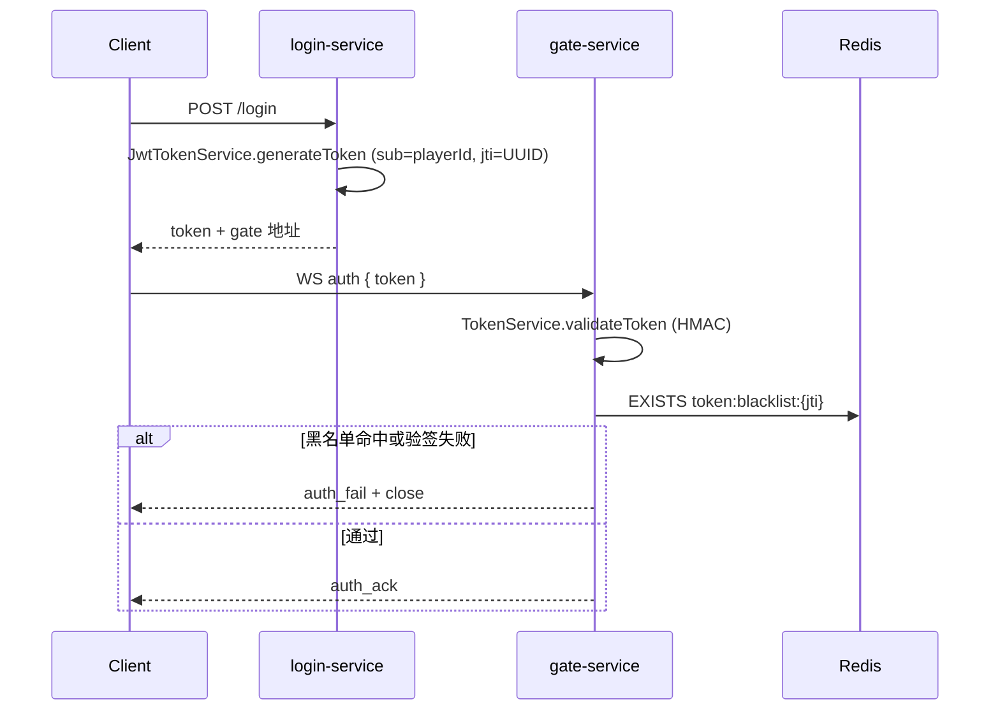
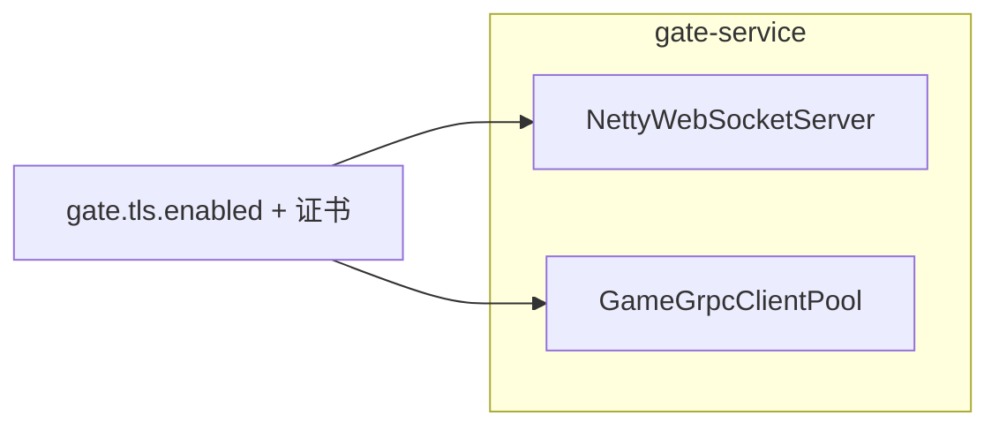

# 第 7 章：安全体系 — 认证、加密与防护

**读者定位**：已熟悉网关/游戏服分层与 Netty、gRPC 的工程师。本章聚焦 **为何这样切职责**、**配置如何与运行时行为挂钩**，以及 **当前实现与业界实践的差距**。

---

## 7.1 JWT 无状态认证 + Redis 黑名单

### 问题引入

玩家入口在 **login-service**（HTTP），长连接在 **gate-service**（WebSocket）。若 Gate 每次转发都去 Login 查会话，会增加延迟与耦合；若完全无状态，则 **登出/封号无法即时生效**（JWT 在过期前始终有效）。

### 设计决策

| 方案 | 优点 | 缺点 |
|------|------|------|
| 有状态 Session（Redis/DB） | 可立即吊销 | Gate 需额外 RPC/查询，故障面扩大 |
| 纯 JWT | Gate 仅验签，扩展性好 | 吊销困难 |
| **JWT + jti 黑名单（Redis）** | Gate 仍是无状态验签；吊销走 Redis O(1) 查 key | 依赖 Redis；需为黑名单设合理 TTL |

本项目采用 **签发在 Login、验签在 Gate**，`sub` 承载 `playerId`，`jti` 作为黑名单键，与 OpenSpec 中 `token:blacklist:{jti}` 约定一致。

### 核心实现

**签发（login-service）**：带 `id`（即 jti）、过期时间与 HMAC 签名。

```30:40:login-service/src/main/java/com/clawai/gatedemo/login/service/JwtTokenService.java
    public String generateToken(Long playerId) {
        Date now = new Date();
        Date expiry = new Date(now.getTime() + expireSeconds * 1000);

        return Jwts.builder()
                .id(UUID.randomUUID().toString())
                .subject(String.valueOf(playerId))
                .issuedAt(now)
                .expiration(expiry)
                .signWith(secretKey)
                .compact();
    }
```

**验签（gate-service）**：只解析与校验，不签发；异常统一吞掉并返回 `null`，由上层决定是否关连接。

```32:44:gate-service/src/main/java/com/clawai/gatedemo/gate/auth/TokenService.java
    public Claims validateToken(String token) {
        try {
            return Jwts.parser()
                    .verifyWith(secretKey)
                    .build()
                    .parseSignedClaims(token)
                    .getPayload();
        } catch (ExpiredJwtException e) {
            logger.warn("Token expired: {}", e.getMessage());
        } catch (JwtException e) {
            logger.warn("Invalid token: {}", e.getMessage());
        }
        return null;
    }
```

**黑名单**：`SET token:blacklist:{jti} 1 EX ttl`，查询用 `EXISTS`；Redis 异常时 `isBlacklisted` 选择 **失败返回 false**（fail-open；若业务要求 **fail-closed** 需改策略）。

```26:44:gate-service/src/main/java/com/clawai/gatedemo/gate/auth/TokenBlacklistService.java
    public void addToBlacklist(String jti, long ttlSeconds) {
        if (jti == null) return;
        try {
            redisOperations.opsForValue().set(BLACKLIST_PREFIX + jti, "1", ttlSeconds, TimeUnit.SECONDS);
            logger.info("Token jti={} added to blacklist, ttl={}s", jti, ttlSeconds);
        } catch (Exception e) {
            logger.error("Failed to add token to blacklist: {}", e.getMessage());
        }
    }

    public boolean isBlacklisted(String jti) {
        if (jti == null) return false;
        try {
            return Boolean.TRUE.equals(redisOperations.hasKey(BLACKLIST_PREFIX + jti));
        } catch (Exception e) {
            logger.error("Failed to check blacklist: {}", e.getMessage());
            return false;
        }
    }
```

**合成验证器**：先 JWT，再黑名单，最后解析 `sub` → `Long`。

```28:50:gate-service/src/main/java/com/clawai/gatedemo/gate/auth/TokenValidator.java
    public Long validate(String token) {
        if (token == null || token.isBlank()) {
            return null;
        }

        Claims claims = tokenService.validateToken(token);
        if (claims == null) {
            return null;
        }

        String jti = claims.getId();
        if (jti != null && blacklistService.isBlacklisted(jti)) {
            logger.warn("Token is blacklisted: jti={}", jti);
            return null;
        }

        try {
            return Long.parseLong(claims.getSubject());
        } catch (NumberFormatException e) {
            logger.warn("Invalid subject in token: {}", claims.getSubject());
            return null;
        }
    }
```

**WebSocket 侧接入点**：首包 `auth` 从 `body.token` 取串，走 `TokenValidator`，失败则 `auth_fail` 并关连接。

```167:182:gate-service/src/main/java/com/clawai/gatedemo/gate/handler/GateNettyWebSocketHandler.java
    private void handleAuth(ChannelHandlerContext ctx, PlayerMessage message) {
        String token = null;
        if (message.getBody() != null) {
            Object t = message.getBody().get("token");
            if (t != null) token = t.toString();
        }

        Long playerId = tokenValidator.validate(token);
        if (playerId == null) {
            logger.warn("认证失败：无效 token from {}", ctx.channel().remoteAddress());
            PlayerMessage errResp = new PlayerMessage();
            errResp.setType("auth_fail");
            errResp.setTimestamp(System.currentTimeMillis());
            sendToClient(ctx, errResp);
            ctx.close();
            return;
        }
```

**测试锚点**（验签与 Redis 契约，节选）：

```46:54:gate-service/src/test/java/com/clawai/gatedemo/gate/auth/TokenServiceTest.java
    @Test
    void validateToken_withExpiredToken_returnsNull() {
        String token = createToken("12345", "jti-002", new Date(System.currentTimeMillis() - 1000));
        Claims claims = tokenService.validateToken(token);
        assertNull(claims);
    }
```

```32:37:gate-service/src/test/java/com/clawai/gatedemo/gate/auth/TokenBlacklistServiceTest.java
    @Test
    void addToBlacklist_callsRedisSetWithCorrectKey() {
        String jti = "jti-abc123";
        long ttlSeconds = 3600;

        tokenBlacklistService.addToBlacklist(jti, ttlSeconds);

        verify(valueOps).set(eq("token:blacklist:" + jti), eq("1"), eq(ttlSeconds), eq(TimeUnit.SECONDS));
    }
```

### 演进复盘

- **改进**：职责清晰（Login 签发 / Gate 验签 + 黑名单），Gate 热路径无 HTTP 回源。
- **技术债**：`addToBlacklist` 应在 **登出/封禁 API** 中调用并与 token 剩余寿命对齐 TTL；若未接好，黑名单只完成「读侧」能力。
- **密钥**：`gate.jwt.secret` 与 `login.jwt.secret` 必须一致；生产应使用 Secret 注入，避免默认值。

### 扩展思考

- **旋转密钥**：多 `kid` + JWKS，或短期 access + refresh。
- **练习**：在 login-service 增加 `POST /logout`，解析 jti 并 `addToBlacklist(jti, remainingTtl)`。



---

## 7.2 TLS（wss + gRPC TLS）配置策略

### 问题引入

明文 WebSocket / gRPC 在公网或零信任网络中易被窃听与篡改；集群内有时由 Ingress/网格终止 TLS，应用层仍可能要 **出集群或东西向加密**。

### 设计决策

- **单一开关**：`gate.tls.enabled` 同时驱动 **wss** 与 **gRPC `useTransportSecurity()`**，避免只加密一侧。
- **证书形态**：PEM（cert+key）与 PKCS12 并存，由 `TlsSslContextFactory` 构建 Netty `SslContext`；gRPC 使用 `useTransportSecurity()` 时依赖 **系统/JVM 默认信任库**（生产常需自定义 trust 材料）。

### 核心实现

**配置模型**（节选）：

```51:67:gate-service/src/main/java/com/clawai/gatedemo/gate/config/GateConfig.java
    public static class TlsConfig {
        private boolean enabled = false;
        private String certPath;
        private String keyPath;
        private String keystorePath;
        private String keystorePassword;

        public boolean isEnabled() { return enabled; }
        public void setEnabled(boolean enabled) { this.enabled = enabled; }
        public String getCertPath() { return certPath; }
        public void setCertPath(String certPath) { this.certPath = certPath; }
        public String getKeyPath() { return keyPath; }
        public void setKeyPath(String keyPath) { this.keyPath = keyPath; }
        public String getKeystorePath() { return keystorePath; }
        public void setKeystorePath(String keystorePath) { this.keystorePath = keystorePath; }
        public String getKeystorePassword() { return keystorePassword; }
        public void setKeystorePassword(String keystorePassword) { this.keystorePassword = keystorePassword; }
    }
```

**Netty WebSocket**：启用时 pipeline 首部加 `SslHandler`。

```76:99:gate-service/src/main/java/com/clawai/gatedemo/gate/ws/NettyWebSocketServer.java
        if (gateConfig.getTls().isEnabled()) {
            try {
                sslContext = TlsSslContextFactory.buildServerContext(gateConfig.getTls());
                logger.info("TLS enabled for WebSocket (wss://)");
            } catch (Exception e) {
                throw new RuntimeException("Failed to initialize TLS for WebSocket", e);
            }
        }
        // ...
                        if (sslContext != null) {
                            pipeline.addLast("ssl", sslContext.newHandler(ch.alloc()));
                        }
```

**gRPC 客户端池**：

```178:189:gate-service/src/main/java/com/clawai/gatedemo/gate/grpc/GameGrpcClientPool.java
        ManagedChannelBuilder<?> builder = ManagedChannelBuilder
            .forAddress(host, port)
            .keepAliveTime(poolConfig.getKeepAliveTime(), TimeUnit.SECONDS)
            .keepAliveTimeout(poolConfig.getKeepAliveTimeout(), TimeUnit.SECONDS)
            .keepAliveWithoutCalls(poolConfig.isKeepAliveWithoutCalls());

        if (gateConfig.getTls().isEnabled()) {
            builder.useTransportSecurity();
            logger.info("gRPC TLS enabled for game {}", gameId);
        } else {
            builder.usePlaintext();
        }
```

**PEM / PKCS12 工厂**：

```20:37:gate-service/src/main/java/com/clawai/gatedemo/gate/config/TlsSslContextFactory.java
    public static SslContext buildServerContext(GateConfig.TlsConfig tlsConfig) throws Exception {
        if (tlsConfig.getCertPath() != null && tlsConfig.getKeyPath() != null) {
            logger.info("Loading TLS certs from PEM: cert={}, key={}", tlsConfig.getCertPath(), tlsConfig.getKeyPath());
            return SslContextBuilder.forServer(
                    new File(tlsConfig.getCertPath()),
                    new File(tlsConfig.getKeyPath())
            ).build();
        }

        if (tlsConfig.getKeystorePath() != null && tlsConfig.getKeystorePassword() != null) {
            logger.info("Loading TLS certs from keystore: {}", tlsConfig.getKeystorePath());
            KeyStore keyStore = KeyStore.getInstance("PKCS12");
            try (FileInputStream fis = new FileInputStream(tlsConfig.getKeystorePath())) {
                keyStore.load(fis, tlsConfig.getKeystorePassword().toCharArray());
            }
            KeyManagerFactory kmf = KeyManagerFactory.getInstance(KeyManagerFactory.getDefaultAlgorithm());
            kmf.init(keyStore, tlsConfig.getKeystorePassword().toCharArray());
            return SslContextBuilder.forServer(kmf).build();
        }
```

环境变量绑定见 `gate-service/src/main/resources/application.yml` 中 `gate.tls.*`。

### 演进复盘

- **改进**：wss 与 gRPC 安全策略同源配置。
- **技术债**：未暴露 gRPC 客户端 trust manager；Game 与 Gate 须协议一致，避免「一边 TLS 一边明文」。

### 扩展思考

- 为 `ManagedChannelBuilder` 配置 **自签 CA** 或 **SPIFFE** 身份。
- **行业实践**：南北向 Ingress TLS；东西向 **mTLS** 或服务网格。



---

## 7.3 应用层消息体加密（现状与向 AES-GCM 演进）

### 问题引入

TLS 保护传输层；在 **TLS 终止在边缘** 或需 **字段级加密** 时，可能要在协议里加对称加密。小节标题中的 **AES-GCM** 指 **推荐目标**；下列代码为仓库当前实现。

### 设计决策

- **AES-GCM（推荐）**：AEAD，需随机 nonce，带完整性。
- **当前实现**：`AES/ECB/PKCS5Padding`，16 字节密钥。ECB **无 IV、无完整性**，**不宜长期用于生产**，适合 demo 或占位。

### 核心实现

```14:35:gate-service/src/main/java/com/clawai/gatedemo/gate/security/MessageEncryptor.java
    private static final String ALGORITHM = "AES";
    private static final String TRANSFORMATION = "AES/ECB/PKCS5Padding";

    private final SecretKeySpec secretKey;
    private final Cipher encryptCipher;
    private final Cipher decryptCipher;

    public MessageEncryptor(byte[] key) {
        if (key.length != 16) {
            throw new IllegalArgumentException("Key must be 16 bytes");
        }
        this.secretKey = new SecretKeySpec(key, ALGORITHM);

        try {
            this.encryptCipher = Cipher.getInstance(TRANSFORMATION);
            this.encryptCipher.init(Cipher.ENCRYPT_MODE, secretKey);

            this.decryptCipher = Cipher.getInstance(TRANSFORMATION);
            this.decryptCipher.init(Cipher.DECRYPT_MODE, secretKey);
        } catch (Exception e) {
            throw new RuntimeException("Failed to initialize cipher", e);
        }
    }
```

配置占位：

```54:57:gate-service/src/main/resources/application.yml
  security:
    encryption:
      enabled: ${GATE_ENCRYPTION_ENABLED:false}
      key: ${GATE_ENCRYPTION_KEY:}
```

### 演进复盘

- **改进**：密钥长度校验、独立加解密 `Cipher` 实例。
- **技术债**：算法模式与 AES-GCM 目标不一致；需定义帧格式（version、nonce、ciphertext、tag）并接入 `PlayerMessage` 编解码路径。

### 扩展思考

- 使用 `AES/GCM/NoPadding`，12 字节随机 IV 前置；密钥经 HKDF 派生。
- **练习**：设计 `encrypted_payload` 二进制布局并与客户端协商。

---

## 7.4 消息验证与 API Key 防护

### 问题引入

JSON 反序列化成功不等于业务合法：超大 `body`、非法 `type`、缺失 `gameId` 会消耗 CPU/带宽；HTTP 面需要轻量 **机器间认证**。

### 设计决策

- **Gate**：白名单 `type` + 字段约束 + `ObjectMapper.writeValueAsBytes` 估 body 体积。
- **Login**：`OncePerRequestFilter` 校验 `X-API-Key`；**空配置即关闭**；健康检查跳过。

### 核心实现

**MessageValidator**（结构要点）：

```48:91:gate-service/src/main/java/com/clawai/gatedemo/gate/security/MessageValidator.java
    public String validate(PlayerMessage message) {
        if (message == null) {
            return "Message is null";
        }

        String type = message.getType();
        if (type == null || type.isEmpty()) {
            return "Message type is required";
        }
        if (!ALLOWED_TYPES.contains(type)) {
            return "Invalid message type: " + type;
        }

        if ("game_msg".equals(type)) {
            Long playerId = message.getPlayerId();
            if (playerId == null || playerId <= 0) {
                return "game_msg requires playerId > 0";
            }
            Integer gameId = message.getGameId();
            if (gameId == null || gameId <= 0) {
                return "game_msg requires gameId > 0";
            }
        }

        String msgType = message.getMsgType();
        if (msgType != null && msgType.length() > msgTypeMaxLength) {
            return "msgType exceeds max length " + msgTypeMaxLength;
        }

        Map<String, Object> body = message.getBody();
        if (body != null && !body.isEmpty()) {
            try {
                byte[] bodyBytes = objectMapper.writeValueAsBytes(body);
                if (bodyBytes.length > bodyMaxBytes) {
                    return "Body exceeds max size " + bodyMaxBytes + " bytes";
                }
            } catch (JsonProcessingException e) {
                logger.warn("Failed to serialize body for size check: {}", e.getMessage());
                return "Invalid body format";
            }
        }

        return null;
    }
```

**Handler 最先校验**：

```117:122:gate-service/src/main/java/com/clawai/gatedemo/gate/handler/GateNettyWebSocketHandler.java
        PlayerMessage message = objectMapper.readValue(text, PlayerMessage.class);
        String validationError = messageValidator.validate(message);
        if (validationError != null) {
            sendError(ctx, "INVALID_MESSAGE", validationError);
            return;
        }
```

**ApiKeyFilter**：

```33:58:login-service/src/main/java/com/clawai/gatedemo/login/security/ApiKeyFilter.java
        if (configuredApiKey == null || configuredApiKey.isEmpty()) {
            filterChain.doFilter(request, response);
            return;
        }

        String path = request.getRequestURI();
        if (isHealthEndpoint(path)) {
            filterChain.doFilter(request, response);
            return;
        }

        String apiKey = request.getHeader(HEADER_X_API_KEY);
        if (apiKey == null || !configuredApiKey.equals(apiKey)) {
            logger.warn("API Key validation failed: path={}, hasKey={}", path, apiKey != null);
            response.setStatus(HttpServletResponse.SC_UNAUTHORIZED);
            response.setContentType("application/json");
            response.getWriter().write("{\"error\":\"Unauthorized\"}");
            return;
        }

        filterChain.doFilter(request, response);
```

### 演进复盘

- **改进**：校验与业务分支解耦；API Key 可选利于本地开发。
- **技术债**：静态 API Key 无轮换；高敏感场景应使用 `MessageDigest.isEqual` 做常量时间比较。

### 扩展思考

- 管理面 **mTLS** 或 **OAuth2 client_credentials**。
- **练习**：为 `game_msg` 增加 Redis 窗口防重放（`seq` 或 nonce）。

---

## 7.5 安全层的可选性设计

### 问题引入

开发/CI 要快启；生产要渐进加固。硬编码全开 TLS 会拖慢迭代。

### 设计决策

| 能力 | 开关 | 行为 |
|------|------|------|
| TLS | `gate.tls.enabled` | false → `ws` + gRPC plaintext |
| 消息加密 | `gate.security.encryption.enabled` | 默认关 |
| API Key | `login.security.api-key` 空 | Filter 直接放行 |
| 优雅关闭 | `gate.shutdown.enabled` | 可跳过 drain（见第 8 章） |

### 核心实现

`gate-service/src/main/resources/application.yml` 中 `gate.tls`、`gate.security.encryption`；`login-service/src/main/resources/application.yml`：

```yaml
login:
  security:
    api-key: ${LOGIN_API_KEY:}
```

### 演进复盘

- **改进**：环境变量驱动，无需改代码。
- **技术债**：生产误配「全关」时无自检；可在 `prod` profile 启动时打印安全摘要（不含密钥）。

### 扩展思考

- `prod` **fail-fast**：API Key 为空或 TLS 未启用时拒绝启动（若未走网格加密）。
- **练习**：`EnvironmentPostProcessor` 实现上述策略。

---

## 本章小结

GateDemo 安全栈 = **JWT + Redis 黑名单**、**统一 TLS 驱动 wss/gRPC**、**入站消息校验**、**Login 可选 API Key**；应用层加密类与配置已就位，**主路径仍以 TLS + JSON 为主**，向 **AES-GCM** 演进时需同时改算法与帧格式。

> **说明**：若你本地工作区中 `MessageValidator`、`ApiKeyFilter` 等文件被意外清空，请以 Git 已提交版本为准；正文引用与行号对齐该版本。
