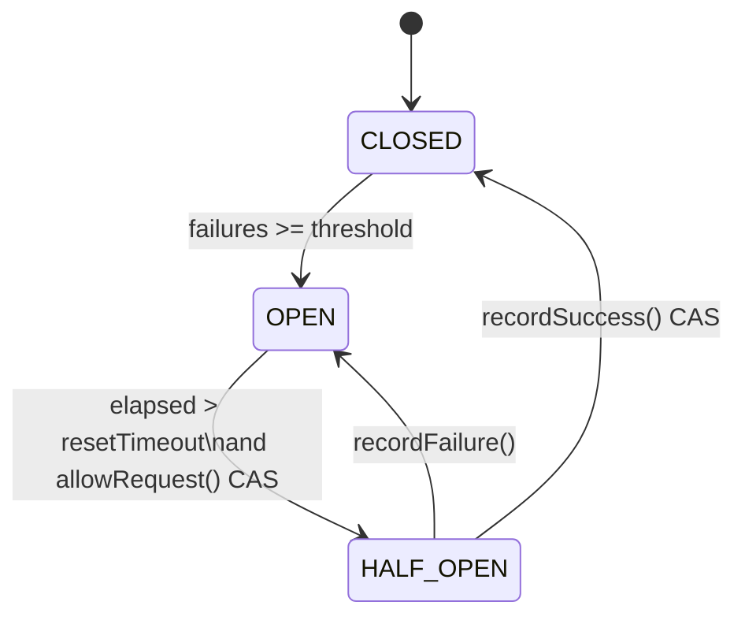
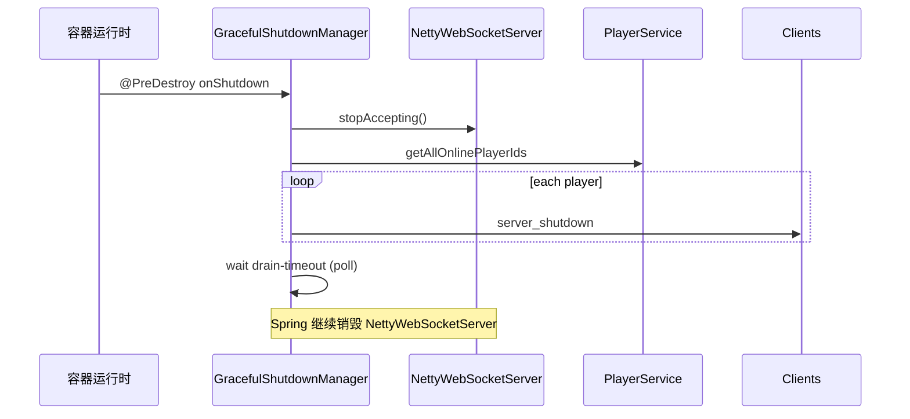

# 第 8 章：弹性设计 — 限流、熔断与优雅关停

**读者定位**：负责网关 SLO、容量与发布策略的工程师。本章对应 **Gate 入口流量形状**、**下游 gRPC 故障传播边界**，以及 **进程退出时的连接排空**。

---

## 8.1 RateLimiter 实现与配置

### 问题引入

WebSocket 长连接上，单玩家刷 `game_msg` 或全局突发会打满 EventLoop、gRPC Stream 与 Game 服。需要 **按玩家隔离** + **总闸**。

### 设计决策

- **每 key 计数窗口**：`ConcurrentHashMap` + `AtomicInteger`；定时任务清理过期 key。
- **两档限流**：`global` 固定 key；per-player 用 `playerId`，未认证时用 channel id。
- **心跳豁免**：不占用 per-player 游戏消息配额。

**注意**：`gate.resilience.RateLimiter` 由 Spring 装配；`gate.ratelimit` 包另有文档更详的实现，**当前 Bean 使用 `resilience` 包**。

### 核心实现

```10:22:gate-service/src/main/java/com/clawai/gatedemo/gate/resilience/ResilienceConfig.java
    @Bean("perPlayerRateLimiter")
    public RateLimiter perPlayerRateLimiter(
            @Value("${gate.ratelimit.per-player.max-requests:60}") int maxRequests,
            @Value("${gate.ratelimit.per-player.window-ms:60000}") long windowMs) {
        return new RateLimiter(maxRequests, windowMs);
    }

    @Bean("globalRateLimiter")
    public RateLimiter globalRateLimiter(
            @Value("${gate.ratelimit.global.max-requests:10000}") int maxRequests,
            @Value("${gate.ratelimit.global.window-ms:1000}") long windowMs) {
        return new RateLimiter(maxRequests, windowMs);
    }
```

```19:45:gate-service/src/main/java/com/clawai/gatedemo/gate/resilience/RateLimiter.java
    public RateLimiter(int maxRequests, long windowMs) {
        this.maxRequests = maxRequests;
        this.windowMs = windowMs;
        this.cleaner = Executors.newSingleThreadScheduledExecutor(r -> {
            Thread t = new Thread(r, "ratelimiter-cleaner");
            t.setDaemon(true);
            return t;
        });
        cleaner.scheduleAtFixedRate(this::cleanup, windowMs, windowMs, TimeUnit.MILLISECONDS);
    }

    public boolean tryAcquire(String key) {
        Window window = windows.computeIfAbsent(key, k -> new Window());
        long now = System.currentTimeMillis();

        if (now - window.windowStart > windowMs) {
            window.count.set(0);
            window.windowStart = now;
        }

        return window.count.incrementAndGet() <= maxRequests;
    }
```

```126:151:gate-service/src/main/java/com/clawai/gatedemo/gate/handler/GateNettyWebSocketHandler.java
        if (!globalRateLimiter.tryAcquire("global")) {
            sendError(ctx, "RATE_LIMITED", "Server rate limit exceeded");
            return;
        }
        // ...
        if (!"heartbeat".equals(type)) {
            Long rateLimitPlayerId = ctx.channel().attr(PlayerService.PLAYER_ID_KEY).get();
            String key = rateLimitPlayerId != null ? String.valueOf(rateLimitPlayerId) : ctx.channel().id().asShortText();
            if (!perPlayerRateLimiter.tryAcquire(key)) {
                sendError(ctx, "RATE_LIMITED", "Too many requests");
                return;
            }
        }
```

```84:90:gate-service/src/test/java/com/clawai/gatedemo/gate/resilience/RateLimiterTest.java
    @Test
    void tryAcquire_overLimit_returnsFalse() {
        rateLimiter = new RateLimiter(3, 10_000);

        assertTrue(rateLimiter.tryAcquire(TEST_KEY));
        assertTrue(rateLimiter.tryAcquire(TEST_KEY));
        assertTrue(rateLimiter.tryAcquire(TEST_KEY));
        assertFalse(rateLimiter.tryAcquire(TEST_KEY));
    }
```

### 演进复盘

- **改进**：双桶、配置化、匿名 fallback key。
- **技术债**：窗口重置与 `incrementAndGet` 非原子组合，极高并发下可能多放行；金融级可换 Redis/令牌桶。

### 扩展思考

- Resilience4j / Bucket4j + Prometheus。
- **练习**：全局限流改为漏桶，平滑 gRPC 出口。

---

## 8.2 CircuitBreaker 状态机设计

### 问题引入

Game 不可用时不应无限尝试转发，避免线程与日志风暴。

### 设计决策

三态 **CLOSED / OPEN / HALF_OPEN**，`AtomicReference` + CAS 迁移；与 **单例 `grpcCircuitBreaker` Bean** 绑定，在 `forwardToGame` 路径上快速失败。

### 核心实现

```29:62:gate-service/src/main/java/com/clawai/gatedemo/gate/resilience/CircuitBreaker.java
    public boolean allowRequest() {
        State current = state.get();
        if (current == State.CLOSED) {
            return true;
        }
        if (current == State.OPEN) {
            if (System.currentTimeMillis() - lastFailureTime > resetTimeoutMs) {
                if (state.compareAndSet(State.OPEN, State.HALF_OPEN)) {
                    logger.info("CircuitBreaker transitioned to HALF_OPEN");
                }
                return true;
            }
            return false;
        }
        // HALF_OPEN: allow one request through
        return true;
    }

    public void recordSuccess() {
        failureCount.set(0);
        if (state.compareAndSet(State.HALF_OPEN, State.CLOSED)) {
            logger.info("CircuitBreaker transitioned to CLOSED");
        }
    }

    public void recordFailure() {
        lastFailureTime = System.currentTimeMillis();
        int count = failureCount.incrementAndGet();
        if (count >= failureThreshold) {
            if (state.compareAndSet(State.CLOSED, State.OPEN) ||
                state.compareAndSet(State.HALF_OPEN, State.OPEN)) {
                logger.warn("CircuitBreaker transitioned to OPEN after {} failures", count);
            }
        }
    }
```

```229:241:gate-service/src/main/java/com/clawai/gatedemo/gate/handler/GateNettyWebSocketHandler.java
        if (!grpcCircuitBreaker.allowRequest()) {
            sendError(ctx, "GAME_UNAVAILABLE", "Game service temporarily unavailable");
            return;
        }

        try {
            playerService.forwardToGame(playerId, gameId, message);
            grpcCircuitBreaker.recordSuccess();
        } catch (Exception e) {
            grpcCircuitBreaker.recordFailure();
            sendError(ctx, "GAME_UNAVAILABLE", "Failed to forward to game service");
        }
```

```37:50:gate-service/src/test/java/com/clawai/gatedemo/gate/resilience/CircuitBreakerTest.java
    @Test
    void openToHalfOpen_afterResetTimeout() throws InterruptedException {
        long resetTimeoutMs = 100;
        CircuitBreaker cb = new CircuitBreaker(2, resetTimeoutMs);

        cb.recordFailure();
        cb.recordFailure();
        assertEquals(OPEN, cb.getState());

        Thread.sleep(resetTimeoutMs + 50);

        assertTrue(cb.allowRequest());
        assertEquals(HALF_OPEN, cb.getState());
    }
```

### 演进复盘

- **改进**：实现短、可测；HALF_OPEN 成功一次即关闭。
- **技术债**：未区分超时/业务错误；单例熔断器若被多 `gameId` 共用，故障隔离不足。

### 扩展思考

- 按 `gameId` 分片 `CircuitBreaker`。
- 与 Resilience4j 对齐指标与半开试探策略。



---

## 8.3 指数退避重连策略

### 问题引入

Stream 断开后固定间隔重连易 **同步风暴**；立即重连则浪费 CPU。

### 设计决策

- **Gate → Game**：每连接一个 `ExponentialBackoff`，失败 `getAndAdvance()`，成功 `reset()`；`ScheduledThreadPoolExecutor` 调度。
- **Player Client**：`ExponentialBackoffPolicy` + `ReconnectManager` 抽象重连节奏。

### 核心实现

```34:52:gate-service/src/main/java/com/clawai/gatedemo/gate/resilience/ExponentialBackoff.java
    public long getAndAdvance() {
        long current = currentDelayMs.get();
        long next = Math.min(maxDelayMs, (long) (current * multiplier));
        currentDelayMs.set(next);
        return current;
    }

    public void reset() {
        currentDelayMs.set(initialDelayMs);
    }

    public long getCurrentDelayMs() {
        return currentDelayMs.get();
    }
```

```193:202:gate-service/src/main/java/com/clawai/gatedemo/gate/grpc/GameGrpcClientPool.java
        GateConfig.GrpcPoolConfig poolCfg = gateConfig.getGrpcPool();
        ExponentialBackoff backoff = new ExponentialBackoff(
            poolCfg.getReconnectDelay(),
            poolCfg.getReconnectMaxDelay(),
            poolCfg.getReconnectMultiplier()
        );

        // 创建连接对象
        GrpcConnection conn = new GrpcConnection(gameId, host, port, channel, backoff);
        connectionPool.put(gameId, conn);
```

```298:312:gate-service/src/main/java/com/clawai/gatedemo/gate/grpc/GameGrpcClientPool.java
    private void scheduleReconnect(GrpcConnection conn) {
        ScheduledExecutorService scheduler = reconnectScheduler;
        if (scheduler == null || scheduler.isShutdown()) {
            logger.warn("重连调度器已关闭，跳过 Game {} 重连", conn.gameId);
            return;
        }

        long delayMs = conn.backoff.getAndAdvance();
        scheduler.schedule(() -> {
            if (!connectionPool.containsKey(conn.gameId)) {
                return;
            }
            logger.info("🔄 尝试重连 Game {}（delay={}ms）", conn.gameId, delayMs);
            startStreamCommunication(conn);
        }, delayMs, TimeUnit.MILLISECONDS);
    }
```

Client:

```13:23:player-client/src/main/java/com/clawai/gatedemo/client/reconnect/ExponentialBackoffPolicy.java
    public ExponentialBackoffPolicy(long initialDelay, long maxDelay, double multiplier, int maxRetries) {
        this.initialDelay = initialDelay;
        this.maxDelay = maxDelay;
        this.multiplier = multiplier;
        this.maxRetries = maxRetries;
        this.currentDelay = initialDelay;
    }

    public static ExponentialBackoffPolicy defaultPolicy() {
        return new ExponentialBackoffPolicy(1000L, 30000L, 2.0, 10);
    }
```

```46:49:player-client/src/main/java/com/clawai/gatedemo/client/reconnect/ExponentialBackoffPolicy.java
    public void onRetry() {
        retryCount++;
        currentDelay = (long) Math.min(currentDelay * multiplier, maxDelay);
    }
```

### 演进复盘

- **改进**：退避参数来自 `gate.grpc-pool`，可调；每 Game 连接独立 `ExponentialBackoff` 实例。
- **技术债**：客户端 `ReconnectManager` 需与真实建连逻辑闭环（`schedule` 内应触发 socket 连接，而非仅 `onRetry` 计数）。

### 扩展思考

- 加 **full jitter**：`delay = random_between(base, min(max, base*2))`。
- **练习**：熔断 OPEN 时暂停 gRPC 重连，避免空转。

---

## 8.4 连接数上限与拒绝策略

### 问题引入

FD、内存、`PlayerService` 注册表均有上限；需 **accept 级** 拒绝。

### 设计决策

`channelActive` 最早 `tryAcquire`；`channelInactive` `release()`；用 Attribute 标记是否曾 acquire，避免误释。

### 核心实现

```33:46:gate-service/src/main/java/com/clawai/gatedemo/gate/resilience/ConnectionLimiter.java
    public boolean tryAcquire() {
        int current;
        int next;
        do {
            current = activeCount.get();
            if (current >= maxConnections) {
                return false;
            }
            next = current + 1;
        } while (!activeCount.compareAndSet(current, next));
        return true;
    }

    public void release() {
        activeCount.decrementAndGet();
    }
```

```92:99:gate-service/src/main/java/com/clawai/gatedemo/gate/handler/GateNettyWebSocketHandler.java
    public void channelActive(ChannelHandlerContext ctx) throws Exception {
        if (!connectionLimiter.tryAcquire()) {
            logger.warn("连接数已达上限 {}，拒绝新连接：{}", connectionLimiter.getMaxConnections(), ctx.channel().remoteAddress());
            ctx.close();
            return;
        }
        ctx.channel().attr(CONNECTION_ACQUIRED).set(true);
```

```281:285:gate-service/src/main/java/com/clawai/gatedemo/gate/handler/GateNettyWebSocketHandler.java
        if (Boolean.TRUE.equals(ctx.channel().attr(CONNECTION_ACQUIRED).get())) {
            connectionLimiter.release();
        }
```

`gate.max-connections` 见 `application.yml`。

### 演进复盘

- **改进**：CAS 轻量；拒绝路径不解析 JSON。
- **技术债**：`release` 若被重复调用可能下溢（当前仅 inactive 一次调用）。

### 扩展思考

- `SO_BACKLOG` 与内核 `somaxconn` 联调。
- **练习**：Micrometer `gauge` 暴露活跃连接。

---

## 8.5 GracefulShutdownManager 实现

### 问题引入

SIGTERM 时立即掐断 TCP，玩家无提示，易产生半开业务态。

### 设计决策

1. `stopAccepting()` 关闭 listen socket。  
2. 广播 `server_shutdown`。  
3. 轮询 `getOnlineCount()` 直至超时。  
4. 后续 Spring 销毁阶段由 `NettyWebSocketServer.stop()` 收尾。  

`gate.shutdown.enabled` 可关编排；`@DependsOn("nettyWebSocketServer")` 影响初始化顺序，**销毁顺序仍要结合 K8s preStop/readiness**。

### 核心实现

```45:96:gate-service/src/main/java/com/clawai/gatedemo/gate/lifecycle/GracefulShutdownManager.java
    @PreDestroy
    public void onShutdown() {
        if (!enabled) {
            logger.info("优雅关闭已禁用，跳过编排");
            return;
        }

        logger.info("=== 开始优雅关闭，drain 超时 {} 秒 ===", drainTimeoutSeconds);

        // 阶段一：停止接受新连接
        nettyWebSocketServer.stopAccepting();
        logger.info("阶段一完成：已停止接受新连接");

        // 阶段二：通知玩家并等待 drain
        Set<Long> playerIds = playerService.getAllOnlinePlayerIds();
        int count = playerIds.size();

        if (count > 0) {
            logger.info("阶段二：通知 {} 个玩家服务器即将关闭", count);

            PlayerMessage shutdownNotice = new PlayerMessage();
            shutdownNotice.setType("server_shutdown");
            shutdownNotice.setTimestamp(System.currentTimeMillis());
            shutdownNotice.setBody(java.util.Map.of("reason", "Server is shutting down, please reconnect later"));

            for (Long playerId : playerIds) {
                playerService.sendToPlayer(playerId, shutdownNotice);
            }

            long deadline = System.currentTimeMillis() + TimeUnit.SECONDS.toMillis(drainTimeoutSeconds);
            while (playerService.getOnlineCount() > 0 && System.currentTimeMillis() < deadline) {
                try {
                    Thread.sleep(200);
                } catch (InterruptedException e) {
                    Thread.currentThread().interrupt();
                    logger.warn("优雅关闭等待被中断");
                    break;
                }
            }

            int remaining = playerService.getOnlineCount();
            if (remaining > 0) {
                logger.warn("drain 超时，仍有 {} 个连接未断开，将由 Netty 强制关闭", remaining);
            } else {
                logger.info("阶段二完成：所有玩家已断开");
            }
        } else {
            logger.info("阶段二：无活跃玩家，跳过 drain");
        }

        logger.info("=== 优雅关闭编排完成 ===");
    }
```

```127:131:gate-service/src/main/java/com/clawai/gatedemo/gate/ws/NettyWebSocketServer.java
    public void stopAccepting() {
        if (serverChannel != null && serverChannel.isOpen()) {
            serverChannel.close();
            logger.info("WebSocket 服务器已停止接受新连接");
        }
    }
```

### 演进复盘

- **改进**：两阶段语义清晰；客户端可识别 `server_shutdown` 触发重连策略（第 8.3 节）。
- **技术债**：`Thread.sleep` 轮询粗糙；多个 `@PreDestroy` 顺序需与运维 preStop 协同。

### 扩展思考

- K8s：`preStop` sleep + readiness 摘流。
- **练习**：`ChannelGroup` 跟踪未关闭连接，替代轮询。



---

## 本章小结

| 能力 | 位置 | 作用 |
|------|------|------|
| 双桶限流 | `ResilienceConfig` + Handler | 全闸 + 每玩家 |
| 熔断 | `CircuitBreaker` + 转发 | 下游快速失败 |
| 退避 | `ExponentialBackoff` + `GameGrpcClientPool` / 客户端 | 抑制重连风暴 |
| 连接上限 | `ConnectionLimiter` | accept 保护 |
| 优雅关停 | `GracefulShutdownManager` | 发布/缩容体验 |

与第 7 章叠加：**准入 → 形状治理 → 下游保护 → 体面退出**。

> **说明**：若本地 `ExponentialBackoff.java`、`ConnectionLimiter.java`、`GracefulShutdownManager.java` 或部分测试文件为空，请以 Git 已提交版本为准；正文行号对齐该版本。
