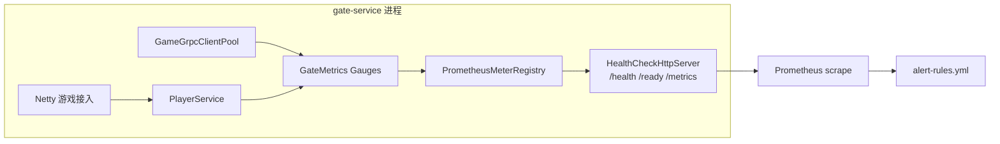

# 第 9 章：可观测性 — 指标、日志与追踪

**受众**：熟悉游戏网关与分布式系统的读者。本章聚焦「为何这样量」「如何暴露」「日志与追踪如何衔接」，不重复可观测性通识。

---

## 1. 问题引入

网关进程同时承担 **高并发 TCP/WebSocket**、**gRPC 长连接池** 与 **Redis 会话态**，若仅依赖「进程还在」或零散 `logger.info`，会出现：

- 容量与背压：连接数上涨、gRPC 池枯竭时，缺少与业务同维度的 **Gauge**，难以做 HPA 与告警。
- 故障定位：单条日志无法关联一次消息往返；跨 Gate → Game 时没有 **trace 上下文**，排障靠猜。
- 采集路径：主业务跑在 Netty，若强依赖 Spring MVC 的 `/actuator/prometheus`，会与 **实际监听端口/线程模型** 脱节，运维侧 scrape 目标混乱。

本章对应仓库中的演进：**Micrometer + 独立 Netty HTTP 暴露 `/metrics`**、**Logstash JSON + MDC 字段预留**、**OpenTelemetry 相关依赖入 POM（桥接准备）**，并与历史 **`MetricsCollector` 日志型指标** 并存，形成可讨论的过渡态。

---

## 2. 设计决策

| 选项 | 优点 | 缺点 | 本仓库取舍 |
|------|------|------|------------|
| 仅日志里打印 MetricsCollector 报表 | 实现快、无外部依赖 | 非时序库语义、无法告警聚合 | 保留为 **过渡/调试**，未作为唯一真相 |
| Spring Boot Actuator 独占 Prometheus | 标准、与生态一致 | gate 主路径在 Netty，808x 与游戏口易混淆；未引入 actuator 时配置无效 | `application.yml` 中 **预埋** `management.*`，与 **Netty `/metrics`** 并行时需明确「以谁为准」 |
| 独立 Netty HTTP：`/health`、`/ready`、`/metrics` | 与 K8s Probe、Prometheus 对齐；不抢业务端口 | 需手写路由与安全策略 | **采用**：`HealthCheckHttpServer` |
| 自定义指标命名随意 | 灵活 | 与 Prometheus/Grafana 约定冲突 | `GateMetrics` 使用 **`active_connections` / `grpc_pool_size`** 等可读名 |
| 全量接入 OTel SDK + 自动 instrumentation | 端到端追踪完整 | 依赖、配置、采样策略成本高 | POM 已加 **micrometer-tracing-bridge-otel** 与 **zipkin exporter**，**运行时全链路配置可后续打开** |

---

## 3. 核心实现

### 3.1 GateMetrics：连接数、gRPC 池（9.1）

`GateMetrics` 在启动时向 **共享 `MeterRegistry`** 注册两个 **Gauge**：在线连接（经 `PlayerService`）与 gRPC 池大小（经 `GameGrpcClientPool`）。Gauge 适合「当前状态」类指标；消息吞吐若要做 **Counter/Timer**，更适合在消息入口/出口埋点（与下文 `MetricsCollector` 的统计维度可逐步合并）。

```java
@Component
public class GateMetrics {

    private final MeterRegistry meterRegistry;
    private final PlayerService playerService;
    private final GameGrpcClientPool gameGrpcClientPool;

    @PostConstruct
    public void register() {
        Gauge.builder("active_connections", playerService, PlayerService::getOnlineCount)
                .description("Number of active WebSocket connections (players online)")
                .register(meterRegistry);

        Gauge.builder("grpc_pool_size", gameGrpcClientPool, GameGrpcClientPool::getPoolSize)
                .description("Number of gRPC connections in the game client pool")
                .register(meterRegistry);
    }
}
```

`MetricsConfig` 显式提供 **`PrometheusMeterRegistry`** 并同时暴露为 **`MeterRegistry` Bean**，便于在不走 Spring Boot Actuator 默认装配的情况下，仍能把 **同一注册表** 注入 Netty 健康检查处理器做 `scrape()`：

```java
@Configuration
public class MetricsConfig {

    @Bean
    public PrometheusMeterRegistry prometheusMeterRegistry() {
        return new PrometheusMeterRegistry(PrometheusConfig.DEFAULT);
    }

    @Bean
    public MeterRegistry meterRegistry(PrometheusMeterRegistry prometheusMeterRegistry) {
        return prometheusMeterRegistry;
    }
}
```

**并存的 `MetricsCollector`**（`gate/monitor/MetricsCollector.java`）用原子类维护消息数、错误数、按 `messageId` 的耗时聚合，并 **每分钟打一段汇总日志**。这是典型的「运维可读的临时方案」：适合开发期 eyeball，不适合作为 Prometheus 唯一数据源；与 OpenSpec 中「迁移到 Micrometer」的方向一致。

```java
public void recordMessage(short messageId, long processTimeMs) {
    totalMessages.incrementAndGet();
    MessageMetrics metrics = messageMetrics.computeIfAbsent(messageId, k -> new MessageMetrics());
    metrics.record(processTimeMs);
}
```

### 3.2 Prometheus 端点与告警规则（9.2）

**抓取端点**：`HealthCheckHttpServer` 内嵌 handler 对 `GET /metrics` 返回 `PrometheusMeterRegistry.scrape()`，Content-Type 使用 Prometheus 文本格式约定：

```java
if ("/metrics".equals(path) || "/metrics/".equals(path)) {
    String scrape = prometheusMeterRegistry.scrape();
    byte[] body = scrape.getBytes(java.nio.charset.StandardCharsets.UTF_8);
    FullHttpResponse response = new DefaultFullHttpResponse(HttpVersion.HTTP_1_1, HttpResponseStatus.OK);
    response.headers().set(HttpHeaderNames.CONTENT_TYPE, "text/plain; version=0.0.4; charset=utf-8");
    // ...
}
```

**健康与就绪**（同进程、同端口）：`/health` 始终 200 返回 JSON 组件状态；`/ready` 在 Redis、gRPC 池不满足时返回 **503**，供 K8s `readinessProbe` 摘流。

`monitoring/prometheus/alert-rules.yml` 覆盖 **进程 CPU/内存**、**up**、**HTTP/gRPC P99 延迟**、**gRPC 熔断** 等。规则假定目标已暴露标准 JVM/Micrometer/gRPC 指标；若某指标尚未注册，Prometheus 侧会表现为无数据或告警不触发——这是告警 YAML 与实装对齐时需要持续校验的点。

```yaml
- alert: HighLatency
  expr: histogram_quantile(0.99, rate(http_server_requests_seconds_bucket[5m])) > 0.5
    or histogram_quantile(0.99, rate(grpc_server_handling_seconds_bucket[5m])) > 0.5
  for: 5m
```

**指标流水线（Mermaid）**



### 3.3 JSON 结构化日志与 traceId / spanId（9.3）

`logback-spring.xml` 按 **Profile** 分流：**prod** 用 `LogstashEncoder` 输出 JSON，并把 MDC 中的 `traceId`、`spanId` 打进字段；非 prod 用明文 pattern，同样预留 `[%X{traceId:-}] [%X{spanId:-}]`，本地可读。

```xml
<appender name="JSON_CONSOLE" class="ch.qos.logback.core.ConsoleAppender">
    <encoder class="net.logstash.logback.encoder.LogstashEncoder">
        <includeMdcKeyName>traceId</includeMdcKeyName>
        <includeMdcKeyName>spanId</includeMdcKeyName>
        <customFields>{"application":"gate-service"}</customFields>
    </encoder>
</appender>
```

业务侧 **`TraceIdGenerator`** 用 **ThreadLocal** 维护 traceId，并强调 **finally 清理** 避免泄漏；另提供 `generateForMessage` 生成短可读 ID。这与「日志里显式带 traceId」的 `MessageLogger` 配套设计：

```java
public static void logIncoming(String traceId, Long playerId, WrappedMessage message) {
    logger.info("[{}] IN  playerId={} msgId={}({}) seq={} len={}",
            traceId, playerId,
            message.getHeader().getMessageId(),
            messageName,
            message.getHeader().getSequence(),
            message.getHeader().getBodyLength());
}
```

**实现注意**：当前仓库中 **Java 代码未普遍使用 `MDC.put("traceId", ...)`**，因此 JSON 中的 `traceId`/`spanId` 字段在完全接通前可能为空；生产落地需要在线程入口（例如 Netty handler）把 `TraceIdGenerator` 与 **MDC** 同步，并在 gRPC **Client/Server Interceptor** 中传播 header。

### 3.4 OpenTelemetry 桥接（9.4）

`gate-service/pom.xml` 引入：

- `micrometer-tracing-bridge-otel`：Micrometer Tracing API 与 OTel 之间的桥
- `opentelemetry-exporter-zipkin`：将 span 导出到 Zipkin 兼容后端

```xml
<dependency>
    <groupId>io.micrometer</groupId>
    <artifactId>micrometer-tracing-bridge-otel</artifactId>
</dependency>
<dependency>
    <groupId>io.opentelemetry</groupId>
    <artifactId>opentelemetry-exporter-zipkin</artifactId>
</dependency>
```

**桥接含义**：依赖到位后，可在 Spring Boot 3 体系下通过 **`management.tracing`**、采样率、Baggage 等与 **Micrometer Observation** 对齐；对 **纯 Netty 路径** 仍需手动 `Observation` 或 OTel API 埋点。本章不展开全套 YAML，以免与你们后续选定的 Collector（OTLP vs Zipkin）绑定；读者应把「POM 桥 + 日志 MDC」视为 **同一 trace 上下文的两条消费通道**。

---

## 4. 演进复盘

**改进**

- 用 **Micrometer Gauge** 表达连接与 gRPC 池，和 **Prometheus 文本暴露** 打通，便于与 K8s 旁路健康端口统一 scrape。
- **Logstash JSON** 为 ELK/Loki 类管道做好准备；明文 dev 模式降低本地噪声。
- 告警规则覆盖 **延迟、资源、熔断**，与微服务治理文档形成闭环。

**仍存技术债**

- **`MetricsCollector` 与 `GateMetrics` 双轨**：前者偏日志报表，后者偏 Prometheus；长期应合并维度，避免「两个真相源」。
- **`application.yml` 的 `management.endpoints`**：若未引入 `spring-boot-starter-actuator`，相关键 **不会生效**；当前 **事实上的 metrics 入口是 Netty `HealthCheckHttpServer`**。
- **MDC 未在 handler 中统一写入**、`spanId` 未与追踪实现联动时，JSON 里预留字段 **语义大于实值**。
- **MessageLogger** 与业务 handler 的调用链需在代码评审中确认全覆盖，否则「可观测消息平面」仍不完整。

---

## 5. 扩展思考

1. **指标模型**：为单条消息增加 `Timer`（或 `DistributionSummary`）时，如何用 **低基数 label**（如 msg 大类）避免 Prometheus 高基数爆炸？
2. **采集安全**：`/metrics` 是否应对内网或 mTLS 隔离？是否拆 **仅 metrics 的 NetworkPolicy**？
3. **全链路**：在 gRPC metadata 中传递 W3C `traceparent`，Game 侧用 **grpc-spring-boot-starter** 或原生 interceptor 还原 parent span。
4. **练习**：在 Netty 入站 handler 中：`TraceIdGenerator.generate()` → `MDC.put("traceId", ...)` → `try { ... } finally { MDC.clear(); TraceIdGenerator.clear(); }`，并验证 prod Profile 下 JSON 行是否出现对应字段。

---

**本章涉及的主要路径**：`gate-service/.../metrics/GateMetrics.java`、`gate-service/.../config/MetricsConfig.java`、`gate-service/.../health/HealthCheckHttpServer.java`、`gate-service/.../monitor/MetricsCollector.java`、`gate-service/.../log/TraceIdGenerator.java`、`gate-service/.../log/MessageLogger.java`、`gate-service/src/main/resources/logback-spring.xml`、`monitoring/prometheus/alert-rules.yml`、`gate-service/pom.xml`。
