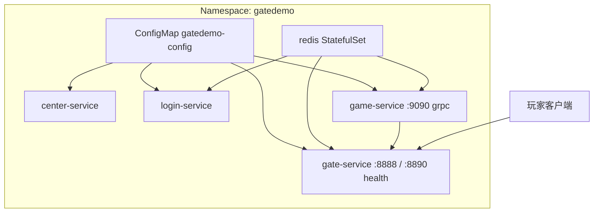

# 第 10 章：生产部署 — 多环境、Docker 与 Kubernetes

**受众**：负责游戏网关与服务编排的工程师。本章串联 **Profile 与密钥边界**、**Compose 本地拓扑**、**K8s 清单与探针**、**CI/CD 制品流**。

---

## 1. 问题引入

从单机 demo 到可运维环境，需要解决：

- **配置分环境**：开发机要调试日志与关 TLS；生产要把 **Redis 地址、JWT、证书** 外置，且避免默认值泄露。
- **依赖拓扑**：Gate 依赖 Redis + Game gRPC；Login 依赖 Redis；Compose/K8s 要表达 **启动顺序与健康依赖**。
- **探针语义**：Liveness「进程是否要杀」与 Readiness「是否接流量」必须区分；Gate 主协议非 HTTP 时，**独立健康端口** 成为标准答案。
- **交付流水线**：镜像标签、多模块 Maven 工程、GHCR 推送需 **可重复、可审计**。

---

## 2. 设计决策

| 维度 | 决策 | 原因 |
|------|------|------|
| 配置 | `application-dev.yml` / `application-prod.yml` + 根 `.env.example` | Spring Profile 管行为差异；`.env` 管本地与 Compose 注入约定 |
| 密钥 | Prod **强制环境变量**（如 `JWT_SECRET`、`REDIS_PASSWORD`、TLS 路径） | 与镜像分层解耦，符合 12-factor |
| 本地编排 | Docker Compose：**Redis + center + login + game + gate**（另附 **player-client** 联调） | 一条命令拉起依赖链；`depends_on` + `healthcheck` 降低竞态 |
| K8s | `Namespace` + 共享 `ConfigMap` + 每服务 `Deployment`/`Service`/`HPA` | 非 Helm 的 **显式 YAML**，便于教程阅读与小集群落地 |
| 探针 | Gate：**HTTP 8890** `/health` vs `/ready`；Game：**gRPC** 9090 | 与实现一致（见 10.4） |
| CI/CD | **CI**：`mvn verify` + 测试报告产物；**Deploy**：`mvn package` + **矩阵构建推送四个服务镜像** | 测试与发布_job 分离，推送用 `docker/build-push-action` |

---

## 3. 核心实现

### 10.1 多环境配置管理（Profile + .env）

**Gate — dev**：关闭 TLS、调试日志、Redis 密码默认值与 JWT 占位。

```yaml
# application-dev.yml
gate:
  redis:
    password: redistest
  tls:
    enabled: false
  jwt:
    secret: ${JWT_SECRET:DefaultGateDemoSecretKeyForHMACSHA256Auth!}

logging:
  level:
    com.clawai.gatedemo: DEBUG
```

**Gate — prod**：TLS 默认开启、Redis 与 Sentinel 占位、日志 INFO、**密钥无安全默认值**。

```yaml
gate:
  redis:
    host: ${REDIS_HOST:localhost}
    password: ${REDIS_PASSWORD}
  tls:
    enabled: true
    cert-path: ${TLS_CERT_PATH}
    key-path: ${TLS_KEY_PATH}
  jwt:
    secret: ${JWT_SECRET}
```

**Game** 同样采用 dev/prod 分文件：`dev` 关 gRPC TLS；`prod` 打开 TLS 并从环境变量取 Redis 密码与证书路径（与 Gate 对称，便于双边 **mTLS/plaintext** 一致）。

根目录 **`.env.example`** 统一约定：`SPRING_PROFILES_ACTIVE`、`JWT_SECRET`、TLS、Redis、`GATE_ID`/`GATE_PORT`/`HEALTH_PORT`、`GAME_ID`/`GRPC_PORT` 等，Compose 与本地 shell 可共用同一套名字。

**主配置** `gate-service/src/main/resources/application.yml`（节选）将 **业务口**、**Redis**、**健康端口**、**game 实例列表** 与 **management 暴露列表** 绑到环境变量：

```yaml
gate:
  port: ${GATE_PORT:8888}
  health:
    port: ${HEALTH_PORT:8890}
  games:
    - id: 1001
      host: ${GAME_1001_HOST:localhost}
      port: ${GAME_1001_PORT:9090}

management:
  endpoints:
    web:
      exposure:
        include: health,prometheus,info
```

### 10.2 五服务 Docker Compose 编排

Compose 中 **核心后端五条线**：`redis`、`center-service`、`login-service`、`game-1001`、`gate-01`。另加 **`player-client`** 用于演示客户端依赖 `gate-01`，不算业务微服务，但完成「端到端可玩」闭环。

要点摘录：

- **Redis**：`healthcheck` + 数据卷；其他服务 `depends_on: condition: service_healthy`。
- **game-1001**：暴露 gRPC `9090`；健康检查使用 **`grpc_health_probe`**（与 K8s gRPC 探针语义一致）。
- **gate-01**：映射 **`8888`（游戏）+ `8890`（健康/metrics）**；环境变量注入 `GAME_1001_HOST`、`REDIS_*`、`JWT_SECRET` 等。

```yaml
  gate-01:
    ports:
      - "8888:8888"
      - "8890:8890"
    environment:
      - SPRING_PROFILES_ACTIVE=dev
      - GATE_ID=gate-01
      - GATE_PORT=8888
      - HEALTH_PORT=8890
      - GAME_1001_HOST=game-1001
      - GAME_1001_PORT=9090
      - REDIS_HOST=redis
      - JWT_SECRET=${JWT_SECRET:-DefaultGateDemoSecretKeyForHMACSHA256Auth!}
    healthcheck:
      test: ["CMD", "curl", "-f", "http://localhost:8890/health"]
```

### 10.3 K8s 部署清单（Namespace / ConfigMap / Service / HPA）

**Namespace** `gatedemo` 隔离资源。

**ConfigMap** `gatedemo-config` 存放非敏感集群内约定：`SPRING_PROFILES_ACTIVE=prod`、Redis Service 名、`GAME_1001_HOST`/`PORT` 等；**敏感项**（密码、JWT）在生产应来自 **Secret**，教程 YAML 为可读性留占位，落地时请替换。

**Gate Deployment**（节选）：双副本、`GATE_ID` 用 **downward API** 取 Pod 名（多副本时便于日志区分）；**liveness** 打 `/health`，**readiness** 打 `/ready`；**HPA** 按 CPU 70% 在 2～10 Pod 间伸缩。

```yaml
livenessProbe:
  httpGet:
    path: /health
    port: 8890
readinessProbe:
  httpGet:
    path: /ready
    port: 8890
---
apiVersion: autoscaling/v2
kind: HorizontalPodAutoscaler
spec:
  minReplicas: 2
  maxReplicas: 10
  metrics:
    - type: Resource
      resource:
        name: cpu
        target:
          type: Utilization
          averageUtilization: 70
```

**Game Service**：`readinessProbe`/`livenessProbe` 使用 **原生 `grpc` 探针**（Kubernetes 1.24+ 特性），端口对齐 gRPC 监听。

**Redis**：`StatefulSet` + `volumeClaimTemplates` 持久化；与 Compose 的匿名卷相比，更贴近生产。

**部署拓扑（Mermaid）**



### 10.4 健康检查端点设计（Netty HTTP / gRPC Health）

**Gate — `HealthCheckHttpServer`**（Netty）：

- **`/health`**：返回组件 JSON（Redis、gRPC 池状态、连接数等），**HTTP 200**（偏「存活 + 可观测」）。
- **`/ready`**：若 Redis 或 gRPC 池不可用 → **503**，供编排系统摘流。
- **`/metrics`**：Prometheus scrape（与第 9 章衔接）。

**Game — gRPC**：容器内使用 `grpc_health_probe`（Compose）与 K8s `grpc` 探针（集群），避免为健康检查再开 HTTP 适配层。

**Trade-off**：Gate 选 **独立 HTTP 端口** 而非仅依赖 Spring `server.port`，是因为 **游戏主监听在 Netty**，与 Spring Web 端口（如 `9083`）解耦，运维规则更清晰。

### 10.5 CI/CD 流水线（GitHub Actions）

**`.github/workflows/ci.yml`**：在 `push`/`pull_request` 上执行 **`mvn clean verify`**，并上传 JaCoCo 与 Surefire 报告（`if: always()` 保证失败可见）。

**`.github/workflows/deploy.yml`**（`main`/`master` 推送）：

1. Job **`build-and-test`**：`mvn clean package` 全量构建。
2. Job **`docker-push`**：`matrix` 遍历 `gate-service`、`game-service`、`login-service`、`center-service`；`mvn package -pl <module> -am -DskipTests` 后 **buildx 推 GHCR**，标签含 **SHA** 与 **latest**。

```yaml
strategy:
  matrix:
    service:
      - gate-service
      - game-service
      - login-service
      - center-service
steps:
  - name: Build JAR
    run: mvn clean package -pl ${{ matrix.service }} -am -B -DskipTests
  - name: Build and push
    uses: docker/build-push-action@v5
    with:
      context: ./${{ matrix.service }}
      push: true
```

**注意**：K8s YAML 中镜像写为 `ghcr.io/OWNER/...`，落地前需替换 **OWNER** 或与 `IMAGE_PREFIX: ${{ github.repository }}` 的命名约定对齐。

---

## 4. 演进复盘

**改进**

- Profile 清晰划分 **TLS、日志、密钥来源**；Compose 与 K8s 对健康检查路径 **与代码一致**。
- HPA 为 HTTP 类服务提供基本弹性；Gate 双副本 + readiness 与游戏长连接场景需结合 **粘滞会话/网关层路由** 再评估（否则缩容仍可能踢连接）。

**技术债 / 风险**

- ConfigMap 明文不适合真生产密钥；需 **Secret + External Secrets** 等。
- `deploy.yml` **推送前跳过测试**（`-DskipTests`）：换环境时需权衡速度与安全。
- **center-service** 在 Compose 中未作为 Gate 的硬依赖，若业务链路依赖中心服，要在 Compose/K8s 中补 **depends_on** 或启动顺序文档。

---

## 5. 扩展思考

1. 将 **Prometheus ServiceMonitor**（若使用 Prometheus Operator）指向 Gate 的 **8890/metrics**，与告警规则第 9 章联动。
2. 为 Gate 增加 **preStop hook**（sleep + 连接排空）与 **PodDisruptionBudget**，与 `GracefulShutdownManager` 行为对齐。
3. **练习**：把 `gatedemo-config` 中的敏感键迁到 `Secret`，并修改 Deployment 的 `envFrom`。
4. **练习**：在 CI 中增加 **`docker compose config` 校验** 与 **Trivy 镜像扫描**，作为 `deploy` 的门禁。

---

**本章涉及的主要路径**：`gate-service/src/main/resources/application.yml`、`application-dev.yml`、`application-prod.yml`、`game-service` 下对应 yml、项目根 `.env.example`、`docker-compose.yml`、`k8s/*.yaml`、`.github/workflows/ci.yml`、`.github/workflows/deploy.yml`、`gate-service/.../health/HealthCheckHttpServer.java`。
