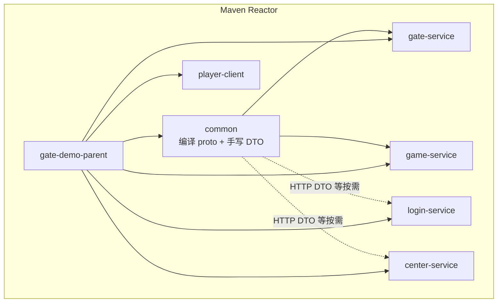
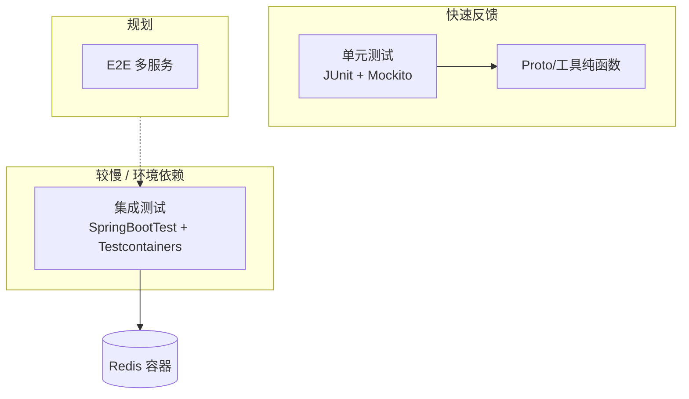

# 第 11 章：公共模块与工程实践

**读者定位**：Level 4 — 游戏/网关领域专家。本章假设你已熟悉 Maven 多模块、gRPC/Proto 与测试金字塔，只讨论 **何时抽 common、如何单一真源编译 Proto、测试分层与仓库物理布局** 的取舍与落地。

---

## 11.1 common 模块的抽取时机与边界

### 问题引入

多服务仓库里常见三类痛：

1. **同一套 `.proto` 在 gate-service、game-service 各自挂 `protobuf-maven-plugin`**：protoc/grpc 版本漂移、生成类包名不一致、改一次协议要改两处构建。
2. **HTTP 侧通用壳（如统一 `code/message/data`）在 login、center 各写一份**：行为相同却重复维护，字段微调容易漏改。
3. **“公共”无限膨胀**：把 Spring Bean、网关协议模型、业务常量全塞进 common，导致任何小服务改依赖都牵一发而动全身。

GateDemo 在演进中通过独立 **`common` 模块** 把「协议与最小共享 DTO」收敛到单一模块；更重的协议封装（如 Gate 内部二进制帧）按设计**刻意**留在各服务，避免 common 变成大杂烩。

### 设计决策

| 选项 | 优点 | 缺点 |
|------|------|------|
| 各模块自编译 Proto | 模块边界“干净” | 双源构建、版本不一致风险高 |
| 独立 `proto` 仓库 + 发布 jar | 多仓库版本语义清晰 | 本地联调与 CI 复杂度上升 |
| **父工程内 `common` 单点编译 Proto + 依赖传递** | 单一真源、Maven Reactor 顺序自然 | consumer 会带上整包生成类（通常可接受） |

归档设计（`openspec/.../extract-common-module`）明确 **Non-Goals**：不在此阶段把 gate 的 `WrappedMessage` 等整包迁入 common；common 保持 **最小依赖**（gRPC/Protobuf 等），不放 Spring Web 全家桶。

**当前边界（与仓库一致）**：

- **在 common**：Proto 生成类、`ApiResponse` 等真正跨服务复用的 DTO。
- **不在 common（除非多模块真实引用）**：TraceId、JSON 工具、Gate 专有帧结构 — 避免 common 依赖面爆炸。

### 核心实现

父 POM 将 `common` 列入 Reactor，并在 `dependencyManagement` 中锁定版本，供子模块引用：

```21:28:/Users/lizhiwei/Work/Lzw/GateDemo/pom.xml
    <modules>
        <module>common</module>
        <module>gate-service</module>
        <module>game-service</module>
        <module>player-client</module>
        <module>center-service</module>
        <module>login-service</module>
    </modules>
```

```44:50:/Users/lizhiwei/Work/Lzw/GateDemo/pom.xml
        <dependencies>
            <dependency>
                <groupId>com.clawai.gatedemo</groupId>
                <artifactId>common</artifactId>
                <version>${project.version}</version>
            </dependency>
```

`common` 模块自述职责与依赖面（仅 gRPC/Proto 栈 + `javax.annotation-api`）：

```13:41:/Users/lizhiwei/Work/Lzw/GateDemo/common/pom.xml
    <artifactId>common</artifactId>
    <packaging>jar</packaging>

    <name>Common Module</name>
    <description>共享 DTO、Proto 生成类、工具类</description>

    <dependencies>
        <!-- gRPC & Protobuf -->
        <dependency>
            <groupId>io.grpc</groupId>
            <artifactId>grpc-netty-shaded</artifactId>
        </dependency>
        <dependency>
            <groupId>io.grpc</groupId>
            <artifactId>grpc-protobuf</artifactId>
        </dependency>
        <dependency>
            <groupId>io.grpc</groupId>
            <artifactId>grpc-stub</artifactId>
        </dependency>
        <dependency>
            <groupId>com.google.protobuf</groupId>
            <artifactId>protobuf-java</artifactId>
        </dependency>
        <dependency>
            <groupId>javax.annotation</groupId>
            <artifactId>javax.annotation-api</artifactId>
            <version>1.3.2</version>
        </dependency>
    </dependencies>
```

手写的共享 DTO 示例 — `ApiResponse` 提供静态工厂，避免各服务各写一套：

```1:29:/Users/lizhiwei/Work/Lzw/GateDemo/common/src/main/java/com/clawai/gatedemo/common/dto/ApiResponse.java
package com.clawai.gatedemo.common.dto;

public class ApiResponse<T> {
    private int code;
    private String message;
    private T data;

    public int getCode() { return code; }
    public void setCode(int code) { this.code = code; }
    public String getMessage() { return message; }
    public void setMessage(String message) { this.message = message; }
    public T getData() { return data; }
    public void setData(T data) { this.data = data; }

    public static <T> ApiResponse<T> success(T data) {
        ApiResponse<T> response = new ApiResponse<>();
        response.setCode(0);
        response.setMessage("success");
        response.setData(data);
        return response;
    }

    public static <T> ApiResponse<T> error(int code, String message) {
        ApiResponse<T> response = new ApiResponse<>();
        response.setCode(code);
        response.setMessage(message);
        return response;
    }
}
```

依赖关系可概括为（`player-client` 当前 POM **未**声明对 `common` 的依赖）：



### 演进复盘

- **改进**：Proto 与跨服务 DTO 有明确“宿主”模块；父 POM 统一 `grpc.version` / `protobuf.version`，与 common 内插件配置对齐。
- **仍存**：`common` 的 `description` 提到「工具类」，但当前源码树中手写 Java 仍以 `ApiResponse` 为主 — 符合“按需迁入”策略，也提示 **文档与代码需偶尔对齐**。
- **技术债**：若未来 `player-client` 也需生成类，要理清是否只依赖 `common` 还是单独 client stub，避免 Android/瘦客户端被迫拉上 `grpc-netty-shaded`。

### 扩展思考

- **行业实践**：大厂常见「IDL 独立仓库 + 语义化版本发布」；中小团队用 **monorepo + common** 性价比更高。
- **练习**：列出三类代码（Proto 生成类、HTTP DTO、带 Spring 注解的配置属性类），各归哪一模块，并说明若放错模块会导致的依赖循环。

---

## 11.2 Proto 文件共享与构建集成

### 问题引入

Gate 与 Game 通过 **同一套 `GameService` IDL** 对话：Unary、双向 `StreamCommunication`、心跳流。若两边各自维护 `.proto` 副本或各自编译，极易出现 **字段号不一致、java_package 不一致、某侧未重新生成** 的线上事故。

### 设计决策

- **单一目录**：仓库根下 `proto/` 存放 `game_service.proto`（可多文件，当前主契约集中在一个文件）。
- **单一编译执行点**：在 **`common` 模块** 配置 `protoSourceRoot` 指向 `../proto`，执行 `compile` + `compile-custom` 生成 Java 与 gRPC stub。
- **父 POM 仍声明 `protobuf-maven-plugin`**：提供全局 `protocArtifact` / `pluginArtifact` 默认值；子模块（common）覆盖 `protoSourceRoot`。注意避免 gate/game **再次**执行生成目标导致重复或路径混乱 — 当前约定是 **仅 common 产出**，服务模块只 `dependency` common。

可选能力：**Proto 文档** 通过 `exec-maven-plugin` + profile `proto-doc` 生成 HTML（默认 `skip=true`，避免无 `protoc-gen-doc` 的环境构建失败）。

### 核心实现

契约节选 — `java_package` 与 `service` 定义与生成类路径直接相关：

```1:18:/Users/lizhiwei/Work/Lzw/GateDemo/proto/game_service.proto
syntax = "proto3";

option java_multiple_files = true;
option java_package = "com.clawai.gatedemo.grpc";
option java_outer_classname = "GameServiceProto";

package gameservice;

// Gate 服务发送给 Game 服务的游戏消息
message GameMessage {
    string gate_id = 1;           // 网关 ID
    int64 player_id = 2;          // 玩家 ID
    int32 game_id = 3;            // 游戏 ID
    string msg_type = 4;          // 消息类型（如：battle.move, chat.send）
    int32 seq = 5;                // 消息序列号
    int64 timestamp = 6;          // 消息时间戳
    bytes body = 7;                 // 消息体（二进制Protobuf数据）
}
```

同文件中还定义了 `GameResponse`、`HeartbeatRequest` / `HeartbeatResponse` 与下列 `service`（Unary + 双向流 + 心跳流）：

```39:49:/Users/lizhiwei/Work/Lzw/GateDemo/proto/game_service.proto
// Gate ↔ Game 服务接口定义
service GameService {
    // 发送游戏消息（单向，非Stream）
    rpc SendGameMessage (GameMessage) returns (GameResponse);
    
    // 双向Stream通信（持久连接，支持双向流式消息）
    rpc StreamCommunication (stream GameMessage) returns (stream GameMessage);
    
    // 心跳保持（双向流）
    rpc Heartbeat (stream HeartbeatRequest) returns (stream HeartbeatResponse);
}
```

`common/pom.xml` 中插件将源码根指回仓库级 `proto/`：

```46:64:/Users/lizhiwei/Work/Lzw/GateDemo/common/pom.xml
            <plugin>
                <groupId>org.xolstice.maven.plugins</groupId>
                <artifactId>protobuf-maven-plugin</artifactId>
                <version>0.6.1</version>
                <configuration>
                    <protocArtifact>com.google.protobuf:protoc:${protobuf.version}:exe:${os.detected.classifier}</protocArtifact>
                    <pluginId>grpc-java</pluginId>
                    <pluginArtifact>io.grpc:protoc-gen-grpc-java:${grpc.version}:exe:${os.detected.classifier}</pluginArtifact>
                    <protoSourceRoot>${project.basedir}/../proto</protoSourceRoot>
                </configuration>
                <executions>
                    <execution>
                        <goals>
                            <goal>compile</goal>
                            <goal>compile-custom</goal>
                        </goals>
                    </execution>
                </executions>
            </plugin>
```

父 POM 启用 `os-maven-plugin` 扩展，供 `${os.detected.classifier}` 解析本机 protoc 可执行包：

```161:168:/Users/lizhiwei/Work/Lzw/GateDemo/pom.xml
        <extensions>
            <!-- OS detection for protobuf -->
            <extension>
                <groupId>kr.motd.maven</groupId>
                <artifactId>os-maven-plugin</artifactId>
                <version>1.7.1</version>
            </extension>
        </extensions>
```

`gate-service` 仅声明对 `common` 的依赖，不再各自编译 proto：

```17:22:/Users/lizhiwei/Work/Lzw/GateDemo/gate-service/pom.xml
    <dependencies>
        <!-- Common module (Proto classes, shared DTOs) -->
        <dependency>
            <groupId>com.clawai.gatedemo</groupId>
            <artifactId>common</artifactId>
        </dependency>
```

### 演进复盘

- **改进**：IDL 真源一份；Java 侧统一落在 `com.clawai.gatedemo.grpc` 包，业务代码 `import` 路径稳定。
- **注意点**：父 POM 与子模块都声明了 protobuf 插件时，要清楚 **哪一模块真正执行 compile** — 当前以 common 为准，避免重复生成。
- **技术债**：`proto-doc` 依赖本机 `protoc` 与 `protoc-gen-doc`，与 Docker 化 CI 需统一（文档见 `common/pom.xml` 注释与 `docs/api-versioning-strategy.md`）。

### 扩展思考

- **行业实践**：Breaking change 用 `package` 版本后缀或独立 `service`；配合 Buf breaking 检测或 CI `git diff` proto。
- **练习**：在 `GameMessage` 增加可选字段，走一遍 `mvn -pl common compile` 与全量 `verify`，观察生成类变更如何传导到 gate/game。

---

## 11.3 测试策略（单元测试 + Testcontainers 集成测试）

### 问题引入

网关代码里大量 **并发、重连、Redis 状态、与外部 gRPC 进程** 交织，仅依赖 Mockito 会漏掉「序列化配置、连接工厂、Spring 装配」类问题。另一方面，全链路 E2E 成本高、flaky 多，需要在 **快速反馈** 与 **真实依赖** 之间分层。

### 设计决策

| 层级 | 手段 | 适用 |
|------|------|------|
| **单元** | JUnit 5 + MockitoExtension | 纯逻辑、Proto 构建、配置对象组合 |
| **集成** | Spring Boot Test + **Testcontainers** | Redis、将来可扩展更多容器 |
| **（规划）全链路** | 多容器 Compose / Testcontainers 网络 | 归档提案中 WebSocket→gRPC 路径 |

Gate 侧实践要点：

- **无 Docker 时跳过**：`@EnabledIf("isDockerAvailable")`，避免开发机未装 Docker 时整模块失败。
- **动态属性**：`@DynamicPropertySource` 将容器映射端口注入 Spring，使被测 Bean 与真实 Redis 协议栈交互。

`gate-service` 已引入 Testcontainers 与 JUnit Jupiter 集成依赖（版本在模块 POM 中锁定）。

### 核心实现

**单元测试示例** — `GameGrpcClientPoolTest` 直接构造 `GameMessage`，验证生成类与 `ByteString` 边界（依赖 common 编译产物）：

```63:87:/Users/lizhiwei/Work/Lzw/GateDemo/gate-service/src/test/java/com/clawai/gatedemo/gate/grpc/GameGrpcClientPoolTest.java
    @Test
    void testGameMessageConstruction() {
        // 测试GameMessage构建（验证二进制格式）
        String bodyJson = "{\"action\":\"move\",\"x\":100,\"y\":200}";
        
        GameMessage message = GameMessage.newBuilder()
            .setGateId("gate-01")
            .setPlayerId(12345L)
            .setGameId(1001)
            .setMsgType("battle.move")
            .setSeq(1)
            .setTimestamp(System.currentTimeMillis())
            .setBody(com.google.protobuf.ByteString.copyFromUtf8(bodyJson))
            .build();

        // 验证
        assertNotNull(message);
        assertEquals("gate-01", message.getGateId());
        assertEquals(12345L, message.getPlayerId());
        assertEquals(1001, message.getGameId());
        assertEquals("battle.move", message.getMsgType());
        
        // 验证二进制转换
        String decodedBody = message.getBody().toStringUtf8();
        assertEquals(bodyJson, decodedBody);
    }
```

**服务发现 + 连接池协作** — 在关闭 discovery 时验证不碰 `GameGrpcClientPool`：

```31:43:/Users/lizhiwei/Work/Lzw/GateDemo/gate-service/src/test/java/com/clawai/gatedemo/gate/service/GameDiscoveryServiceTest.java
    @BeforeEach
    void setUp() {
        gateConfig = new GateConfig();
        gateConfig.getDiscovery().setEnabled(false);
        discoveryService = new GameDiscoveryService(
            redisTemplate, listenerContainer, gateConfig, gameGrpcClientPool);
    }

    @Test
    void discoveryDisabledDoesNotLoadInstances() {
        discoveryService.init();
        verifyNoInteractions(gameGrpcClientPool);
    }
```

**集成测试（Redis）** — 下列代码体现设计意图：真实 Redis 容器、`requirepass`、黑名单读写。若你本地工作区该文件被清空，可与版本库（`git show HEAD:gate-service/.../RedisIntegrationTest.java`）对照恢复。

```java
@Testcontainers
@SpringBootTest(webEnvironment = SpringBootTest.WebEnvironment.NONE)
@EnabledIf("isDockerAvailable")
class RedisIntegrationTest {

    static boolean isDockerAvailable() {
        try {
            return DockerClientFactory.instance().isDockerAvailable();
        } catch (Exception e) {
            return false;
        }
    }

    private static final String REDIS_IMAGE = "redis:7-alpine";

    @Container
    static GenericContainer<?> redis = new GenericContainer<>(DockerImageName.parse(REDIS_IMAGE))
            .withExposedPorts(6379)
            .withCommand("redis-server", "--requirepass", "redistest");

    @DynamicPropertySource
    static void redisProperties(DynamicPropertyRegistry registry) {
        registry.add("gate.redis.host", redis::getHost);
        registry.add("gate.redis.port", () -> redis.getMappedPort(6379).toString());
        registry.add("gate.redis.password", () -> "redistest");
    }

    @Autowired
    private TokenBlacklistService tokenBlacklistService;

    @Test
    void tokenBlacklistService_writeAndRead_fromRealRedis() {
        String jti = "jti-integration-test-001";
        assertFalse(tokenBlacklistService.isBlacklisted(jti));
        tokenBlacklistService.addToBlacklist(jti, 60);
        assertTrue(tokenBlacklistService.isBlacklisted(jti));
    }
}
```

测试分层示意图：



### 演进复盘

- **改进**：JaCoCo 在父 POM `verify` 阶段产出报告，与单元/集成测试可组合进 CI。
- **风险**：`@EnabledIf` 在无 Docker 的 CI 上会**静默跳过**集成测试 — 需在流水线显式提供 Docker 或单独 job。
- **技术债**：归档提案中的「Netty EmbeddedChannel 全链路」与 OpenAPI 生成仍在演进；部分 auth/resilience 测试源文件在工作区可能为空或未提交，需与覆盖率目标对齐。

### 扩展思考

- **行业实践**：Testcontainers + `@ServiceConnection`（Spring Boot 3.1+）简化属性注入；生产镜像与测试镜像版本 pin 到同一 digest。
- **练习**：为 `TokenBlacklistService` 写一个**纯单元测试**（Mock `StringRedisTemplate`），再对比集成测试能额外覆盖哪些失败模式。

---

## 11.4 项目目录结构与命名规范

### 问题引入

模块多了之后，若包名、端口、配置前缀各自为政，新人会混淆「这是 Gate 进程还是 Spring 管理端口」「gRPC stub 在哪个包」。需要与 **运行拓扑**（见第 0 章）对齐的**物理与逻辑命名**。

### 设计决策

- **Maven 模块名**：`common`、`gate-service`、`game-service`、`player-client`、`center-service`、`login-service` — 后缀 `-service` 表示可独立部署的 Spring Boot 应用（`player-client` 为例外：库/演示客户端）。
- **Java 根包**：`com.clawai.gatedemo.<模块名简写>`，例如 `com.clawai.gatedemo.gate.*`、`com.clawai.gatedemo.game.*`；**Proto 生成类**固定 `com.clawai.gatedemo.grpc`（由 `game_service.proto` 的 `option java_package` 决定）。
- **IDL 与文档**：仓库根 `proto/`、`docs/`、`k8s/`、`openspec/` 分层；变更流程可走 OpenSpec（`openspec/changes/`）。

### 核心实现

模块聚合与版本属性集中在父 `pom.xml`（Java 17、Spring Boot 3.2.0、gRPC/Protobuf 版本）。

配置侧，Gate 使用统一前缀 `gate.*`（示例见 `gate-service` 的 `application-*.yml`）：`gate.redis`、`gate.discovery`、`gate.grpc-pool`、`gate.games` 等，便于与 `spring.*`、`management.*` 区分。

### 演进复盘

- **改进**：教程第 0 章已用表格固化端口与协议；代码侧 `GateConfig` 与 K8s manifest 沿用同一环境变量命名风格。
- **技术债**：`docs/service-governance-plan.md` 等占位文件若为空，治理叙事以 `openspec` 归档为准；需定期把「已落地」同步回 `docs/`。

### 扩展思考

- **练习**：画一张「包 → 部署单元 → K8s Deployment」三列表，标出 common 是否单独部署（否）以及为何。

---

## 本章小结

- **common** 解决的是 **DRY + 构建真源**，不是第二套业务层。
- **Proto** 放在仓库 `proto/`，在 **common** 单点编译，gate/game **依赖 jar**。
- **测试** 上 Mockito 守住边界，Testcontainers 守住 **Spring + Redis** 装配与真实 IO。
- **目录与包名** 与拓扑文档一致，降低跨模块导航成本。

---

*下一章：[第 12 章：演进复盘与未来规划](./12-演进复盘与未来规划.md)*
