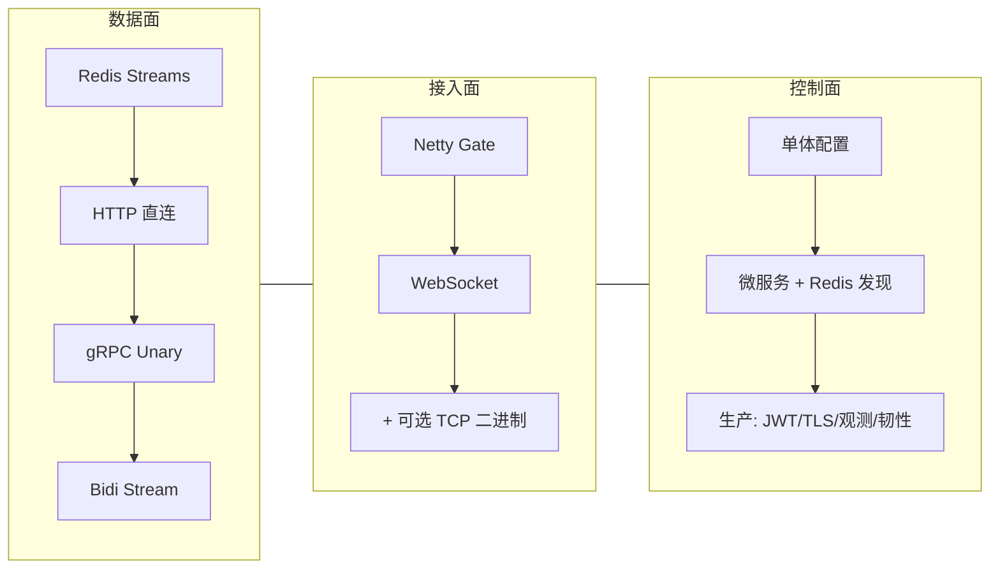
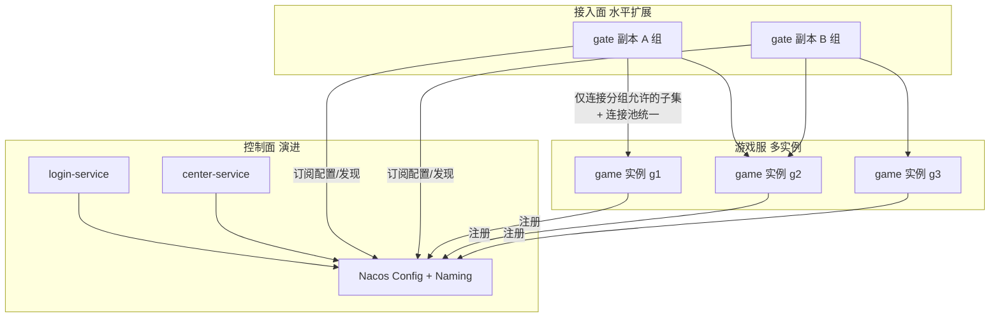

# 第 12 章：演进复盘与未来规划

**读者定位**：Level 4 — 游戏/网关领域专家。本章不做入门科普，而是把 GateDemo **从演示到可运维形态** 的决策链串起来，并对接仓库内 **OpenSpec 活跃变更** 与归档中的服务治理提案。

---

## 12.1 架构演进全景回顾

### 问题引入

单看某一版代码容易误判「为何这里用 Redis、为何 Gate 又嵌 Spring」——网关类项目往往在 **演示简洁性** 与 **生产约束** 之间多次摇摆。需要一条清晰时间线，把 **数据面、控制面、接入形态** 的变迁分开叙述。

### 设计决策（叙事主线）

以下阶段描述的是 **架构演进的语义顺序**（与具体提交顺序可能略有交错），且 **项目始终基于 Java / Spring Boot 技术栈**：

1. **Java/Spring Boot + Redis Streams（初期）**：用消息流做 Gate–Game 解耦，快速验证「异步投递」模型。
2. **去掉 Redis 消息路径，HTTP 直连**：简化拓扑，暴露 HTTP 同步调用的延迟与耦合问题。
3. **纯 Netty Gate（与 Spring 分离关注点）**：接入层用 Netty 扛长连接，控制面再逐步挂回 Spring。
4. **Netty WebSocket 实现**：浏览器与通用客户端统一走 WebSocket 帧，JSON 业务载荷与后续二进制扩展并存。
5. **gRPC 集成（HTTP → gRPC Unary）**：进程间契约改为 Proto，为流式打基础。
6. **完整网关能力**：二进制协议、认证、限流、可选 TCP 等「游戏网关标配」补齐。
7. **gRPC 双向流**：持久 stream 承载上下行，心跳与背压策略与连接生命周期绑定（见 `game_service.proto` 中 `StreamCommunication` / `Heartbeat`）。
8. **微服务拆分（Center、Login、Game Discovery）**：HTTP 配置与登录独立；Game 实例通过 Redis 注册，Gate 动态订阅。
9. **生产化**：JWT、TLS、可观测性（Metrics/Tracing）、K8s 编排、韧性（熔断/限流/退避）、安全加固（加密、校验、黑名单等）。

### 核心实现（里程碑对齐仓库）

当前仓库状态可从下列「锚点」反推阶段 5–9：

- **IDL**：`proto/game_service.proto` 同时定义 Unary 与双向流 RPC，`java_package = com.clawai.gatedemo.grpc`。
- **共享编译**：`common` 模块单点 `protobuf-maven-plugin`，`gate-service` / `game-service` 依赖 `common`（见第 11 章）。
- **运行与编排**：`k8s/*.yaml` 与多环境 `application-*.yml` 体现部署与密钥外置。
- **治理叙事**：`openspec/changes/archive/2026-03-17-add-service-governance/` 等归档记录配置中心/注册发现方向。

### 演进复盘



**时间线总览**（语义顺序，非严格日历）：


> 节点编号与第 12.1 节文字阶段对应；真实排期以 Git 历史与 OpenSpec 归档为准。

**得失小结**：

- **得**：控制面与数据面分离清晰；gRPC 流式与网关二进制帧组合，更贴近商业手游接入架构。
- **失**：阶段叠加后，**连接管理**出现「配置静态列表 + Redis 发现」双路径（正是 `change-game-connection-pool` 要收敛的对象）。

### 扩展思考

- 对照你司现网：哪一阶段与你们 **201x–202x** 的网关演进最像？差异主要在 **发现机制** 还是 **帧协议**？
- 读一遍 `openspec/changes/archive/2026-03-09-change-grpc-stream-communication/specs/` 与当前 `game_service.proto`，标出 **若下线 Unary -only 部署** 会破坏的客户端假设。

---

## 12.2 当前遗留问题与技术债

### 问题引入

「能跑」与「多人长期维护」之间，常见缺口：**双实现并存、文档空文件、测试在部分环境跳过、配置与运行时端口易混淆**。

### 设计决策（归类而非一次性解决）

将技术债分为 **结构性**（需设计变更）与 **工程性**（需补齐文档/测试）两类，优先消化结构性，以免越堆越难拆。

### 核心实现（仓库可观测证据）

1. **Game 连接双路径**（结构性）  
   OpenSpec 设计文档明确：历史上 **GameGrpcClientPool**（配置驱动）与 **GameDiscoveryService**（Redis 发现自管 `ManagedChannel`）并存，导致健康检查与重连策略不一致。`change-game-connection-pool` 目标为 **统一由 GameGrpcClientPool 持有连接**，Discovery 只做 add/remove。

   摘录设计目标：

   ```11:14:/Users/lizhiwei/Work/Lzw/GateDemo/openspec/changes/change-game-connection-pool/design.md
   **Goals:**
   - Gate 侧仅通过**单一连接池**（GameGrpcClientPool）与各 Game 通信，所有取 channel 的调用都走连接池。
   - 连接池支持：预创建/复用、超时与池大小配置、健康检查（含定时 Ping/心跳）、失效连接移除与自动重连。
   - 当启用服务发现时，Discovery 只负责发现/注销实例，连接的创建与销毁委托给连接池（addConnection/removeConnection），不再维护独立 gameChannels。
   ```

2. **服务发现细化**（结构性）  
   `change-game-service-discovery` 提案指出静态 `gate.games` 无法感知 Game 上下线；Redis 注册/事件通道是演进方向（与 `docs/redis-key-design.md` 等文档互补）。

3. **文档占位**  
   当前 `docs/service-governance-plan.md` 在仓库中为空，**服务治理叙事**应以 OpenSpec 归档为准，例如 Nacos 一体化方案提案：

   ```10:13:/Users/lizhiwei/Work/Lzw/GateDemo/openspec/changes/archive/2026-03-17-add-service-governance/proposal.md
   引入外部配置中心与服务注册发现：
   - 引入 Nacos 作为配置中心和服务注册发现一体化方案
   - 通过 Nacos SDK 监听配置变更，实现运行时热更新
   - 统一服务注册与发现，替代硬编码地址
   ```

4. **测试与 CI**  
   Testcontainers 类测试使用 `@EnabledIf("isDockerAvailable")`，无 Docker 时 **集成测试不执行** — 工程上需在流水线保证「有 Docker 的 job」或接受覆盖率缺口。

### 演进复盘

| 类别 | 代表事项 | 影响 |
|------|----------|------|
| 连接管理 | Pool vs Discovery 双轨 | 连接泄漏、重连策略不一致、排障困难 |
| 发现机制 | Redis 事件 vs 未来 Nacos | 运维模型与多环境配置分裂 |
| 文档 | 空 `service-governance-plan.md` | 新人误解「当前真值」在代码还是文档 |
| 测试 | 条件跳过集成测试 | CI 绿但生产路径未测 |

### 扩展思考

- 列出三类 **若现在不修、12 个月后修成本翻倍** 的债，并各自对应一个 OpenSpec change。
- 练习：画 **连接生命周期状态机**（创建 → stream 就绪 → 心跳失败 → 移除 → 重连），分别用「当前双路径」与「连接池统一后」各画一版，对比边数量。

---

## 12.3 未来方向：Nacos 服务治理、Gate–Game 分组、性能基准测试

### 问题引入

当 Game 实例与 Gate 副本数上升后，三类压力同时出现：**控制面配置爆炸**、**全连接导致的惊群与建连风暴**、**缺乏可对比的延迟/吞吐基线**。

### 设计决策

仓库内 **活跃/规划变更** 与 **归档提案** 共同指向三条主线：

1. **Nacos（或同类）服务治理** — 归档提案 `add-service-governance`：配置热更新 + 统一注册发现，减轻硬编码与 Redis 手工拓扑的运维负担。
2. **Gate–Game 分组扩展** — `change-gate-game-grouping`：分组标签、每 Gate 最大连接、渐进建连与随机抖动，缓解「新 Game 上线所有 Gate 同时拨号」的问题。
3. **Game 连接池统一 + 发现细化** — `change-game-connection-pool` 与 `change-game-service-discovery`：先统一连接真相源，再迭代发现协议与 Redis Key 语义。

性能基线方面，归档 `add-alerting-and-perf-tests` 等 change 将压测与告警纳入规划；与 **分组 + 连接池** 强相关 —— 无基线则无法证明「分组后 P99 是否变差（调度开销）」。

### 核心实现（提案要点摘录）

**分组与渐进连接**（`change-gate-game-grouping/proposal.md`）：

```10:14:/Users/lizhiwei/Work/Lzw/GateDemo/openspec/changes/change-gate-game-grouping/proposal.md
实现Gate与Game的分组成员管理：
- Gate和Game分组管理
- 新增Gate时只连接部分Game
- 新增Game时只通知部分Gate
- 支持分组权重配置
```

**连接池统一目标**（与 12.2 呼应）— Discovery 只调 `addConnection` / `removeConnection`，不再维护并行 `gameChannels`（完整论述见 `change-game-connection-pool/design.md` 的 Goals / Decisions）。

**未来架构愿景**（示意）：



### 演进复盘

- **与现状的 gap**：当前仍以 **Redis + 静态配置** 为主力路径；Nacos 与分组属 **规划/提案** 层，落地需迁移配置与发现客户端，并处理 **双注册过渡期**。
- **依赖顺序建议**：先 **连接池统一**（降低行为不确定性）→ 再 **发现协议增强** → 再 **分组与路由**（否则分组只是在两套连接模型上打补丁）。
- **性能基准**：应在统一连接后采集「每 Game 单 channel + 双向流」下的 **建连速率、stream 重建间隔、黑名单/Redis 调用** 对 P99 的贡献，否则分组策略无法量化。

### 扩展思考

- **行业对比**：腾讯/网易系自研名字服务 + 自定义路由 vs 云厂商 **MSE/Nacos**；分组策略有时放在 **调度器（matchmaking）** 而非纯 infra — GateDemo 将来是否把「分组」上移到 Login 返回的元数据？
- **练习**：为 `change-gate-game-grouping` 写三条 **验收指标**（例如：新 Game 上线时并发 gRPC 握手数上限、全集群建连完成时间 P95、误分组玩家率）。

---

## 本章小结

- **演进**：Java/Spring 栈上，从消息/HTTP 实验走向 **gRPC 双向流 + 微服务 + 生产化运维**。
- **技术债**：连接管理双路径、文档与 OpenSpec 脱节、条件跳过式集成测试 — 需在路线图里显式消化。
- **未来**：**Nacos 类治理**、**Gate–Game 分组**、**连接池统一 + 发现细化**、**可重复压测基线** 形成闭环。

---

*上一章：[第 11 章：公共模块与工程实践](./11-公共模块与工程实践.md)*
